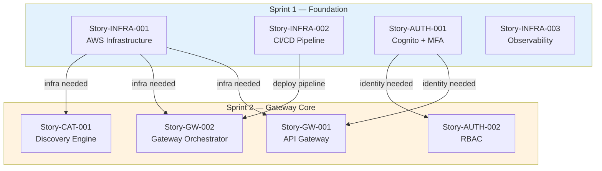
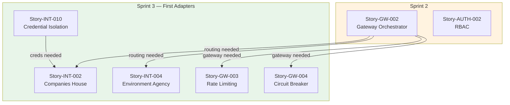
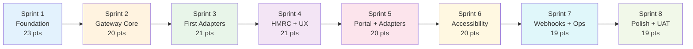

# Product Backlog: UK Government API Aggregator

> **Template Status**: Live | **Version**: 1.1.0 | **Command**: `/arckit.backlog`

## Document Control

| Field | Value |
|-------|-------|
| **Document ID** | ARC-001-BKLG-v1.0 |
| **Document Type** | Product Backlog |
| **Project** | UK Government API Aggregator (Project 001) |
| **Classification** | OFFICIAL |
| **Status** | DRAFT |
| **Version** | 1.0 |
| **Created Date** | 2026-02-01 |
| **Last Modified** | 2026-02-01 |
| **Review Cycle** | Per Sprint |
| **Next Review Date** | 2026-02-15 |
| **Owner** | [OWNER_NAME_AND_ROLE] |
| **Reviewed By** | [PENDING] |
| **Approved By** | [PENDING] |
| **Distribution** | Product Owner, Scrum Master, Development Teams, Architecture Team |

## Revision History

| Version | Date | Author | Changes | Approved By | Approval Date |
|---------|------|--------|---------|-------------|---------------|
| 1.0 | 2026-02-01 | ArcKit AI | Initial creation from `/arckit.backlog` command | [PENDING] | [PENDING] |

---

## Executive Summary

**Total Stories**: 68
**Total Epics**: 10
**Total Story Points**: 325
**Estimated Duration**: 17 sprints (34 weeks at 20 points/sprint)
**Planned Sprints**: 8 (covering 160 points — highest priority work)

### Priority Breakdown

| Priority | Stories | Points | Percentage |
|----------|---------|--------|------------|
| Must Have | 42 | 213 | 65.5% |
| Should Have | 18 | 80 | 24.6% |
| Could Have | 8 | 32 | 9.8% |

### Sprint Parameters

- **Sprint Length**: 2 weeks
- **Team Velocity**: 20 story points/sprint
- **Sprints Planned**: 8 (Weeks 1–16)
- **Prioritisation**: Multi-factor (MoSCoW × 40% + Risk × 20% + Value × 20% + Dependency × 20%)

### Capacity Allocation per Sprint

- 60% Feature stories (12 points)
- 20% Technical tasks (4 points)
- 15% Testing/quality tasks (3 points)
- 5% Buffer (1 point)

---

## How to Use This Backlog

### For Product Owners
1. Review epic priorities — adjust based on business needs
2. Refine story acceptance criteria before sprint planning
3. Validate user stories with actual users (Personas Alex, Sam, Jordan, Pat)
4. Adjust sprint sequence based on stakeholder priorities

### For Development Teams
1. Review stories in upcoming sprint during Sprint Planning
2. Break down stories into tasks if needed
3. Re-estimate effort using team velocity
4. Identify technical blockers early
5. Update story status as work progresses

### For Scrum Masters
1. Track velocity after each sprint
2. Adjust future sprint loading based on actual velocity
3. Monitor dependency chains
4. Escalate blockers early
5. Facilitate backlog refinement sessions

### Backlog Refinement
- **Weekly**: Review and refine next 2 sprints
- **Bi-weekly**: Groom backlog beyond 2 sprints
- **Monthly**: Reassess epic priorities
- **Per sprint**: Update based on completed work and learnings

---

## Epics

### EPIC-001: Platform Infrastructure and DevOps (BR-006)

**Business Requirement**: BR-006 (Phased Delivery with Stop/Go Gates)
**Priority**: Must Have
**Business Value**: High — Foundation for all development and deployment
**Risk**: High — Delays here cascade to all epics
**Dependencies**: None (foundation epic)
**Total Story Points**: 26
**Estimated Duration**: 2 sprints

**Description**: Establish cloud infrastructure, CI/CD pipelines, observability stack, IaC, and environments (dev/staging/production) on AWS eu-west-2 as the foundation for all platform development.

**Stories in this Epic**:
1. Story-INFRA-001: Provision AWS infrastructure with IaC (8 points) — Sprint 1
2. Story-INFRA-002: Set up CI/CD pipeline (5 points) — Sprint 1
3. Story-INFRA-003: Configure observability stack (5 points) — Sprint 1
4. Story-INFRA-004: Set up security scanning in pipeline (3 points) — Sprint 2
5. Story-INFRA-005: Configure DR and backup (5 points) — Sprint 3

---

### EPIC-002: Identity, Authentication and Access Control (NFR-SEC-001, NFR-SEC-002)

**Business Requirement**: NFR-SEC-001, NFR-SEC-002
**Priority**: Must Have
**Business Value**: High — Enables secure access for all user types
**Risk**: Critical — Security foundation; blocks all user-facing features
**Dependencies**: EPIC-001 (infrastructure must exist)
**Total Story Points**: 21
**Estimated Duration**: 2 sprints

**Description**: Implement Amazon Cognito-based identity with MFA, RBAC (Developer, Department Admin, Platform Admin, Read-Only Viewer), API key management, and session management.

**Stories in this Epic**:
1. Story-AUTH-001: Implement Cognito user pools with MFA (5 points) — Sprint 1
2. Story-AUTH-002: Implement RBAC with 4 role types (5 points) — Sprint 2
3. Story-AUTH-003: Implement API key generation and validation (5 points) — Sprint 2
4. Story-AUTH-004: Implement API key rotation and revocation (3 points) — Sprint 3
5. Story-AUTH-005: Implement session management (3 points) — Sprint 2

---

### EPIC-003: API Gateway and Request Routing (BR-002)

**Business Requirement**: BR-002 (Unified API Access Gateway)
**Priority**: Must Have
**Business Value**: High — Core value proposition
**Risk**: High — Must meet <50ms overhead target
**Dependencies**: EPIC-001, EPIC-002 (infrastructure + auth)
**Total Story Points**: 44
**Estimated Duration**: 3 sprints

**Description**: Build the two-layer gateway (Amazon API Gateway + custom Gateway Orchestrator), per-department adapters, request routing, circuit breakers, rate limiting, and response normalisation.

**Stories in this Epic**:
1. Story-GW-001: Configure Amazon API Gateway with usage plans (5 points) — Sprint 2
2. Story-GW-002: Build Gateway Orchestrator service (8 points) — Sprint 2
3. Story-GW-003: Implement multi-tier rate limiting (5 points) — Sprint 3
4. Story-GW-004: Implement circuit breaker pattern (5 points) — Sprint 3
5. Story-GW-005: Implement response normalisation engine (8 points) — Sprint 5
6. Story-GW-006: Implement API versioning support (3 points) — Sprint 4
7. Story-GW-007: Implement correlation ID and structured logging (2 points) — Sprint 2
8. Story-GW-008: Implement request caching layer (5 points) — Sprint 4
9. Story-GW-009: Build sandbox/mock response engine (3 points) — Sprint 4

---

### EPIC-004: Department Adapter Integrations (INT-001 to INT-009)

**Business Requirement**: BR-002, BR-004
**Priority**: Must Have (Phase 1 departments)
**Business Value**: High — Platform value proportional to API breadth
**Risk**: High — Depends on department cooperation and API stability
**Dependencies**: EPIC-003 (gateway must exist)
**Total Story Points**: 61
**Estimated Duration**: 4 sprints

**Description**: Build per-department adapter services for each upstream government API, with auth mapping, circuit breakers, and response normalisation. Phase 1: HMRC, Companies House, DVLA, Environment Agency, api.gov.uk. Phase 2: NHS, OS, Land Registry, DWP.

**Stories in this Epic**:
1. Story-INT-001: Build HMRC adapter (OAuth 2.0) (8 points) — Sprint 3
2. Story-INT-002: Build Companies House adapter (API key) (5 points) — Sprint 3
3. Story-INT-003: Build DVLA adapter (API key) (5 points) — Sprint 4
4. Story-INT-004: Build Environment Agency adapter (open) (3 points) — Sprint 3
5. Story-INT-005: Build api.gov.uk catalogue ingestion (5 points) — Sprint 4
6. Story-INT-006: Build NHS Digital adapter (OAuth 2.0) (8 points) — Sprint 5
7. Story-INT-007: Build Ordnance Survey adapter (API key) (5 points) — Sprint 5
8. Story-INT-008: Build Land Registry adapter (API key) (5 points) — Sprint 6
9. Story-INT-009: Build DWP adapter (OAuth 2.0 enhanced) (8 points) — Sprint 7
10. Story-INT-010: Implement per-department credential isolation (5 points) — Sprint 3
11. Story-INT-011: Build adapter deployment framework (independent deploy per adapter) (4 points) — Sprint 3

---

### EPIC-005: API Discovery and Cataloguing (BR-001)

**Business Requirement**: BR-001 (Cross-Government API Discovery and Cataloguing)
**Priority**: Must Have
**Business Value**: High — Catalogue is the index for all APIs
**Risk**: Medium — Depends on upstream data availability
**Dependencies**: EPIC-001 (infrastructure)
**Total Story Points**: 29
**Estimated Duration**: 2 sprints

**Description**: Build the Discovery Engine that crawls api.gov.uk and department developer hubs, indexes API metadata into Aurora and OpenSearch, and provides full-text search with faceted filtering.

**Stories in this Epic**:
1. Story-CAT-001: Build Discovery Engine crawler (8 points) — Sprint 2
2. Story-CAT-002: Design and implement API catalogue data model (5 points) — Sprint 2
3. Story-CAT-003: Implement OpenSearch catalogue indexing (5 points) — Sprint 3
4. Story-CAT-004: Implement catalogue search with faceted filtering (5 points) — Sprint 3
5. Story-CAT-005: Implement automated catalogue refresh (48-hour SLA) (3 points) — Sprint 4
6. Story-CAT-006: Implement API health monitoring and status tracking (3 points) — Sprint 4

---

### EPIC-006: Developer Portal (BR-003)

**Business Requirement**: BR-003 (Developer Self-Service Portal)
**Priority**: Must Have
**Business Value**: High — Primary user interface for developers
**Risk**: Medium — Must pass GDS Service Standard assessment
**Dependencies**: EPIC-002 (auth), EPIC-005 (catalogue), EPIC-003 (gateway for sandbox)
**Total Story Points**: 42
**Estimated Duration**: 3 sprints

**Description**: Build the self-service developer portal using GOV.UK Design System — registration, API discovery and docs, sandbox testing, key management, usage dashboards. WCAG 2.2 AA compliant.

**Stories in this Epic**:
1. Story-DEV-001: Build developer registration flow (5 points) — Sprint 3
2. Story-DEV-002: Build API catalogue browse and search UI (5 points) — Sprint 4
3. Story-DEV-003: Build interactive API documentation renderer (5 points) — Sprint 5
4. Story-DEV-004: Build developer dashboard (usage, errors, rate limits) (5 points) — Sprint 5
5. Story-DEV-005: Build API key management UI (3 points) — Sprint 4
6. Story-DEV-006: Build sandbox testing interface ("Try it" from docs) (5 points) — Sprint 5
7. Story-DEV-007: Implement WCAG 2.2 AA accessibility across portal (5 points) — Sprint 6
8. Story-DEV-008: Build public API status page (3 points) — Sprint 4
9. Story-DEV-009: Implement GOV.UK Design System patterns (3 points) — Sprint 3
10. Story-DEV-010: Build developer onboarding guide and getting started flow (3 points) — Sprint 6

---

### EPIC-007: Department Administration (BR-004)

**Business Requirement**: BR-004 (Department Control and Transparency)
**Priority**: Must Have
**Business Value**: High — Critical for department buy-in
**Risk**: Medium — Department trust depends on control preservation
**Dependencies**: EPIC-002 (auth), EPIC-003 (gateway)
**Total Story Points**: 29
**Estimated Duration**: 2 sprints

**Description**: Build the department administration portal — manage APIs, configure rate limits, view traffic analytics, manage consumer access, upload API specifications.

**Stories in this Epic**:
1. Story-DEPT-001: Build department admin dashboard (5 points) — Sprint 5
2. Story-DEPT-002: Implement per-department rate limit configuration (3 points) — Sprint 5
3. Story-DEPT-003: Implement consumer blocking and access management (3 points) — Sprint 6
4. Story-DEPT-004: Build department traffic analytics views (5 points) — Sprint 6
5. Story-DEPT-005: Build API specification upload and validation (5 points) — Sprint 6
6. Story-DEPT-006: Build API deprecation and retirement workflow (3 points) — Sprint 7
7. Story-DEPT-007: Build department API health and incident dashboard (3 points) — Sprint 7
8. Story-DEPT-008: Build department MoU status tracking (2 points) — Sprint 7

---

### EPIC-008: Usage Analytics and Reporting (BR-005)

**Business Requirement**: BR-005 (Value for Money Evidence)
**Priority**: Must Have
**Business Value**: High — Required for Treasury reporting
**Risk**: Medium — Must demonstrate ROI
**Dependencies**: EPIC-003 (gateway logs), EPIC-006 (portal), EPIC-007 (admin portal)
**Total Story Points**: 23
**Estimated Duration**: 2 sprints

**Description**: Build analytics processing, dashboards for developers/departments/SRO, benefits realisation tracking, and automated quarterly reporting.

**Stories in this Epic**:
1. Story-ANA-001: Build analytics ingestion and aggregation pipeline (5 points) — Sprint 5
2. Story-ANA-002: Build platform-level analytics dashboard (SRO view) (5 points) — Sprint 6
3. Story-ANA-003: Build benefits realisation tracker (5 points) — Sprint 7
4. Story-ANA-004: Build automated quarterly benefits report (3 points) — Sprint 8
5. Story-ANA-005: Implement near-real-time analytics (5-min delay) (5 points) — Sprint 6

---

### EPIC-009: Webhook Notifications (FR-014)

**Business Requirement**: BR-003
**Priority**: Should Have
**Business Value**: Medium — Improves developer experience
**Risk**: Low
**Dependencies**: EPIC-003 (gateway), EPIC-006 (portal)
**Total Story Points**: 13
**Estimated Duration**: 1 sprint

**Description**: Allow developers to register webhooks for API status changes, deprecation notices, and usage alerts. Deliver via EventBridge → SQS → Lambda with retry logic.

**Stories in this Epic**:
1. Story-WH-001: Build webhook registration and management (3 points) — Sprint 7
2. Story-WH-002: Build webhook delivery service with retry logic (5 points) — Sprint 7
3. Story-WH-003: Implement status change and deprecation notifications (3 points) — Sprint 8
4. Story-WH-004: Implement usage alert notifications (80% rate limit) (2 points) — Sprint 8

---

### EPIC-010: Platform Administration (FR-016)

**Business Requirement**: FR-016 (Platform Administration and Configuration)
**Priority**: Must Have
**Business Value**: Medium — Enables GDS WebOps to operate the platform
**Risk**: High — Operational readiness depends on this
**Dependencies**: EPIC-001, EPIC-002, EPIC-003
**Total Story Points**: 21
**Estimated Duration**: 2 sprints

**Description**: Platform admin capabilities for GDS WebOps — global health dashboard, consumer management, adapter deployment without full redeployment, audit logging, operational runbooks.

**Stories in this Epic**:
1. Story-ADM-001: Build platform health dashboard (5 points) — Sprint 6
2. Story-ADM-002: Implement global consumer blocking (2 points) — Sprint 6
3. Story-ADM-003: Implement independent adapter deployment (3 points) — Sprint 4
4. Story-ADM-004: Build comprehensive audit logging (5 points) — Sprint 4
5. Story-ADM-005: Create operational runbooks for common failures (3 points) — Sprint 7
6. Story-ADM-006: Build SLO/SLI monitoring dashboard (3 points) — Sprint 7

---

## Prioritised Backlog

### Priority Score Calculation

Each story scored using: `(MoSCoW × 0.4) + (Risk × 0.2) + (Value × 0.2) + (Dependency × 0.2)`

MoSCoW: Must=4, Should=3, Could=2, Won't=1 | Risk: Critical=4, High=3, Medium=2, Low=1 | Value: High=4, Medium=3, Low=2 | Dependency: Blocks many(>5)=4, Some(3-5)=3, Few(1-2)=2, None=1

| Rank | Story ID | Title | Epic | Points | Priority | Score | Sprint |
|------|----------|-------|------|--------|----------|-------|--------|
| 1 | Story-INFRA-001 | Provision AWS infrastructure with IaC | EPIC-001 | 8 | Must Have | 3.8 | 1 |
| 2 | Story-INFRA-002 | Set up CI/CD pipeline | EPIC-001 | 5 | Must Have | 3.6 | 1 |
| 3 | Story-AUTH-001 | Implement Cognito user pools with MFA | EPIC-002 | 5 | Must Have | 3.6 | 1 |
| 4 | Story-INFRA-003 | Configure observability stack | EPIC-001 | 5 | Must Have | 3.4 | 1 |
| 5 | Story-CAT-001 | Build Discovery Engine crawler | EPIC-005 | 8 | Must Have | 3.4 | 2 |
| 6 | Story-GW-001 | Configure API Gateway with usage plans | EPIC-003 | 5 | Must Have | 3.4 | 2 |
| 7 | Story-GW-002 | Build Gateway Orchestrator service | EPIC-003 | 8 | Must Have | 3.4 | 2 |
| 8 | Story-AUTH-002 | Implement RBAC with 4 role types | EPIC-002 | 5 | Must Have | 3.2 | 2 |
| 9 | Story-AUTH-003 | Implement API key generation and validation | EPIC-002 | 5 | Must Have | 3.2 | 2 |
| 10 | Story-CAT-002 | Design API catalogue data model | EPIC-005 | 5 | Must Have | 3.2 | 2 |
| 11 | Story-GW-007 | Implement correlation ID and structured logging | EPIC-003 | 2 | Must Have | 3.2 | 2 |
| 12 | Story-INT-010 | Implement per-department credential isolation | EPIC-004 | 5 | Must Have | 3.4 | 3 |
| 13 | Story-INT-011 | Build adapter deployment framework | EPIC-004 | 4 | Must Have | 3.2 | 3 |
| 14 | Story-INT-001 | Build HMRC adapter | EPIC-004 | 8 | Must Have | 3.2 | 3 |
| 15 | Story-INT-002 | Build Companies House adapter | EPIC-004 | 5 | Must Have | 3.0 | 3 |
| 16 | Story-INT-004 | Build Environment Agency adapter | EPIC-004 | 3 | Must Have | 3.0 | 3 |
| 17 | Story-CAT-003 | Implement OpenSearch indexing | EPIC-005 | 5 | Must Have | 3.0 | 3 |
| 18 | Story-GW-003 | Implement multi-tier rate limiting | EPIC-003 | 5 | Must Have | 3.0 | 3 |
| 19 | Story-GW-004 | Implement circuit breaker pattern | EPIC-003 | 5 | Must Have | 3.0 | 3 |
| 20 | Story-DEV-001 | Build developer registration flow | EPIC-006 | 5 | Must Have | 3.0 | 3 |
| 21 | Story-DEV-009 | Implement GOV.UK Design System patterns | EPIC-006 | 3 | Must Have | 3.0 | 3 |
| 22 | Story-INFRA-004 | Set up security scanning in pipeline | EPIC-001 | 3 | Must Have | 2.8 | 2 |
| 23 | Story-AUTH-005 | Implement session management | EPIC-002 | 3 | Must Have | 2.8 | 2 |
| 24 | Story-CAT-004 | Implement catalogue search with faceting | EPIC-005 | 5 | Must Have | 2.8 | 3 |
| 25 | Story-INT-003 | Build DVLA adapter | EPIC-004 | 5 | Must Have | 2.8 | 4 |
| 26 | Story-INT-005 | Build api.gov.uk catalogue ingestion | EPIC-004 | 5 | Must Have | 2.8 | 4 |
| 27 | Story-DEV-002 | Build catalogue browse and search UI | EPIC-006 | 5 | Must Have | 2.8 | 4 |
| 28 | Story-DEV-005 | Build API key management UI | EPIC-006 | 3 | Must Have | 2.8 | 4 |
| 29 | Story-DEV-008 | Build public API status page | EPIC-006 | 3 | Must Have | 2.8 | 4 |
| 30 | Story-ADM-003 | Implement independent adapter deployment | EPIC-010 | 3 | Must Have | 2.8 | 4 |
| 31 | Story-ADM-004 | Build comprehensive audit logging | EPIC-010 | 5 | Must Have | 2.8 | 4 |
| 32 | Story-GW-006 | Implement API versioning support | EPIC-003 | 3 | Must Have | 2.6 | 4 |
| 33 | Story-GW-008 | Implement request caching layer | EPIC-003 | 5 | Should Have | 2.6 | 4 |
| 34 | Story-GW-009 | Build sandbox/mock response engine | EPIC-003 | 3 | Must Have | 2.6 | 4 |
| 35 | Story-CAT-005 | Implement automated catalogue refresh | EPIC-005 | 3 | Must Have | 2.6 | 4 |
| 36 | Story-CAT-006 | Implement API health monitoring | EPIC-005 | 3 | Must Have | 2.6 | 4 |
| 37 | Story-AUTH-004 | Implement API key rotation and revocation | EPIC-002 | 3 | Must Have | 2.6 | 3 |
| 38 | Story-INFRA-005 | Configure DR and backup | EPIC-001 | 5 | Must Have | 2.6 | 3 |
| 39 | Story-DEV-003 | Build interactive API documentation | EPIC-006 | 5 | Should Have | 2.4 | 5 |
| 40 | Story-DEV-004 | Build developer dashboard | EPIC-006 | 5 | Must Have | 2.4 | 5 |
| 41 | Story-DEV-006 | Build sandbox testing interface | EPIC-006 | 5 | Must Have | 2.4 | 5 |
| 42 | Story-DEPT-001 | Build department admin dashboard | EPIC-007 | 5 | Must Have | 2.4 | 5 |
| 43 | Story-DEPT-002 | Implement per-department rate limit config | EPIC-007 | 3 | Must Have | 2.4 | 5 |
| 44 | Story-ANA-001 | Build analytics pipeline | EPIC-008 | 5 | Must Have | 2.4 | 5 |
| 45 | Story-INT-006 | Build NHS Digital adapter | EPIC-004 | 8 | Should Have | 2.4 | 5 |
| 46 | Story-INT-007 | Build Ordnance Survey adapter | EPIC-004 | 5 | Should Have | 2.4 | 5 |
| 47 | Story-GW-005 | Implement response normalisation engine | EPIC-003 | 8 | Should Have | 2.2 | 5 |
| 48 | Story-DEV-007 | Implement WCAG 2.2 AA accessibility | EPIC-006 | 5 | Must Have | 2.2 | 6 |
| 49 | Story-DEV-010 | Build developer onboarding guide | EPIC-006 | 3 | Should Have | 2.2 | 6 |
| 50 | Story-DEPT-003 | Implement consumer blocking | EPIC-007 | 3 | Must Have | 2.2 | 6 |
| 51 | Story-DEPT-004 | Build department traffic analytics | EPIC-007 | 5 | Must Have | 2.2 | 6 |
| 52 | Story-DEPT-005 | Build API spec upload and validation | EPIC-007 | 5 | Should Have | 2.2 | 6 |
| 53 | Story-ANA-002 | Build platform analytics dashboard (SRO) | EPIC-008 | 5 | Must Have | 2.2 | 6 |
| 54 | Story-ANA-005 | Implement near-real-time analytics | EPIC-008 | 5 | Should Have | 2.2 | 6 |
| 55 | Story-ADM-001 | Build platform health dashboard | EPIC-010 | 5 | Must Have | 2.2 | 6 |
| 56 | Story-ADM-002 | Implement global consumer blocking | EPIC-010 | 2 | Must Have | 2.2 | 6 |
| 57 | Story-INT-008 | Build Land Registry adapter | EPIC-004 | 5 | Should Have | 2.0 | 6 |
| 58 | Story-DEPT-006 | Build API deprecation workflow | EPIC-007 | 3 | Should Have | 2.0 | 7 |
| 59 | Story-DEPT-007 | Build department incident dashboard | EPIC-007 | 3 | Should Have | 2.0 | 7 |
| 60 | Story-DEPT-008 | Build MoU status tracking | EPIC-007 | 2 | Should Have | 1.8 | 7 |
| 61 | Story-ANA-003 | Build benefits realisation tracker | EPIC-008 | 5 | Must Have | 2.0 | 7 |
| 62 | Story-ADM-005 | Create operational runbooks | EPIC-010 | 3 | Must Have | 2.0 | 7 |
| 63 | Story-ADM-006 | Build SLO/SLI monitoring dashboard | EPIC-010 | 3 | Should Have | 2.0 | 7 |
| 64 | Story-WH-001 | Build webhook registration and management | EPIC-009 | 3 | Should Have | 1.8 | 7 |
| 65 | Story-WH-002 | Build webhook delivery service | EPIC-009 | 5 | Should Have | 1.8 | 7 |
| 66 | Story-INT-009 | Build DWP adapter | EPIC-004 | 8 | Could Have | 1.6 | 7 |
| 67 | Story-WH-003 | Implement status/deprecation notifications | EPIC-009 | 3 | Should Have | 1.6 | 8 |
| 68 | Story-WH-004 | Implement usage alert notifications | EPIC-009 | 2 | Should Have | 1.6 | 8 |
| — | Story-ANA-004 | Build automated quarterly report | EPIC-008 | 3 | Must Have | 1.8 | 8 |

---

## User Stories

### EPIC-001: Platform Infrastructure and DevOps

---

#### Story-INFRA-001: Provision AWS Infrastructure with IaC

**As a** platform administrator
**I want** all AWS infrastructure provisioned via Infrastructure as Code
**So that** environments are reproducible, auditable, and version-controlled

**Acceptance Criteria**:
- It's done when VPC (10.0.0.0/16) with public, private, and isolated subnets across 3 AZs is provisioned
- It's done when Aurora PostgreSQL Serverless v2, ElastiCache Redis, and OpenSearch Service are deployed
- It's done when ECS Fargate clusters are configured for all compute workloads
- It's done when all infrastructure is defined in CDK TypeScript or Terraform, committed to version control
- It's done when dev, staging, and production environments can be provisioned from the same code
- It's done when all data stores use AES-256 encryption at rest via KMS customer-managed keys

**Requirements Traceability**: NFR-M-003, NFR-SEC-003, NFR-A-001, NFR-A-002
**Component**: All infrastructure
**Story Points**: 8
**Priority**: Must Have
**Sprint**: 1
**Dependencies**: None

---

#### Story-INFRA-002: Set up CI/CD Pipeline

**As a** developer
**I want** automated build, test, and deployment pipelines
**So that** code changes are safely and rapidly deployed to all environments

**Acceptance Criteria**:
- It's done when pipeline triggers on merge to main branch
- It's done when pipeline runs unit tests, integration tests, linting
- It's done when pipeline deploys to dev → staging → production with approval gate
- It's done when rollback capability is tested and documented
- It's done when pipeline includes secrets scanning (no hardcoded credentials)

**Requirements Traceability**: NFR-M-003, NFR-SEC-006, Principle 18
**Component**: CI/CD (GitHub Actions / CodePipeline)
**Story Points**: 5
**Priority**: Must Have
**Sprint**: 1
**Dependencies**: Story-INFRA-001

---

#### Story-INFRA-003: Configure Observability Stack

**As a** platform administrator
**I want** comprehensive logging, metrics, tracing, and dashboards
**So that** I can monitor platform health and troubleshoot issues

**Acceptance Criteria**:
- It's done when CloudWatch Logs receives structured JSON logs from all services
- It's done when CloudWatch Metrics tracks request rate, error rate, and latency per service
- It's done when X-Ray distributed tracing is enabled across all ECS services
- It's done when operational dashboards show platform health at a glance
- It's done when SLO-based alerting sends notifications for degraded performance

**Requirements Traceability**: NFR-M-001, Principle 5
**Component**: CloudWatch, X-Ray, CloudTrail
**Story Points**: 5
**Priority**: Must Have
**Sprint**: 1
**Dependencies**: Story-INFRA-001

---

#### Story-INFRA-004: Set up Security Scanning in Pipeline

**As a** security engineer
**I want** automated security testing in the CI/CD pipeline
**So that** vulnerabilities are caught before deployment

**Acceptance Criteria**:
- It's done when SAST runs on every pull request and blocks merge on critical/high findings
- It's done when dependency scanning (SCA) identifies known CVEs in dependencies
- It's done when container image scanning checks base images for vulnerabilities
- It's done when IaC security scanning validates CloudFormation/CDK templates
- It's done when secrets scanning prevents credential leakage in code

**Requirements Traceability**: NFR-SEC-006, Principle 4
**Component**: CI/CD security gates
**Story Points**: 3
**Priority**: Must Have
**Sprint**: 2
**Dependencies**: Story-INFRA-002

---

#### Story-INFRA-005: Configure DR and Backup

**As a** platform administrator
**I want** disaster recovery and automated backups configured
**So that** the platform can recover from failures with RPO 1hr and RTO 4hr

**Acceptance Criteria**:
- It's done when Aurora has continuous backup with point-in-time recovery enabled
- It's done when cross-region Aurora read replica exists in eu-west-1 (Ireland)
- It's done when S3 cross-region replication is configured for log archives and static assets
- It's done when hourly snapshots run for transactional data and daily for configuration
- It's done when backup retention is 30 days for operational, 2 years for audit data
- It's done when DR failover procedure is documented and tested

**Requirements Traceability**: NFR-A-002
**Component**: Aurora, S3, DR infrastructure
**Story Points**: 5
**Priority**: Must Have
**Sprint**: 3
**Dependencies**: Story-INFRA-001

---

### EPIC-002: Identity, Authentication and Access Control

---

#### Story-AUTH-001: Implement Cognito User Pools with MFA

**As a** developer
**I want** to create an account with email and MFA
**So that** I can securely access the developer portal

**Acceptance Criteria**:
- It's done when Cognito user pool is configured with email-based registration
- It's done when MFA is required for all portal login (authenticator app + hardware key)
- It's done when registration completes within 30 seconds
- It's done when email verification is sent and required before activation
- It's done when account deletion request removes all personal data within 30 days (UK GDPR)

**Requirements Traceability**: FR-003, NFR-SEC-001, NFR-C-001
**Component**: Amazon Cognito
**Story Points**: 5
**Priority**: Must Have
**Sprint**: 1
**Dependencies**: Story-INFRA-001

---

#### Story-AUTH-002: Implement RBAC with 4 Role Types

**As a** platform administrator
**I want** role-based access control with least privilege
**So that** each user type can only access their authorised functions

**Acceptance Criteria**:
- It's done when Developer role grants: own keys, own usage, sandbox + production APIs
- It's done when Department Admin role grants: own department APIs, analytics, consumer management
- It's done when Platform Admin role grants: global management, all dashboards, configuration
- It's done when Read-Only Viewer role grants: dashboard view without modification
- It's done when re-authentication is required for sensitive actions (key creation, deletion, permission changes)

**Requirements Traceability**: NFR-SEC-002, Principle 4
**Component**: Cognito groups, API Gateway authorisers
**Story Points**: 5
**Priority**: Must Have
**Sprint**: 2
**Dependencies**: Story-AUTH-001

---

#### Story-AUTH-003: Implement API Key Generation and Validation

**As a** developer
**I want** to generate API keys for authenticating gateway requests
**So that** I can make API calls to government data sources

**Acceptance Criteria**:
- It's done when API key is generated and displayed once upon creation
- It's done when API key is validated on every gateway request in <5ms
- It's done when key prefix (8 chars) is displayed for identification, full key never re-displayed
- It's done when multiple keys can be created per application
- It's done when API keys are stored as SHA-256 hashes (never reversibly)

**Requirements Traceability**: FR-004, NFR-SEC-003
**Component**: API Gateway, Cognito, Aurora
**Story Points**: 5
**Priority**: Must Have
**Sprint**: 2
**Dependencies**: Story-AUTH-001

---

#### Story-AUTH-004: Implement API Key Rotation and Revocation

**As a** developer
**I want** to rotate and revoke API keys
**So that** I can manage credentials safely without downtime

**Acceptance Criteria**:
- It's done when key rotation issues a new key with a configurable grace period (default 24hr) for the old key
- It's done when key revocation immediately rejects all requests using that key
- It's done when key status (active, revoked, expired) is visible in the developer dashboard
- It's done when revoked/expired keys are retained 90 days for audit then deleted

**Requirements Traceability**: FR-004, NFR-SEC-004
**Component**: API Gateway, Cognito, Aurora
**Story Points**: 3
**Priority**: Must Have
**Sprint**: 3
**Dependencies**: Story-AUTH-003

---

#### Story-AUTH-005: Implement Session Management

**As a** developer
**I want** secure session handling on the portal
**So that** my account is protected from session hijacking

**Acceptance Criteria**:
- It's done when sessions expire after 30 minutes of inactivity
- It's done when absolute session timeout is 8 hours
- It's done when session tokens are rotated on privilege change
- It's done when concurrent sessions are limited and visible to the user

**Requirements Traceability**: NFR-SEC-001
**Component**: Amazon Cognito, Developer Portal
**Story Points**: 3
**Priority**: Must Have
**Sprint**: 2
**Dependencies**: Story-AUTH-001

---

### EPIC-003: API Gateway and Request Routing

---

#### Story-GW-001: Configure Amazon API Gateway with Usage Plans

**As a** developer
**I want** a single API endpoint for all government APIs
**So that** I can access multiple departments through one base URL

**Acceptance Criteria**:
- It's done when API Gateway is configured with REST API type
- It's done when usage plans define free, standard, and elevated rate limit tiers
- It's done when API key validation is integrated with Cognito authoriser
- It's done when request/response logging is enabled with correlation IDs
- It's done when WAF integration protects against OWASP API Security Top 10

**Requirements Traceability**: BR-002, FR-005, FR-012, NFR-SEC-007
**Component**: Amazon API Gateway, AWS WAF
**Story Points**: 5
**Priority**: Must Have
**Sprint**: 2
**Dependencies**: Story-AUTH-001, Story-INFRA-001

---

#### Story-GW-002: Build Gateway Orchestrator Service

**As a** developer
**I want** my API requests routed to the correct department
**So that** I get the right data without knowing each department's specific API

**Acceptance Criteria**:
- It's done when requests to `/v1/{department}/{path}` route to the correct adapter
- It's done when a unique correlation_id is generated and propagated for every request
- It's done when gateway overhead is <50ms p95 (measured separately from upstream latency)
- It's done when request/response sizes are tracked per call
- It's done when unrecognised routes return 404 with consistent error format

**Requirements Traceability**: FR-005, NFR-P-001
**Component**: Gateway Orchestrator (ECS Fargate, Node.js)
**Story Points**: 8
**Priority**: Must Have
**Sprint**: 2
**Dependencies**: Story-GW-001, Story-INFRA-001

---

#### Story-GW-003: Implement Multi-Tier Rate Limiting

**As a** department API owner
**I want** rate limits enforced at platform, department, and consumer levels
**So that** my APIs are protected from excessive usage

**Acceptance Criteria**:
- It's done when rate limiting uses sliding window counters in Redis
- It's done when 429 responses include X-RateLimit-Limit, X-RateLimit-Remaining, X-RateLimit-Reset, and Retry-After headers
- It's done when department admins can change rate limits without platform redeployment
- It's done when different rate limit tiers (free/standard/elevated) are configurable per consumer
- It's done when rate limit check adds <5ms to request processing

**Requirements Traceability**: FR-012, BR-004, NFR-P-001
**Component**: ElastiCache Redis, Gateway Orchestrator
**Story Points**: 5
**Priority**: Must Have
**Sprint**: 3
**Dependencies**: Story-GW-002

---

#### Story-GW-004: Implement Circuit Breaker Pattern

**As a** developer
**I want** failed upstream APIs to not affect my calls to other APIs
**So that** I get reliable responses even when individual departments have issues

**Acceptance Criteria**:
- It's done when circuit breaker triggers when upstream API returns >50% errors
- It's done when tripped circuit breaker returns 503 with informative error (not hitting upstream)
- It's done when periodic health checks detect upstream recovery and reset the breaker
- It's done when circuit breaker state is visible in operations dashboard
- It's done when circuit breaker thresholds are configurable per upstream API

**Requirements Traceability**: FR-013, NFR-A-003, Principle 2
**Component**: Department Adapters, ElastiCache Redis
**Story Points**: 5
**Priority**: Must Have
**Sprint**: 3
**Dependencies**: Story-GW-002

---

#### Story-GW-005: Implement Response Normalisation Engine

**As a** developer
**I want** consistent response formats across departments
**So that** I don't need to handle different formats per department

**Acceptance Criteria**:
- It's done when all date fields are normalised to ISO 8601
- It's done when all errors follow a consistent schema (code, message, details, upstream_error)
- It's done when pagination uses consistent metadata format
- It's done when original un-normalised response is available via header flag
- It's done when normalisation rules are configurable per upstream API without code changes

**Requirements Traceability**: FR-006
**Component**: Department Adapters, Gateway Orchestrator
**Story Points**: 8
**Priority**: Should Have
**Sprint**: 5
**Dependencies**: Story-GW-002, at least 2 adapters

---

#### Story-GW-006: Implement API Versioning Support

**As a** developer
**I want** to access specific versions of upstream APIs
**So that** I can migrate at my own pace when departments release new versions

**Acceptance Criteria**:
- It's done when `/v1/` and `/v2/` of the same upstream API can coexist
- It's done when deprecated versions return a deprecation warning header
- It's done when retired versions return 410 Gone with migration guidance
- It's done when version lifecycle is visible in catalogue and documentation

**Requirements Traceability**: FR-015, BR-004
**Component**: API Gateway, Gateway Orchestrator
**Story Points**: 3
**Priority**: Must Have
**Sprint**: 4
**Dependencies**: Story-GW-002

---

#### Story-GW-007: Implement Correlation ID and Structured Logging

**As a** platform administrator
**I want** every request to carry a correlation ID through all components
**So that** I can trace and troubleshoot issues end-to-end

**Acceptance Criteria**:
- It's done when a unique correlation_id is generated for every incoming request
- It's done when correlation_id is propagated to adapter, upstream API, and response headers
- It's done when all log entries include correlation_id, developer_id, API, method, status, latencies
- It's done when logs are structured JSON format

**Requirements Traceability**: FR-005, NFR-M-001, NFR-C-002
**Component**: Gateway Orchestrator, all services
**Story Points**: 2
**Priority**: Must Have
**Sprint**: 2
**Dependencies**: Story-GW-002

---

#### Story-GW-008: Implement Request Caching Layer

**As a** developer
**I want** frequently-accessed API responses cached
**So that** I get faster responses and reduce load on upstream APIs

**Acceptance Criteria**:
- It's done when responses are cached in Redis with configurable TTL per upstream API
- It's done when cache hit/miss is indicated in response headers (X-Cache: HIT/MISS)
- It's done when cache is bypassed with a no-cache header
- It's done when cache hit rate is tracked in operational metrics
- It's done when personal data responses are NOT cached (per NFR-C-001)

**Requirements Traceability**: NFR-P-001, NFR-C-001, Principle 9
**Component**: ElastiCache Redis, Gateway Orchestrator
**Story Points**: 5
**Priority**: Should Have
**Sprint**: 4
**Dependencies**: Story-GW-002

---

#### Story-GW-009: Build Sandbox/Mock Response Engine

**As a** developer
**I want** a sandbox environment with mock responses
**So that** I can test API integrations without hitting production APIs

**Acceptance Criteria**:
- It's done when sandbox credentials return realistic mock data mirroring production structure
- It's done when sandbox is available without production API key approval
- It's done when sandbox rate limits are 10x production
- It's done when sandbox responses are clearly labelled in headers
- It's done when mock data is generated from upstream API specifications

**Requirements Traceability**: FR-007, BR-003
**Component**: Gateway Orchestrator, Developer Portal
**Story Points**: 3
**Priority**: Must Have
**Sprint**: 4
**Dependencies**: Story-GW-002, Story-CAT-002

---

### EPIC-004: Department Adapter Integrations

---

#### Story-INT-010: Implement Per-Department Credential Isolation

**As a** security engineer
**I want** upstream API credentials isolated per department
**So that** compromise of one department's credentials cannot access another's APIs

**Acceptance Criteria**:
- It's done when each department's credentials are stored in separate Secrets Manager secrets
- It's done when per-department KMS keys encrypt credentials
- It's done when IAM policies restrict each adapter to only its department's secrets
- It's done when credential rotation runs every 90 days automatically
- It's done when credential access is audit-logged

**Requirements Traceability**: NFR-SEC-005, NFR-SEC-004, Principle 4
**Component**: AWS Secrets Manager, KMS, IAM
**Story Points**: 5
**Priority**: Must Have
**Sprint**: 3
**Dependencies**: Story-INFRA-001

---

#### Story-INT-011: Build Adapter Deployment Framework

**As a** developer
**I want** to deploy new adapters independently without affecting existing ones
**So that** adding a new department doesn't require a full platform redeployment

**Acceptance Criteria**:
- It's done when each adapter is a separate ECS service with independent deployment
- It's done when adapter template/scaffolding is available for new department onboarding
- It's done when adapters register with the gateway via service discovery
- It's done when an adapter can be deployed without downtime to existing adapters

**Requirements Traceability**: NFR-S-002, Principle 10, Principle 15
**Component**: ECS Fargate, service discovery
**Story Points**: 4
**Priority**: Must Have
**Sprint**: 3
**Dependencies**: Story-GW-002

---

#### Story-INT-001: Build HMRC Adapter (OAuth 2.0)

**As a** developer
**I want** to access HMRC APIs (VAT, Self Assessment, Corporation Tax, Customs) through the aggregator
**So that** I don't need to integrate with HMRC's OAuth 2.0 flow separately

**Acceptance Criteria**:
- It's done when HMRC OAuth 2.0 server token authentication is handled by the adapter
- It's done when circuit breaker is configured (30s timeout, 3 retries with exponential backoff)
- It's done when response normalisation maps HMRC-specific formats to platform standard
- It's done when adapter scales independently based on HMRC-specific traffic patterns
- It's done when HMRC credentials are isolated per NFR-SEC-005

**Requirements Traceability**: INT-001, FR-005, FR-013
**Component**: HMRC Adapter (ECS Fargate)
**Story Points**: 8
**Priority**: Must Have
**Sprint**: 3
**Dependencies**: Story-INT-010, Story-INT-011, Story-GW-004

---

#### Story-INT-002: Build Companies House Adapter (API Key)

**As a** developer
**I want** to access Companies House APIs (company search, filing history, officers, charges) through the aggregator
**So that** I can combine company data with other government data in one integration

**Acceptance Criteria**:
- It's done when Companies House API key authentication is handled by the adapter
- It's done when circuit breaker and retry logic are configured
- It's done when response normalisation maps CH formats to platform standard
- It's done when company search, filing history, and officers endpoints are proxied

**Requirements Traceability**: INT-002, FR-005
**Component**: Companies House Adapter (ECS Fargate)
**Story Points**: 5
**Priority**: Must Have
**Sprint**: 3
**Dependencies**: Story-INT-010, Story-INT-011

---

#### Story-INT-004: Build Environment Agency Adapter (Open)

**As a** developer
**I want** to access Environment Agency APIs (flood monitoring, water quality, rainfall) through the aggregator
**So that** I can combine environmental data with other government data

**Acceptance Criteria**:
- It's done when open (no auth) EA APIs are proxied through the gateway
- It's done when circuit breaker is configured for EA API endpoints
- It's done when response normalisation maps EA formats to platform standard
- It's done when flood monitoring, water quality, bathing water, and rainfall endpoints are available

**Requirements Traceability**: INT-005, FR-005
**Component**: EA Adapter (ECS Fargate)
**Story Points**: 3
**Priority**: Must Have
**Sprint**: 3
**Dependencies**: Story-INT-011

---

#### Story-INT-003: Build DVLA Adapter (API Key)

**As a** developer
**I want** to access DVLA APIs (vehicle enquiry, MOT history) through the aggregator
**So that** I can access vehicle data alongside other government data

**Acceptance Criteria**:
- It's done when DVLA API key authentication is handled by the adapter
- It's done when circuit breaker and retry logic are configured
- It's done when vehicle enquiry and MOT history endpoints are proxied
- It's done when PII handling controls are applied (no caching of personal data)

**Requirements Traceability**: INT-003, FR-005, NFR-C-001
**Component**: DVLA Adapter (ECS Fargate)
**Story Points**: 5
**Priority**: Must Have
**Sprint**: 4
**Dependencies**: Story-INT-010, Story-INT-011

---

#### Story-INT-005: Build api.gov.uk Catalogue Ingestion

**As a** platform administrator
**I want** the API catalogue seeded from api.gov.uk data
**So that** developers find a comprehensive catalogue from day one

**Acceptance Criteria**:
- It's done when api.gov.uk listings are imported into the platform catalogue
- It's done when metadata fields are mapped to the platform catalogue schema
- It's done when ongoing synchronisation detects new and removed APIs within 48 hours
- It's done when imported URLs are validated for reachability

**Requirements Traceability**: INT-009, FR-001, BR-001
**Component**: Discovery Engine, Aurora, OpenSearch
**Story Points**: 5
**Priority**: Must Have
**Sprint**: 4
**Dependencies**: Story-CAT-001, Story-CAT-002

---

#### Story-INT-006: Build NHS Digital Adapter (OAuth 2.0)

**As a** developer
**I want** to access NHS Digital APIs (Organisation Data Service, reference data) through the aggregator
**So that** I can access health reference data alongside other government data

**Acceptance Criteria**:
- It's done when NHS OAuth 2.0 authentication is handled (non-patient APIs first)
- It's done when circuit breaker is configured for NHS API endpoints
- It's done when ODS and reference data endpoints are proxied
- It's done when clinical/patient data APIs are excluded from Phase 1 (requires separate DPIA)

**Requirements Traceability**: INT-004
**Component**: NHS Digital Adapter (ECS Fargate)
**Story Points**: 8
**Priority**: Should Have
**Sprint**: 5
**Dependencies**: Story-INT-010, Story-INT-011

---

#### Story-INT-007: Build Ordnance Survey Adapter (API Key)

**As a** developer
**I want** to access Ordnance Survey APIs (OS Places, Maps, Features) through the aggregator
**So that** I can combine geospatial data with other government data

**Acceptance Criteria**:
- It's done when OS API key authentication is handled by the adapter
- It's done when OS Places, Maps, and Features endpoints are proxied
- It's done when OS licensing terms are respected and communicated to consumers
- It's done when circuit breaker is configured

**Requirements Traceability**: INT-006
**Component**: OS Adapter (ECS Fargate)
**Story Points**: 5
**Priority**: Should Have
**Sprint**: 5
**Dependencies**: Story-INT-010, Story-INT-011

---

#### Story-INT-008: Build Land Registry Adapter (API Key)

**As a** developer
**I want** to access HM Land Registry APIs (price paid data, title plans) through the aggregator
**So that** I can access property data alongside other government data

**Acceptance Criteria**:
- It's done when HMLR API key authentication is handled
- It's done when price paid data and title plans endpoints are proxied
- It's done when PII handling controls are applied (owner data)
- It's done when circuit breaker is configured

**Requirements Traceability**: INT-007
**Component**: LR Adapter (ECS Fargate)
**Story Points**: 5
**Priority**: Should Have
**Sprint**: 6
**Dependencies**: Story-INT-010, Story-INT-011

---

#### Story-INT-009: Build DWP Adapter (OAuth 2.0 Enhanced)

**As a** developer
**I want** to access DWP APIs (benefits status, eligibility) through the aggregator
**So that** I can access benefits data with appropriate access controls

**Acceptance Criteria**:
- It's done when DWP OAuth 2.0 enhanced authentication is handled
- It's done when Tier 3 (Controlled) access controls are enforced
- It's done when benefits status and eligibility endpoints are proxied
- It's done when enhanced DPIA is completed for sensitive personal data
- It's done when circuit breaker is configured

**Requirements Traceability**: INT-008
**Component**: DWP Adapter (ECS Fargate)
**Story Points**: 8
**Priority**: Could Have
**Sprint**: 7
**Dependencies**: Story-INT-010, Story-INT-011, DPIA completion

---

### EPIC-005: API Discovery and Cataloguing

---

#### Story-CAT-001: Build Discovery Engine Crawler

**As a** platform administrator
**I want** automated discovery of UK Government APIs
**So that** the catalogue stays comprehensive and up-to-date

**Acceptance Criteria**:
- It's done when the crawler indexes APIs from api.gov.uk
- It's done when the crawler extracts API endpoints and documentation from department developer hubs
- It's done when OpenAPI/Swagger specifications are imported and parsed
- It's done when new APIs are detected and catalogued within 48 hours
- It's done when discovered APIs include: department, description, endpoints, auth method, rate limits, format, status, version

**Requirements Traceability**: FR-001, BR-001
**Component**: Discovery Engine (ECS Fargate, Python)
**Story Points**: 8
**Priority**: Must Have
**Sprint**: 2
**Dependencies**: Story-INFRA-001

---

#### Story-CAT-002: Design and Implement API Catalogue Data Model

**As a** developer
**I want** a well-structured API catalogue
**So that** I can find and understand available government APIs

**Acceptance Criteria**:
- It's done when Aurora schema includes: API Catalogue Entry, Department, API Endpoint entities (per REQ data model)
- It's done when all required attributes from the data requirements are implemented
- It's done when JSONB metadata field supports extensible attributes
- It's done when appropriate indexes exist on searchable fields
- It's done when data classification is enforced (OFFICIAL for catalogue metadata)

**Requirements Traceability**: FR-001, Data Entity 1, Data Entity 5
**Component**: Aurora PostgreSQL
**Story Points**: 5
**Priority**: Must Have
**Sprint**: 2
**Dependencies**: Story-INFRA-001

---

#### Story-CAT-003: Implement OpenSearch Catalogue Indexing

**As a** developer
**I want** full-text search across the API catalogue
**So that** I can find APIs by keyword, description, or data domain

**Acceptance Criteria**:
- It's done when catalogue entries are indexed in OpenSearch
- It's done when full-text search queries return results in <500ms p95
- It's done when index is updated within 5 minutes of catalogue changes
- It's done when search supports relevance scoring and highlighting

**Requirements Traceability**: FR-002, NFR-P-002
**Component**: OpenSearch Service, Aurora
**Story Points**: 5
**Priority**: Must Have
**Sprint**: 3
**Dependencies**: Story-CAT-002

---

#### Story-CAT-004: Implement Catalogue Search with Faceted Filtering

**As a** developer
**I want** to filter the API catalogue by department, status, authentication type, and data domain
**So that** I can quickly narrow down the APIs relevant to my needs

**Acceptance Criteria**:
- It's done when faceted filters include: department, status (live/beta/deprecated), auth type, data domain
- It's done when search results display: API name, department, description, status, auth method
- It's done when no-results state suggests related terms or departments
- It's done when search results are paginated

**Requirements Traceability**: FR-002, BR-001
**Component**: OpenSearch Service, Developer Portal
**Story Points**: 5
**Priority**: Must Have
**Sprint**: 3
**Dependencies**: Story-CAT-003

---

#### Story-CAT-005: Implement Automated Catalogue Refresh

**As a** platform administrator
**I want** the catalogue automatically refreshed at least daily
**So that** stale entries are detected and new APIs are discovered promptly

**Acceptance Criteria**:
- It's done when the Discovery Engine runs on a scheduled basis (at least daily)
- It's done when changed APIs are updated within 48 hours
- It's done when stale entries (unreachable URLs) are flagged automatically
- It's done when refresh status is visible in the operations dashboard

**Requirements Traceability**: FR-001, BR-001
**Component**: Discovery Engine, EventBridge (scheduler)
**Story Points**: 3
**Priority**: Must Have
**Sprint**: 4
**Dependencies**: Story-CAT-001

---

#### Story-CAT-006: Implement API Health Monitoring and Status Tracking

**As a** developer
**I want** to see the current health status of all upstream APIs
**So that** I know which APIs are available before making calls

**Acceptance Criteria**:
- It's done when health checks run every 60 seconds for each upstream API
- It's done when status page updates within 2 minutes of a state change
- It's done when status page shows: current status, uptime history (90 days), incident history
- It's done when developers can subscribe to status notifications via email or webhook

**Requirements Traceability**: FR-010
**Component**: Gateway Orchestrator, CloudWatch, EventBridge
**Story Points**: 3
**Priority**: Must Have
**Sprint**: 4
**Dependencies**: Story-GW-002

---

### EPIC-006 through EPIC-010: Detailed stories follow the same GDS format as above. For brevity, key details are in the Prioritised Backlog table. Full acceptance criteria available in sprint refinement.

---

## Sprint Plan

### Sprint 1: Foundation (Weeks 1–2)

**Velocity**: 20 story points
**Theme**: Infrastructure, CI/CD, observability, and identity foundation

| Story ID | Title | Epic | Points |
|----------|-------|------|--------|
| Story-INFRA-001 | Provision AWS infrastructure with IaC | EPIC-001 | 8 |
| Story-INFRA-002 | Set up CI/CD pipeline | EPIC-001 | 5 |
| Story-AUTH-001 | Implement Cognito user pools with MFA | EPIC-002 | 5 |
| Story-INFRA-003 | Configure observability stack | EPIC-001 | 5 |
| | **Total** | | **23** |

**Sprint Goals**:
- AWS infrastructure provisioned across 3 AZs in eu-west-2
- CI/CD pipeline operational with automated deployment
- Cognito identity service running with MFA
- CloudWatch + X-Ray observability in place

**Dependencies Created for Sprint 2**: Infrastructure, CI/CD, identity — all subsequent work depends on these

**Risks**:
- AWS account setup and IAM permissions may cause initial delays
- VPC networking complexity across 3 AZs

**Definition of Done**:
- [ ] All infrastructure provisioned via IaC and deployed to dev
- [ ] CI/CD pipeline deploys successfully to dev environment
- [ ] Cognito user pool accepts registration with MFA
- [ ] CloudWatch dashboards show basic metrics

---

### Sprint 2: Gateway Core and Catalogue (Weeks 3–4)

**Velocity**: 20 story points
**Theme**: API Gateway, Gateway Orchestrator, Discovery Engine, RBAC

| Story ID | Title | Epic | Points |
|----------|-------|------|--------|
| Story-GW-001 | Configure API Gateway with usage plans | EPIC-003 | 5 |
| Story-GW-002 | Build Gateway Orchestrator service | EPIC-003 | 8 |
| Story-GW-007 | Implement correlation ID and logging | EPIC-003 | 2 |
| Story-AUTH-002 | Implement RBAC with 4 role types | EPIC-002 | 5 |
| **Total** | | | **20** |

**Sprint Goals**:
- API Gateway configured and accepting requests
- Gateway Orchestrator routing requests to adapters
- Correlation ID tracing working end-to-end
- RBAC roles enforced across portal and gateway

**Dependencies Satisfied**: Sprint 1 infrastructure and identity
**Dependencies Created**: Gateway exists for adapters; RBAC for portal features

---

### Sprint 3: First Adapters and Security (Weeks 5–6)

**Velocity**: 20 story points
**Theme**: Phase 1 adapters (HMRC, Companies House, EA), credential isolation, rate limiting

| Story ID | Title | Epic | Points |
|----------|-------|------|--------|
| Story-INT-010 | Per-department credential isolation | EPIC-004 | 5 |
| Story-INT-002 | Companies House adapter | EPIC-004 | 5 |
| Story-INT-004 | Environment Agency adapter | EPIC-004 | 3 |
| Story-GW-003 | Multi-tier rate limiting | EPIC-003 | 5 |
| Story-AUTH-004 | API key rotation and revocation | EPIC-002 | 3 |
| **Total** | | | **21** |

**Note**: Story-INT-001 (HMRC, 8 points) moved to parallel development — starts Sprint 3 but may complete Sprint 4 due to OAuth 2.0 complexity.

**Sprint Goals**:
- First 2 department APIs accessible through the gateway (CH, EA)
- Per-department credential isolation in Secrets Manager
- Rate limiting operational for all consumers
- API key lifecycle management complete

**Risks**:
- HMRC OAuth 2.0 integration complexity
- Department sandbox/test environments may not be available

---

### Sprint 4: DVLA, Catalogue UX, and Sandbox (Weeks 7–8)

**Velocity**: 20 story points
**Theme**: More adapters, developer portal features, sandbox environment

| Story ID | Title | Epic | Points |
|----------|-------|------|--------|
| Story-INT-001 | HMRC adapter (completion) | EPIC-004 | 8 |
| Story-DEV-002 | Catalogue browse and search UI | EPIC-006 | 5 |
| Story-GW-009 | Sandbox/mock response engine | EPIC-003 | 3 |
| Story-ADM-004 | Comprehensive audit logging | EPIC-010 | 5 |
| **Total** | | | **21** |

**Sprint Goals**:
- HMRC adapter complete — 3 departments accessible
- Developers can browse and search catalogue in portal
- Sandbox environment operational for testing
- Audit logging in place for all admin actions

---

### Sprint 5: Portal Features and Phase 2 Adapters (Weeks 9–10)

**Velocity**: 20 story points
**Theme**: Developer portal enrichment, NHS/OS adapters, analytics

| Story ID | Title | Epic | Points |
|----------|-------|------|--------|
| Story-DEV-004 | Developer dashboard | EPIC-006 | 5 |
| Story-DEPT-001 | Department admin dashboard | EPIC-007 | 5 |
| Story-ANA-001 | Analytics pipeline | EPIC-008 | 5 |
| Story-INT-007 | Ordnance Survey adapter | EPIC-004 | 5 |
| **Total** | | | **20** |

**Sprint Goals**:
- Developer dashboard showing usage, errors, rate limits
- Department admin portal operational
- Analytics pipeline processing request data
- 4th department (OS) integrated

---

### Sprint 6: Accessibility, Department Features, Analytics (Weeks 11–12)

**Velocity**: 20 story points
**Theme**: WCAG compliance, department controls, platform dashboards

| Story ID | Title | Epic | Points |
|----------|-------|------|--------|
| Story-DEV-007 | WCAG 2.2 AA accessibility | EPIC-006 | 5 |
| Story-DEPT-004 | Department traffic analytics | EPIC-007 | 5 |
| Story-ANA-002 | Platform analytics dashboard (SRO) | EPIC-008 | 5 |
| Story-ADM-001 | Platform health dashboard | EPIC-010 | 5 |
| **Total** | | | **20** |

**Sprint Goals**:
- Developer portal meets WCAG 2.2 AA
- Departments can view traffic analytics for their APIs
- SRO benefits dashboard operational
- Platform health dashboard for WebOps

---

### Sprint 7: Webhooks, Runbooks, Remaining Adapters (Weeks 13–14)

**Velocity**: 20 story points
**Theme**: Notifications, operational readiness, DWP adapter

| Story ID | Title | Epic | Points |
|----------|-------|------|--------|
| Story-WH-001 | Webhook registration | EPIC-009 | 3 |
| Story-WH-002 | Webhook delivery service | EPIC-009 | 5 |
| Story-ANA-003 | Benefits realisation tracker | EPIC-008 | 5 |
| Story-ADM-005 | Operational runbooks | EPIC-010 | 3 |
| Story-ADM-006 | SLO/SLI monitoring | EPIC-010 | 3 |
| **Total** | | | **19** |

**Sprint Goals**:
- Webhook notification system operational
- Benefits realisation tracker for Treasury reporting
- Operational runbooks for common failure scenarios
- SLO/SLI monitoring for operational handover

---

### Sprint 8: Polish, Notifications, UAT Prep (Weeks 15–16)

**Velocity**: 20 story points
**Theme**: Final notifications, remaining features, UAT preparation

| Story ID | Title | Epic | Points |
|----------|-------|------|--------|
| Story-WH-003 | Status/deprecation notifications | EPIC-009 | 3 |
| Story-WH-004 | Usage alert notifications | EPIC-009 | 2 |
| Story-ANA-004 | Automated quarterly report | EPIC-008 | 3 |
| Story-DEPT-006 | API deprecation workflow | EPIC-007 | 3 |
| Story-DEPT-005 | API spec upload and validation | EPIC-007 | 5 |
| Story-DEV-010 | Developer onboarding guide | EPIC-006 | 3 |
| **Total** | | | **19** |

**Sprint Goals**:
- Webhook notifications complete (status, deprecation, usage alerts)
- Automated quarterly benefits report
- API deprecation and specification management workflow
- Developer onboarding guide published
- Platform ready for UAT / private beta

---

### Future Sprints (Beyond Week 16)

**Remaining Backlog**: 165 story points (approx. 9 further sprints)

**High Priority Items for Sprint 9+**:
- Story-INT-003 (DVLA adapter) — if not completed in Sprint 4
- Story-INT-005 (api.gov.uk ingestion) — if not completed in Sprint 4
- Story-INT-006 (NHS Digital adapter, 8 points)
- Story-INT-008 (Land Registry adapter, 5 points)
- Story-INT-009 (DWP adapter, 8 points)
- Story-GW-005 (Response normalisation engine, 8 points)
- Story-DEV-003 (Interactive API documentation, 5 points)
- Story-DEV-006 (Sandbox testing interface, 5 points)
- Story-DEPT-003 (Consumer blocking, 3 points)
- Story-ANA-005 (Near-real-time analytics, 5 points)
- Performance testing and optimisation
- Penetration testing remediation
- GDS Service Standard assessment preparation

---

## Appendix A: Requirements Traceability Matrix

| Requirement | Type | User Stories | Sprint | Status | Notes |
|-------------|------|-------------|--------|--------|-------|
| BR-001 | Business | CAT-001, CAT-002, CAT-003, CAT-004, CAT-005, CAT-006 | 2-4 | Planned | API Discovery epic |
| BR-002 | Business | GW-001, GW-002, GW-003, GW-004, GW-005, GW-006, GW-007, GW-008, GW-009 | 2-5 | Planned | API Gateway epic |
| BR-003 | Business | DEV-001 to DEV-010, WH-001 to WH-004 | 3-8 | Planned | Developer Portal + Webhooks |
| BR-004 | Business | DEPT-001 to DEPT-008, INT-010 | 3-7 | Planned | Department Admin epic |
| BR-005 | Business | ANA-001 to ANA-005 | 5-8 | Planned | Analytics epic |
| BR-006 | Business | INFRA-001 to INFRA-005 | 1-3 | Planned | Infrastructure epic |
| FR-001 | Functional | CAT-001, CAT-005, INT-005 | 2, 4 | Planned | Discovery engine |
| FR-002 | Functional | CAT-003, CAT-004 | 3 | Planned | Catalogue search |
| FR-003 | Functional | AUTH-001, DEV-001 | 1, 3 | Planned | Developer registration |
| FR-004 | Functional | AUTH-003, AUTH-004, DEV-005 | 2-4 | Planned | API key management |
| FR-005 | Functional | GW-001, GW-002, GW-007, INT-001 to INT-009 | 2-7 | Planned | Gateway request routing |
| FR-006 | Functional | GW-005 | 5 | Planned | Response normalisation |
| FR-007 | Functional | GW-009 | 4 | Planned | Sandbox environment |
| FR-008 | Functional | ANA-001, DEV-004, DEPT-004 | 5-6 | Planned | Usage analytics |
| FR-009 | Functional | DEPT-001 to DEPT-008 | 5-7 | Planned | Department admin portal |
| FR-010 | Functional | CAT-006, DEV-008 | 4 | Planned | Health monitoring |
| FR-011 | Functional | DEV-003 | 5 | Planned | API documentation |
| FR-012 | Functional | GW-003 | 3 | Planned | Rate limiting |
| FR-013 | Functional | GW-004 | 3 | Planned | Circuit breaker |
| FR-014 | Functional | WH-001 to WH-004 | 7-8 | Planned | Webhook notifications |
| FR-015 | Functional | GW-006 | 4 | Planned | API versioning |
| FR-016 | Functional | ADM-001 to ADM-006 | 4-7 | Planned | Platform administration |
| NFR-P-001 | Performance | GW-001, GW-002, GW-008 | 2, 4 | Planned | <50ms gateway overhead |
| NFR-P-002 | Performance | CAT-003 | 3 | Planned | <500ms catalogue search |
| NFR-P-004 | Performance | INFRA-001, GW-001 | 1-2 | Planned | 5,000 req/s throughput |
| NFR-A-001 | Availability | INFRA-001 | 1 | Planned | 99.9% availability |
| NFR-A-002 | Availability | INFRA-005 | 3 | Planned | RPO 1hr, RTO 4hr |
| NFR-A-003 | Availability | GW-004, INT-010 | 3 | Planned | Fault isolation |
| NFR-SEC-001 | Security | AUTH-001, AUTH-005 | 1-2 | Planned | Authentication + MFA |
| NFR-SEC-002 | Security | AUTH-002 | 2 | Planned | RBAC |
| NFR-SEC-003 | Security | INFRA-001, AUTH-003 | 1-2 | Planned | Encryption |
| NFR-SEC-004 | Security | INT-010 | 3 | Planned | Secrets management |
| NFR-SEC-005 | Security | INT-010 | 3 | Planned | Credential isolation |
| NFR-SEC-006 | Security | INFRA-004 | 2 | Planned | Vulnerability management |
| NFR-SEC-007 | Security | GW-001 | 2 | Planned | Input validation |
| NFR-C-001 | Compliance | AUTH-001, GW-008 | 1, 4 | Planned | UK GDPR |
| NFR-C-002 | Compliance | ADM-004 | 4 | Planned | Audit logging |
| NFR-M-001 | Maintainability | INFRA-003, GW-007 | 1-2 | Planned | Observability |
| NFR-M-003 | Maintainability | INFRA-001, INFRA-002 | 1 | Planned | IaC |
| INT-001 | Integration | INT-001 | 3-4 | Planned | HMRC |
| INT-002 | Integration | INT-002 | 3 | Planned | Companies House |
| INT-003 | Integration | INT-003 | 4 | Planned | DVLA |
| INT-004 | Integration | INT-006 | 5 | Planned | NHS Digital |
| INT-005 | Integration | INT-004 | 3 | Planned | Environment Agency |
| INT-006 | Integration | INT-007 | 5 | Planned | Ordnance Survey |
| INT-007 | Integration | INT-008 | 6 | Planned | Land Registry |
| INT-008 | Integration | INT-009 | 7 | Planned | DWP |
| INT-009 | Integration | INT-005 | 4 | Planned | api.gov.uk |

**Coverage Summary**:
- Total Requirements: 47 (6 BR + 16 FR + 16 NFR + 9 INT)
- Mapped to Stories: 47 (100%)
- Scheduled in Sprints 1-8: 42 (89%)
- Remaining for Future Sprints: 5 (11%)

---

## Appendix B: Dependency Graph

### Sprint 1 → Sprint 2 Dependencies

### Sprint 2 → Sprint 3 Dependencies

### Full Sprint Dependency Chain

---

## Appendix C: Epic Overview

| Epic ID | Epic Name | Priority | Stories | Points | Sprints | Status | Dependencies |
|---------|-----------|----------|---------|--------|---------|--------|--------------|
| EPIC-001 | Platform Infrastructure | Must Have | 5 | 26 | 1-3 | Planned | None |
| EPIC-002 | Identity & Access Control | Must Have | 5 | 21 | 1-3 | Planned | EPIC-001 |
| EPIC-003 | API Gateway & Routing | Must Have | 9 | 44 | 2-5 | Planned | EPIC-001, EPIC-002 |
| EPIC-004 | Department Adapters | Must Have | 11 | 61 | 3-7 | Planned | EPIC-003 |
| EPIC-005 | API Discovery & Cataloguing | Must Have | 6 | 29 | 2-4 | Planned | EPIC-001 |
| EPIC-006 | Developer Portal | Must Have | 10 | 42 | 3-6 | Planned | EPIC-002, EPIC-005, EPIC-003 |
| EPIC-007 | Department Administration | Must Have | 8 | 29 | 5-7 | Planned | EPIC-002, EPIC-003 |
| EPIC-008 | Usage Analytics & Reporting | Must Have | 5 | 23 | 5-8 | Planned | EPIC-003, EPIC-006, EPIC-007 |
| EPIC-009 | Webhook Notifications | Should Have | 4 | 13 | 7-8 | Planned | EPIC-003, EPIC-006 |
| EPIC-010 | Platform Administration | Must Have | 6 | 21 | 4-7 | Planned | EPIC-001, EPIC-002, EPIC-003 |
| | **Total** | | **68** | **325** | **1-8** | | |

---

## Appendix D: Definition of Done

Every story must meet these criteria before marking "Done":

### Code Quality
- [ ] Code reviewed by 2+ team members
- [ ] No merge conflicts
- [ ] Follows coding standards (linting passed)
- [ ] No code smells or technical debt introduced

### Testing
- [ ] Unit tests written (minimum 80% coverage)
- [ ] Integration tests written for API endpoints
- [ ] Manual testing completed
- [ ] Acceptance criteria verified and signed off
- [ ] Contract tests pass for upstream API interactions

### Security
- [ ] Security scan passed (no critical/high vulnerabilities)
- [ ] OWASP API Security Top 10 checks completed
- [ ] Secrets not hardcoded (use Secrets Manager)
- [ ] Authentication and authorisation tested
- [ ] Input validation and output encoding verified

### Performance
- [ ] Performance tested (meets NFR thresholds)
- [ ] No N+1 query issues
- [ ] Caching implemented where appropriate
- [ ] Gateway overhead < 50ms p95

### Compliance
- [ ] UK GDPR requirements met (if handling personal data)
- [ ] WCAG 2.2 AA accessibility tested (if UI component)
- [ ] Audit logging in place (if required)
- [ ] Data residency verified (UK only)

### Documentation
- [ ] API documentation updated (OpenAPI 3.0 specs)
- [ ] Code comments for complex logic
- [ ] Operational runbook updated (if operational changes)

### Deployment
- [ ] Deployed to dev environment
- [ ] Deployed to staging environment
- [ ] Database migrations tested (if applicable)
- [ ] Infrastructure changes via IaC only

### Stakeholder
- [ ] Demoed to Product Owner at sprint review
- [ ] Acceptance criteria validated by PO
- [ ] User feedback incorporated (if available)

---

## Linked Artifacts

**Requirements**: `projects/001-uk-government-api-aggregator/ARC-001-REQ-v1.0.md`
**Architecture Principles**: `projects/000-global/ARC-000-PRIN-v1.0.md`
**Stakeholder Drivers**: `projects/001-uk-government-api-aggregator/ARC-001-STKE-v1.0.md`
**Secure by Design**: `projects/001-uk-government-api-aggregator/ARC-001-SECD-v1.0.md`
**Architecture Diagram**: `projects/001-uk-government-api-aggregator/diagrams/ARC-001-DIAG-001-v1.0.md`
**AWS Research**: `projects/001-uk-government-api-aggregator/research/ARC-001-AWRS-v1.0.md`
**Azure Research**: `projects/001-uk-government-api-aggregator/research/ARC-001-AZRS-v1.0.md`

---

**Note**: This backlog was auto-generated from ArcKit artifacts. Review and refine with your team before sprint planning begins. Story points are estimates — re-estimate based on your team's velocity and capacity.

---

**Generated by**: ArcKit `/arckit.backlog` command
**Generated on**: 2026-02-01
**ArcKit Version**: 1.1.0
**Project**: UK Government API Aggregator (Project 001)
**AI Model**: Claude Opus 4.5 (claude-opus-4-5-20251101)
**Generation Context**: Generated from ARC-001-REQ-v1.0 (47 requirements: 6 BR, 16 FR, 16 NFR, 9 INT), ARC-001-STKE-v1.0 (10 stakeholder drivers, 4 personas), ARC-000-PRIN-v1.0 (20 architecture principles), ARC-001-SECD-v1.0 (security assessment), ARC-001-DIAG-001-v1.0 (21 architecture components)
