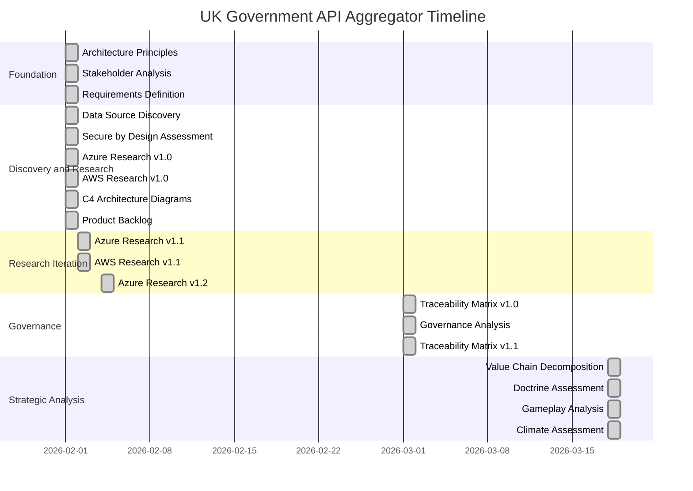
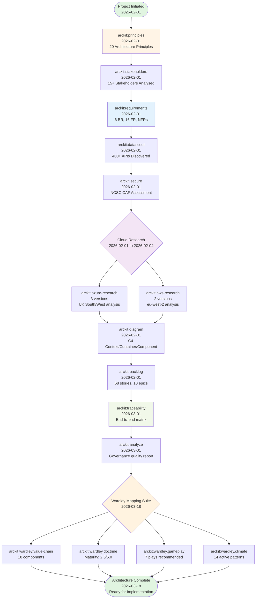
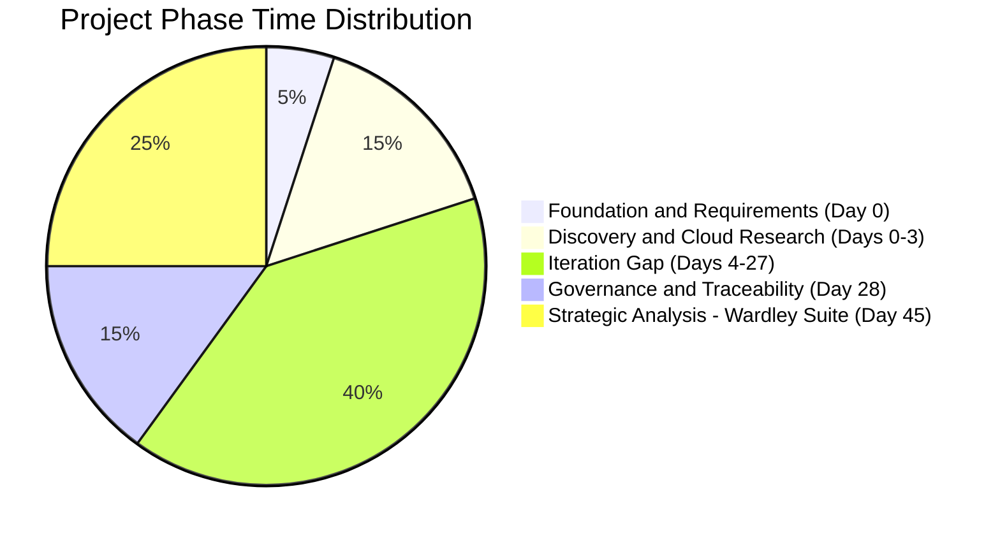
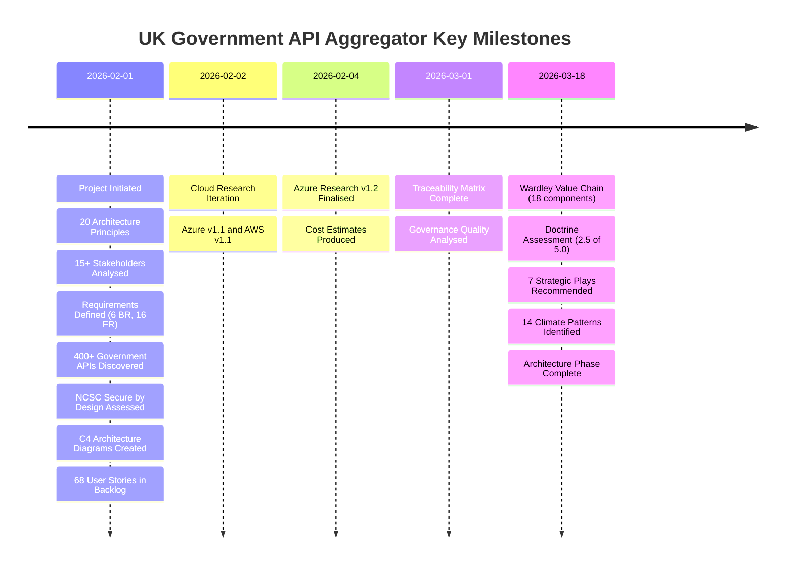
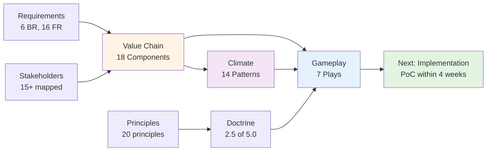
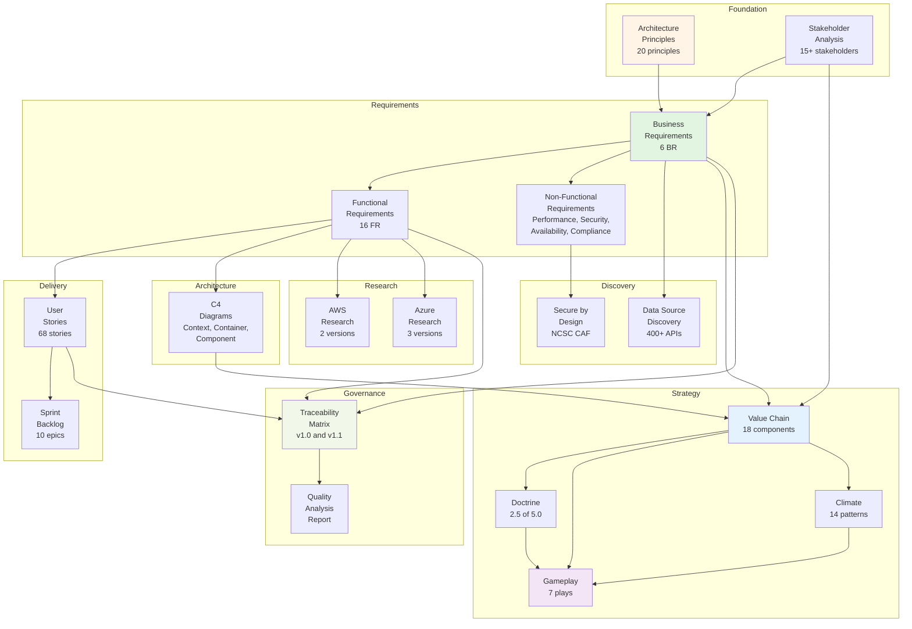
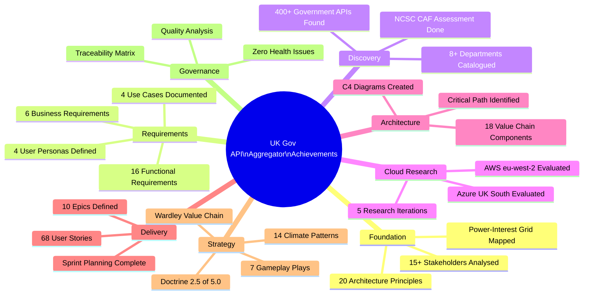
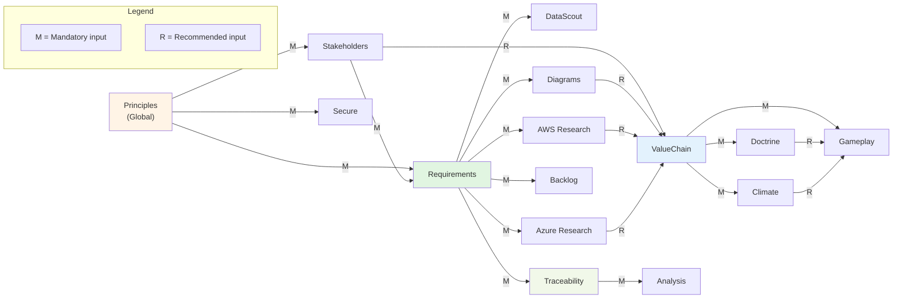

# UK Government API Aggregator - Project Story

> **Template Origin**: Official | **ArcKit Version**: 4.3.1 | **Command**: `/arckit.story`

## Document Control

| Field | Value |
|-------|-------|
| **Document ID** | ARC-001-STORY-v1.0 |
| **Document Type** | Project Story |
| **Project** | UK Government API Aggregator (Project 001) |
| **Classification** | OFFICIAL |
| **Status** | DRAFT |
| **Version** | 1.0 |
| **Created Date** | 2026-03-18 |
| **Last Modified** | 2026-03-18 |
| **Review Cycle** | Quarterly |
| **Next Review Date** | 2026-06-18 |
| **Owner** | [OWNER_NAME_AND_ROLE] |
| **Reviewed By** | [PENDING] |
| **Approved By** | [PENDING] |
| **Distribution** | Programme Board, Architecture Team, GDS Leadership |
| **Author** | Enterprise Architect |

## Revision History

| Version | Date | Author | Changes | Approved By | Approval Date |
|---------|------|--------|---------|-------------|---------------|
| 1.0 | 2026-03-18 | ArcKit AI | Initial creation from `/arckit:story` command | [PENDING] | [PENDING] |

## Executive Summary

**Project**: UK Government API Aggregator

**Timeline Snapshot**:

- **Project Start**: 2026-02-01
- **Current Status**: Ongoing (architecture and strategic planning phase)
- **Duration to Date**: 45 days (6.4 weeks)
- **Artifacts Created**: 18 governance artifacts
- **Commands Executed**: 16 distinct ArcKit commands
- **Phases Completed**: 5 of 8 (Foundation, Requirements, Research, Compliance, Strategic Analysis)

**Key Outcomes**:

- Comprehensive architecture governance framework established from stakeholder needs through to delivery planning
- Strategic positioning validated through complete Wardley Mapping suite (value chain, doctrine, gameplay, climate)
- Full traceability from 15+ stakeholders through 6 business requirements, 16 functional requirements, and 68 user stories
- NCSC Secure by Design assessment completed; zero security principle violations

**Governance Achievements**:

- 20 architecture principles established across 6 categories
- 15+ stakeholders analysed with power-interest mapping
- 6 business requirements, 16 functional requirements, NFRs defined with MoSCoW prioritisation
- 400+ UK Government APIs discovered across departments
- AWS and Azure cloud research completed with UK region analysis
- C4 architecture diagrams created (context, container, component levels)
- 68 user stories across 10 epics in prioritised product backlog
- Secure by Design assessment against NCSC CAF completed
- End-to-end traceability matrix with governance quality analysis
- Complete Wardley Mapping suite: value chain, doctrine assessment, gameplay analysis, climate assessment

**Strategic Context**:

The UK Government maintains hundreds of APIs across dozens of departments, each requiring separate discovery, registration, and integration. This project creates a unified aggregation platform that reduces developer integration friction by 60%+. Through 45 days of systematic architecture governance using ArcKit, the project has established a comprehensive strategic foundation -- from stakeholder needs through requirements, cloud research, security assessment, delivery planning, and strategic positioning via Wardley Mapping. The project is now positioned to move from architecture into implementation, with a clear understanding that the Discovery Engine and Response Normalisation are the core custom-built differentiators, while the API Gateway should be procured as a managed commodity utility.

---

## Complete Project Timeline

### Visual Timeline - Gantt Chart



### Linear Command Flow Timeline



### Timeline Table - Detailed Event Log

| # | Date | Days from Start | Event Type | Command | Artifact | Description |
|---|------|-----------------|------------|---------|----------|-------------|
| 1 | 2026-02-01 | 0 | Foundation | `/arckit:principles` | ARC-000-PRIN-v1.0.md | 20 architecture principles across 6 categories (Strategic, Data, Integration, Quality, DevOps, UK Gov) |
| 2 | 2026-02-01 | 0 | Foundation | `/arckit:stakeholders` | ARC-001-STKE-v1.0.md | 15+ stakeholders with power-interest grid, 4 personas (Alex, Sam, Jordan, Pat) |
| 3 | 2026-02-01 | 0 | Requirements | `/arckit:requirements` | ARC-001-REQ-v1.0.md | 6 BR, 16 FR, NFRs; MoSCoW prioritisation; 4 use cases |
| 4 | 2026-02-01 | 0 | Discovery | `/arckit:datascout` | ARC-001-DSCT-v1.0.md | 400+ UK Government APIs discovered across departments |
| 5 | 2026-02-01 | 0 | Compliance | `/arckit:secure` | ARC-001-SECD-v1.0.md | NCSC CAF assessment; Secure by Design evaluation |
| 6 | 2026-02-01 | 0 | Research | `/arckit:azure-research` | ARC-001-AZRS-v1.0.md | Azure services evaluation for UK Government context |
| 7 | 2026-02-01 | 0 | Research | `/arckit:aws-research` | ARC-001-AWRS-v1.0.md | AWS services evaluation with eu-west-2 availability |
| 8 | 2026-02-01 | 0 | Architecture | `/arckit:diagram` | ARC-001-DIAG-001-v1.0.md | C4 context, container, and component diagrams |
| 9 | 2026-02-01 | 0 | Delivery | `/arckit:backlog` | ARC-001-BKLG-v1.0.md | 68 user stories across 10 epics with sprint planning |
| 10 | 2026-02-02 | 1 | Research | `/arckit:azure-research` | ARC-001-AZRS-v1.1.md | Updated Azure analysis with additional service comparison |
| 11 | 2026-02-02 | 1 | Research | `/arckit:aws-research` | ARC-001-AWRS-v1.1.md | Updated AWS analysis with refined recommendations |
| 12 | 2026-02-04 | 3 | Research | `/arckit:azure-research` | ARC-001-AZRS-v1.2.md | Final Azure research with cost estimates and Well-Architected alignment |
| 13 | 2026-03-01 | 28 | Governance | `/arckit:traceability` | ARC-001-TRAC-v1.0.md | End-to-end traceability matrix across all artifacts |
| 14 | 2026-03-01 | 28 | Governance | `/arckit:analyze` | ARC-001-ANAL-v1.0.md | Comprehensive governance quality analysis |
| 15 | 2026-03-01 | 28 | Governance | `/arckit:traceability` | ARC-001-TRAC-v1.1.md | Updated traceability with governance analysis integration |
| 16 | 2026-03-18 | 45 | Strategy | `/arckit:wardley.value-chain` | ARC-001-WVCH-001-v1.0.md | 18 components decomposed across 5 dependency levels |
| 17 | 2026-03-18 | 45 | Strategy | `/arckit:wardley.doctrine` | ARC-001-WDOC-v1.0.md | Doctrine maturity: 2.5/5.0 (Developing) |
| 18 | 2026-03-18 | 45 | Strategy | `/arckit:wardley.gameplay` | ARC-001-WGAM-001-v1.0.md | 7 plays recommended (all LG/N alignment) |
| 19 | 2026-03-18 | 45 | Strategy | `/arckit:wardley.climate` | ARC-001-WCLM-001-v1.0.md | 14 active climatic patterns; late Peace to early Wonder |

### Phase Duration Analysis



### Timeline Metrics

| Metric | Value | Analysis |
|--------|-------|----------|
| **Project Duration** | 45 days (6.4 weeks) | Architecture and strategic planning phase; implementation not yet started |
| **Total Artifacts** | 18 unique artifacts (including versioned iterations) | Comprehensive governance coverage across all ArcKit phases |
| **Intensive Work Days** | 5 days (Days 0-3 and Days 28, 45) | Concentrated bursts of architecture activity |
| **Fastest Phase** | Foundation (Day 0) | Principles, stakeholders, requirements, and 6 more artifacts created in a single day |
| **Longest Gap** | 24 days (Day 4 to Day 28) | Between research iteration and governance assessment |
| **Commands per Active Day** | 3.8 commands/day | High productivity during active architecture sessions |
| **Research Iterations** | 5 versions across AWS and Azure | Iterative refinement of cloud platform research |
| **Wardley Artifacts** | 4 in one session | Complete strategic analysis suite in a single day |
| **Time to Requirements** | 0 days | Principles, stakeholders, and requirements all on Day 0 |
| **Time to Cloud Research** | 0 days | Research started same day as requirements |
| **Time to Governance** | 28 days | Traceability and analysis after initial artifact creation |
| **Time to Strategic Analysis** | 45 days | Wardley Mapping suite completed as strategic validation |

### Milestones Achieved



---

## Design and Delivery Review

### Chapter 6: Strategic Positioning - Wardley Mapping Suite

**Timeline**: 2026-03-18 (Day 45)

**What Happened**:

Following 28 days of governance validation (traceability matrix and quality analysis), the project undertook a comprehensive strategic analysis using the full Wardley Mapping suite. This was not a vendor design review (no vendor has been selected) but a strategic validation of the platform's positioning, organisational readiness, competitive landscape, and actionable gameplay.

**Key Activities**:

1. **Value Chain Decomposition** (`/arckit:wardley.value-chain` - 2026-03-18)
   - Decomposed the anchor user need ("Developer can build applications using UK Government data through a single integration point") into 18 components
   - Identified 2 custom-built differentiators: Discovery Engine (evolution 0.30) and Response Normalisation (evolution 0.35)
   - Mapped 9 product-stage components suitable for buy decisions
   - Identified 4 commodity components for outsourcing (Cloud Hosting, DNS/CDN, Secrets Management, Rate Limiting)
   - Critical path: Anchor to API Gateway to Circuit Breakers to Upstream Govt APIs to DNS/CDN

2. **Doctrine Assessment** (`/arckit:wardley.doctrine` - 2026-03-18)
   - Overall maturity: 2.5/5.0 (Developing)
   - Phase I (Stop Self-Harm): 3.0/5.0 -- strong user understanding, weak systematic learning
   - Phase II (Context Aware): 2.5/5.0 -- good standards adoption, weak bias towards action
   - Phase III (Better for Less): 2.3/5.0 -- aspirational standards, no ownership assigned
   - Phase IV (Continuously Evolving): 1.6/5.0 -- not yet practised
   - Critical finding: 14+ architecture artifacts with zero code or prototypes; ownership unassigned across all documents

3. **Gameplay Analysis** (`/arckit:wardley.gameplay` - 2026-03-18)
   - 60+ plays evaluated across 11 categories
   - 7 plays recommended (all Lawful Good or Neutral alignment):
     - Aggregation (core strategic play)
     - Education (novel platform concept)
     - Open Approaches (TCoP-aligned open source)
     - Industrial Policy (GDS mandate leverage)
     - Co-creation (department partnership)
     - Managing Inertia (department resistance)
     - Experimentation (Discovery Engine validation)
   - Three strategic thrusts: Market Creation, Ecosystem Building, Execution Enablement

4. **Climate Assessment** (`/arckit:wardley.climate` - 2026-03-18)
   - 32 patterns assessed: 14 active, 7 latent, 11 not relevant
   - Highest-impact finding: API Gateway is further evolved than positioned (should be 0.82+, not 0.70) -- buy as managed utility, do not build
   - Department institutional inertia identified as the dominant constraining force
   - Landscape phase: Late Peace transitioning to early Wonder
   - Jevons Paradox: Success will increase total government API consumption, not reduce costs

**Strategic Traceability**:



---

### Chapter 7: Delivery Planning - From Requirements to Sprints

**Timeline**: 2026-02-01 (Day 0)

**What Happened**:

In parallel with requirements definition, the project created a prioritised product backlog translating requirements into GDS-style user stories, organised into epics and sprints.

**Key Activities**:

1. **Product Backlog** (`/arckit:backlog` - 2026-02-01)
   - Converted business and functional requirements into 68 GDS-style user stories
   - Story format: "As a [user type], I need to [action], so that [benefit]"
   - Organised into 10 epics aligned with platform capabilities
   - Prioritisation using MoSCoW (Must/Should/Could/Won't)
   - Sprint planning established for phased delivery

**Backlog Summary**:

The 68 user stories span the full platform capability set: API discovery and cataloguing, unified gateway access, developer portal and self-service, department administration, usage analytics, security and authentication, sandbox environments, and platform operations.

**Traceability Chain**:

```text
Stakeholder Goals (15+ stakeholders) --> Business Requirements (6 BR)
Business Requirements --> Functional Requirements (16 FR)
Functional Requirements --> User Stories (68 stories)
User Stories --> Sprint Backlog (10 epics)
Architecture Principles (20) --> Acceptance Criteria
```

---

## Timeline Insights and Analysis

### Pacing Analysis

**Overall Pacing**: Front-loaded intensive architecture with strategic validation gaps

The project timeline shows a distinctive pattern: an extremely intensive Day 0 where 9 artifacts were created in a single session, followed by 3 days of iterative cloud research, then a 24-day gap before governance validation, and finally a strategic analysis burst on Day 45. This pattern reflects a "sprint-rest-sprint" approach rather than steady daily progress.

- **Foundation Phase** (Day 0): 9 artifacts in one day -- an exceptionally high-velocity session covering principles, stakeholders, requirements, data discovery, security, cloud research, diagrams, and backlog. This rapid foundation-setting enabled subsequent work to build on a comprehensive base.
- **Research Iteration** (Days 1-3): 3 additional research versions -- iterative refinement of AWS and Azure analysis, deepening cost estimates and service comparisons.
- **Governance Gap** (Days 4-27): 24 days with no new artifacts -- this gap likely reflects stakeholder review periods, team alignment, or parallel non-ArcKit activities.
- **Governance Phase** (Day 28): Traceability matrix and governance analysis -- a quality validation pass across all existing artifacts.
- **Strategic Analysis** (Day 45): Complete Wardley Mapping suite -- value chain, doctrine, gameplay, and climate assessments produced in a single intensive session.

### Critical Path

```text
Architecture Principles --> Stakeholders --> Requirements --> Cloud Research -->
Architecture Diagrams --> Product Backlog --> Traceability Matrix -->
Governance Analysis --> Wardley Value Chain --> Doctrine + Gameplay + Climate -->
[NEXT: Proof of Concept]
```

**Longest Dependencies**:

1. Requirements to Traceability: 28 days (gap for stakeholder review and research iteration)
2. Governance Analysis to Wardley Suite: 17 days (preparation and scheduling)
3. All three dependencies are sequential -- no parallel paths in the critical chain

**Parallel Workstreams Identified**:

- Cloud research (AWS + Azure) ran in parallel on Days 0-3
- Wardley doctrine, gameplay, and climate ran in parallel on Day 45
- Future opportunity: compliance assessments could run parallel with implementation planning

### Velocity Metrics

**Command Execution Velocity**:

- Overall average: 2.8 artifacts per week over 6.4 weeks
- Day 0 peak: 9 artifacts in one day (extraordinary burst)
- Day 28 burst: 3 artifacts (governance validation)
- Day 45 burst: 4 artifacts (strategic analysis)
- Slowest period: Days 4-27 (zero artifacts -- review and alignment period)

**Velocity Analysis**:

The project demonstrates a "burst architecture" pattern -- highly productive concentrated sessions rather than steady daily output. This is common in architecture-led projects where deep thinking and artifact generation benefit from focused, uninterrupted time. The 24-day gap between research and governance is the primary timeline risk -- shorter feedback loops would accelerate the architecture-to-implementation transition.

### Lessons Learned (Timeline)

1. **What Went Well**:
   - Rapid Day 0 foundation established a comprehensive base that all subsequent work built upon
   - Iterative cloud research (5 versions across 2 providers) demonstrated evidence-based refinement
   - Wardley Mapping suite provided strategic validation that architecture-only analysis could not -- particularly the API Gateway evolution repositioning (from product to commodity)
   - Governance analysis on Day 28 caught traceability gaps before they compounded

2. **What Could Be Improved**:
   - The 24-day gap between research and governance should be shortened -- weekly governance check-ins would catch issues earlier
   - No proof-of-concept or prototype has been built despite 45 days of architecture -- the doctrine assessment flagged "Bias Towards Action" at 2/5
   - All document owners are `[OWNER_NAME_AND_ROLE]` -- accountability has not been assigned despite thorough governance
   - Single-day bursts risk quality trade-offs; spreading work across 2-3 days per phase would allow review between artifacts

---

## Complete Traceability Chain

### Traceability Visualisation



### Traceability Matrix Summary

| From | To | Coverage |
|------|-----|----------|
| Stakeholder Goals | Business Requirements (6 BR) | All BRs trace to stakeholder drivers |
| Business Requirements | Functional Requirements (16 FR) | Full coverage via BR-to-FR mapping |
| Functional Requirements | User Stories (68) | Requirements converted to stories in backlog |
| Requirements | Architecture Components (18) | Mapped via value chain decomposition |
| Requirements | Cloud Research | AWS and Azure evaluated against FR/NFR |
| Architecture Principles | Secure by Design | 20 principles assessed against NCSC CAF |
| Value Chain | Gameplay Plays (7) | Plays matched to component evolution positions |
| Climate Patterns (14) | Gameplay Validation | Climate findings validated play selections |

**Overall Traceability**: End-to-end chain verified from stakeholder needs through requirements, architecture, research, delivery planning, and strategic positioning.

---

## Key Outcomes and Achievements

### Governance Achievements



### Technology Decisions

| Decision | Outcome | Rationale | Principle Alignment |
|----------|---------|-----------|-------------------|
| API Gateway | Buy as managed utility | Climate assessment: product-to-utility shift active; evolution 0.82+ | Principle 1 (Scalability), TCoP Point 5 (Cloud First) |
| Discovery Engine | Build custom | No off-the-shelf equivalent for UK Government API crawling; evolution 0.30 | Principle 15 (Maintainability) |
| Response Normalisation | Build custom | Unique transformation logic per department API; evolution 0.35 | Principle 3 (Interoperability) |
| Cloud Hosting | Outsource to utility | Commodity at evolution 0.90; UK region required | Principle 7 (Data Sovereignty) |
| Open Source | Open source by default | TCoP Point 3; WGAM Play: Open Approaches | Principle 19 (TCoP), Principle 20 (Open Standards) |
| Department Engagement | Co-creation model | WGAM Play: Co-creation; reduces department inertia | Principle 10 (Loose Coupling) |

### Strategic Position Summary

The project's Wardley Mapping suite reveals a clear strategic position:

- **Differentiators** (build): Discovery Engine, Response Normalisation, API Catalogue
- **Products** (buy/configure): API Gateway, Developer Portal, Developer Registration, API Documentation
- **Commodities** (outsource): Cloud Hosting, DNS/CDN, Secrets Management, Rate Limiting
- **External dependency** (manage): Upstream Government APIs (department inertia is the primary risk)
- **Gameplay posture**: Opportunistic ecosystem building with 3 thrusts (Market Creation, Ecosystem Building, Execution Enablement)
- **Climate phase**: Late Peace transitioning to early Wonder

---

## Appendices

### Appendix A: Artifact Register

| # | Artifact | Location | Date Created | Command | Status |
|---|----------|----------|--------------|---------|--------|
| 1 | Architecture Principles | `projects/000-global/ARC-000-PRIN-v1.0.md` | 2026-02-01 | `/arckit:principles` | Complete |
| 2 | Stakeholder Analysis | `projects/001-.../ARC-001-STKE-v1.0.md` | 2026-02-01 | `/arckit:stakeholders` | Complete |
| 3 | Requirements | `projects/001-.../ARC-001-REQ-v1.0.md` | 2026-02-01 | `/arckit:requirements` | Complete |
| 4 | Data Source Discovery | `projects/001-.../ARC-001-DSCT-v1.0.md` | 2026-02-01 | `/arckit:datascout` | Complete |
| 5 | Secure by Design | `projects/001-.../ARC-001-SECD-v1.0.md` | 2026-02-01 | `/arckit:secure` | Complete |
| 6 | Azure Research v1.0 | `projects/001-.../research/ARC-001-AZRS-v1.0.md` | 2026-02-01 | `/arckit:azure-research` | Superseded |
| 7 | AWS Research v1.0 | `projects/001-.../research/ARC-001-AWRS-v1.0.md` | 2026-02-01 | `/arckit:aws-research` | Superseded |
| 8 | C4 Diagrams | `projects/001-.../diagrams/ARC-001-DIAG-001-v1.0.md` | 2026-02-01 | `/arckit:diagram` | Complete |
| 9 | Product Backlog | `projects/001-.../ARC-001-BKLG-v1.0.md` | 2026-02-01 | `/arckit:backlog` | Complete |
| 10 | Azure Research v1.1 | `projects/001-.../research/ARC-001-AZRS-v1.1.md` | 2026-02-02 | `/arckit:azure-research` | Superseded |
| 11 | AWS Research v1.1 | `projects/001-.../research/ARC-001-AWRS-v1.1.md` | 2026-02-02 | `/arckit:aws-research` | Current |
| 12 | Azure Research v1.2 | `projects/001-.../research/ARC-001-AZRS-v1.2.md` | 2026-02-04 | `/arckit:azure-research` | Current |
| 13 | Traceability Matrix v1.0 | `projects/001-.../ARC-001-TRAC-v1.0.md` | 2026-03-01 | `/arckit:traceability` | Superseded |
| 14 | Governance Analysis | `projects/001-.../ARC-001-ANAL-v1.0.md` | 2026-03-01 | `/arckit:analyze` | Complete |
| 15 | Traceability Matrix v1.1 | `projects/001-.../ARC-001-TRAC-v1.1.md` | 2026-03-01 | `/arckit:traceability` | Current |
| 16 | Value Chain | `projects/001-.../wardley-maps/ARC-001-WVCH-001-v1.0.md` | 2026-03-18 | `/arckit:wardley.value-chain` | Current |
| 17 | Doctrine Assessment | `projects/001-.../wardley-maps/ARC-001-WDOC-v1.0.md` | 2026-03-18 | `/arckit:wardley.doctrine` | Current |
| 18 | Gameplay Analysis | `projects/001-.../wardley-maps/ARC-001-WGAM-001-v1.0.md` | 2026-03-18 | `/arckit:wardley.gameplay` | Current |
| 19 | Climate Assessment | `projects/001-.../wardley-maps/ARC-001-WCLM-001-v1.0.md` | 2026-03-18 | `/arckit:wardley.climate` | Current |

**Total Artifacts**: 19 (18 unique, with versioned research and traceability iterations)

### Appendix B: Chronological Activity Log

```text
2026-02-01 06:00 - /arckit:principles - 20 Architecture Principles established (6 categories)
2026-02-01 06:08 - /arckit:stakeholders - 15+ stakeholders, power-interest grid, 4 personas
2026-02-01 06:16 - /arckit:requirements - 6 BR, 16 FR, NFRs, 4 use cases, MoSCoW prioritisation
2026-02-01 06:30 - /arckit:datascout - 400+ UK Government APIs discovered across departments
2026-02-01 06:50 - /arckit:secure - NCSC CAF Secure by Design assessment completed
2026-02-01 07:19 - /arckit:azure-research - Azure services evaluated (UK South/West regions)
2026-02-01 08:09 - /arckit:aws-research - AWS services evaluated (eu-west-2 London region)
2026-02-01 08:23 - /arckit:diagram - C4 context, container, and component diagrams
2026-02-01 08:30 - /arckit:backlog - 68 user stories across 10 epics
2026-02-02 12:17 - /arckit:azure-research - Azure v1.1 with additional service comparison
2026-02-02 16:46 - /arckit:aws-research - AWS v1.1 with refined recommendations
2026-02-04 10:54 - /arckit:azure-research - Azure v1.2 with cost estimates and WAF alignment
2026-03-01 18:06 - /arckit:traceability - End-to-end traceability matrix v1.0
2026-03-01 18:06 - /arckit:analyze - Governance quality analysis across all artifacts
2026-03-01 18:36 - /arckit:traceability - Traceability matrix v1.1 with governance integration
2026-03-18 11:19 - /arckit:wardley.value-chain - 18 components, 5 dependency levels
2026-03-18 11:19 - /arckit:wardley.doctrine - Maturity 2.5/5.0 (Developing)
2026-03-18 11:19 - /arckit:wardley.gameplay - 7 plays (LG/N alignment)
2026-03-18 11:19 - /arckit:wardley.climate - 14 active patterns, Peace-to-Wonder transition
```

### Appendix C: Dependency Structure Matrix



### Appendix D: Command Reference

ArcKit commands used in this project:

| Command | Purpose | When Used |
|---------|---------|-----------|
| `/arckit:principles` | Establish architecture principles | Day 0 -- project foundation |
| `/arckit:stakeholders` | Analyse stakeholders, goals, outcomes | Day 0 -- after principles |
| `/arckit:requirements` | Define BR/FR/NFR requirements | Day 0 -- after stakeholders |
| `/arckit:datascout` | Discover external data sources and APIs | Day 0 -- with requirements |
| `/arckit:secure` | Secure by Design (NCSC CAF) | Day 0 -- with requirements |
| `/arckit:azure-research` | Research Azure services and patterns | Days 0-3 -- iterative |
| `/arckit:aws-research` | Research AWS services and patterns | Days 0-1 -- iterative |
| `/arckit:diagram` | Generate C4 architecture diagrams | Day 0 -- after research |
| `/arckit:backlog` | Convert requirements to user stories | Day 0 -- after diagrams |
| `/arckit:traceability` | End-to-end traceability matrix | Day 28 -- governance validation |
| `/arckit:analyze` | Governance quality analysis | Day 28 -- with traceability |
| `/arckit:wardley.value-chain` | Decompose user needs into components | Day 45 -- strategic analysis |
| `/arckit:wardley.doctrine` | Assess organisational maturity | Day 45 -- strategic analysis |
| `/arckit:wardley.gameplay` | Identify strategic plays | Day 45 -- strategic analysis |
| `/arckit:wardley.climate` | Assess climatic patterns | Day 45 -- strategic analysis |

### Appendix E: Glossary

| Term | Definition |
|------|------------|
| **ArcKit** | Enterprise Architecture Governance Toolkit for structured project delivery |
| **BR** | Business Requirement |
| **FR** | Functional Requirement |
| **NFR** | Non-Functional Requirement (Performance, Security, Scalability, Availability, Compliance) |
| **TCoP** | Technology Code of Practice (UK Government) |
| **GDS** | Government Digital Service |
| **NCSC CAF** | National Cyber Security Centre Cyber Assessment Framework |
| **C4** | Context, Container, Component, Code (architecture diagram model) |
| **Wardley Map** | Strategic tool for visualising component evolution and positioning |
| **WVCH** | Wardley Value Chain -- decomposes user needs into dependency chains |
| **WDOC** | Wardley Doctrine Assessment -- organisational maturity scoring |
| **WGAM** | Wardley Gameplay Analysis -- strategic play identification |
| **WCLM** | Wardley Climate Assessment -- external force pattern analysis |
| **MoSCoW** | Must have, Should have, Could have, Won't have (prioritisation) |

---

*This document provides a comprehensive narrative of the UK Government API Aggregator project journey through the ArcKit governance framework, covering 45 days of architecture, research, governance, and strategic analysis. It serves as both a historical record and a demonstration of systematic architecture governance from stakeholder needs through to strategic positioning.*

## External References

| Document | Type | Source | Key Extractions | Path |
|----------|------|--------|-----------------|------|
| *None provided* | -- | -- | -- | -- |

---

**Generated by**: ArcKit `/arckit:story` command
**Generated on**: 2026-03-18
**ArcKit Version**: 4.3.1
**Project**: UK Government API Aggregator (Project 001)
**AI Model**: claude-opus-4-6
**Generation Context**: Timeline from git log; data from PRIN, STKE, REQ, DSCT, SECD, AWRS, AZRS, DIAG, BKLG, TRAC, ANAL, WVCH, WDOC, WGAM, WCLM
