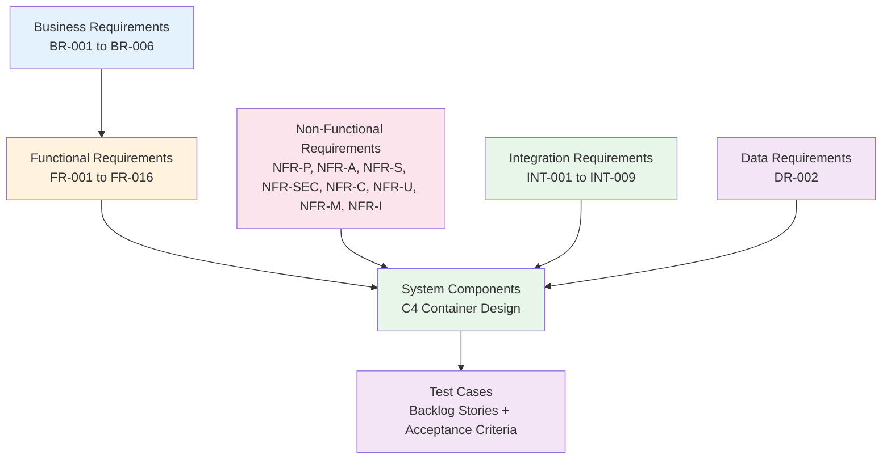

# Requirements Traceability Matrix: UK Government API Aggregator

> **Template Status**: Live | **ArcKit Version**: 2.22.5 | **Command**: `/arckit.traceability`

## Document Control

| Field | Value |
|-------|-------|
| **Document ID** | ARC-001-TRAC-v1.1 |
| **Document Type** | Requirements Traceability Matrix |
| **Project** | UK Government API Aggregator (Project 001) |
| **Classification** | OFFICIAL |
| **Status** | DRAFT |
| **Version** | 1.1 |
| **Created Date** | 2026-03-01 |
| **Last Modified** | 2026-03-01 |
| **Review Cycle** | Monthly |
| **Next Review Date** | 2026-03-31 |
| **Owner** | [PENDING] |
| **Reviewed By** | [PENDING] |
| **Approved By** | [PENDING] |
| **Distribution** | Programme Board, Architecture Team, Development Teams, Security Team, GDS Assessors |

## Revision History

| Version | Date | Author | Changes | Approved By | Approval Date |
|---------|------|--------|---------|-------------|---------------|
| 1.0 | 2026-03-01 | ArcKit AI | Initial creation from `/arckit.traceability` command | [PENDING] | [PENDING] |
| 1.1 | 2026-03-01 | ArcKit AI | Incorporated governance analysis findings (ARC-001-ANAL-v1.0): 5 critical + 8 high issues integrated into gap analysis; added updated research references (AWRS v1.1, AZRS v1.2); expanded compliance and governance gaps; updated action items and risk register; ArcKit version updated to 2.22.5 | [PENDING] | [PENDING] |

## Document Purpose

This document provides end-to-end requirements traceability for the UK Government API Aggregator platform, mapping 59 requirements from the requirements document (ARC-001-REQ-v1.0) through architecture design, implementation planning, and test coverage. It supports go/no-go decisions at phase gates, GDS Service Standard assessment evidence, and audit trail for compliance.

**v1.1 Update**: This revision incorporates findings from the Governance Analysis Report (ARC-001-ANAL-v1.0) which identified 26 findings (5 critical, 8 high, 9 medium, 4 low) that affect traceability coverage and gap analysis.

---

## 1. Overview

### 1.1 Purpose

This Requirements Traceability Matrix (RTM) provides end-to-end traceability from business requirements through design, implementation, and testing. It ensures:

- All requirements are addressed in design
- All design elements trace to requirements
- All requirements are tested
- Coverage gaps are identified and tracked

### 1.2 Traceability Scope

This matrix traces:

### 1.3 Document References

| Document | Version | Date | Link |
|----------|---------|------|------|
| Requirements Document | 1.0 | 2026-02-01 | ARC-001-REQ-v1.0 |
| Architecture Diagrams (C4 Container) | 1.0 | 2026-02-01 | ARC-001-DIAG-001-v1.0 |
| Secure by Design Assessment | 1.0 | 2026-02-01 | ARC-001-SECD-v1.0 |
| Product Backlog | 1.0 | 2026-02-01 | ARC-001-BKLG-v1.0 |
| Stakeholder Analysis | 1.0 | 2026-02-01 | ARC-001-STKE-v1.0 |
| Architecture Principles | 1.0 | 2026-02-01 | ARC-000-PRIN-v1.0 |
| Data Source Discovery | 1.0 | 2026-02-01 | ARC-001-DSCT-v1.0 |
| Governance Analysis Report | 1.0 | 2026-03-01 | ARC-001-ANAL-v1.0 |
| AWS Technology Research | 1.1 | 2026-02-02 | ARC-001-AWRS-v1.1 |
| Azure Technology Research | 1.2 | 2026-02-04 | ARC-001-AZRS-v1.2 |
| High-Level Design (HLD) | — | — | Not yet created |
| Detailed Design (DLD) | — | — | Not yet created |
| Test Plan | — | — | Not yet created |
| Risk Register | — | — | Not yet created |
| DPIA | — | — | Not yet created |

---

## 2. Traceability Matrix

### 2.1 Forward Traceability: Business Requirements → Design → Implementation → Tests

| Req ID | Requirement | Priority | Design Component(s) | Design Ref | Implementation (Backlog) | Test Coverage | Status |
|--------|-------------|----------|---------------------|------------|--------------------------|---------------|--------|
| BR-001 | Cross-Government API Discovery and Cataloguing | MUST | Discovery Engine, Aurora PostgreSQL, OpenSearch Service | DIAG §Container, §Component Inventory | EPIC-005: Story-DISC-001 to Story-DISC-005 | Acceptance criteria per story; integration tests for crawler | ⏳ Planned |
| BR-002 | Unified API Access Gateway | MUST | API Gateway, Gateway Orchestrator, Dept Adapters (x8) | DIAG §Container, Decision 1 & 2 | EPIC-003: Story-GW-001 to Story-GW-009 | Performance tests (NFR-P-001); integration tests per adapter | ⏳ Planned |
| BR-003 | Developer Self-Service Portal | MUST | Developer Portal (ECS Fargate, GOV.UK Design System), Cognito, Aurora | DIAG §Container, Decision 4 | EPIC-006: Story-PORT-001 to Story-PORT-006 | UAT with developer persona (Alex); WCAG 2.2 AA audit | ⏳ Planned |
| BR-004 | Department Control and Transparency | MUST | Admin Portal, Dept Adapters, Analytics Processor | DIAG §Container | EPIC-008: Story-ADMIN-001 to Story-ADMIN-005 | UAT with dept admin persona (Sam); analytics dashboard tests | ⏳ Planned |
| BR-005 | Value for Money Evidence | MUST | Analytics Processor, Aurora, CloudWatch | DIAG §Container | EPIC-009: Story-ANAL-001 to Story-ANAL-004 | Dashboard metric accuracy tests; cost-per-call calculation validation | ⏳ Planned |
| BR-006 | Phased Delivery with Stop/Go Gates | MUST | CI/CD Pipeline, IaC, Multi-environment deployment | BKLG EPIC-001 | EPIC-001: Story-INFRA-001 to Story-INFRA-005 | Pipeline validation; environment smoke tests | ⏳ Planned |

### 2.2 Forward Traceability: Functional Requirements → Design → Implementation → Tests

| Req ID | Requirement | Priority | Design Component(s) | Design Ref | Implementation (Backlog) | Test Coverage | Status |
|--------|-------------|----------|---------------------|------------|--------------------------|---------------|--------|
| FR-001 | API Catalogue Discovery Engine | MUST | Discovery Engine (ECS Fargate, Python), Aurora, OpenSearch | DIAG §Container | EPIC-005: Story-DISC-001 (Crawl api.gov.uk), Story-DISC-002 (Index metadata) | Integration: crawl api.gov.uk and verify indexing; unit: metadata parser | ⏳ Planned |
| FR-002 | API Catalogue Search and Browse | MUST | OpenSearch Service, Developer Portal | DIAG §Container | EPIC-005: Story-DISC-003 (Full-text search), Story-DISC-004 (Faceted filters) | Performance: < 500ms p95; functional: search relevance tests | ⏳ Planned |
| FR-003 | Developer Registration and Account Management | MUST | Developer Portal, Amazon Cognito, Aurora | DIAG §Container, §Auth | EPIC-002: Story-AUTH-001; EPIC-006: Story-PORT-001 | Functional: registration flow; security: MFA enforcement | ⏳ Planned |
| FR-004 | API Key Management | MUST | API Gateway, Cognito, Aurora | DIAG §Container, §Auth | EPIC-002: Story-AUTH-003, Story-AUTH-004 | Functional: key generation/rotation/revocation; security: key hashing | ⏳ Planned |
| FR-005 | API Gateway Request Routing | MUST | API Gateway, Gateway Orchestrator, Dept Adapters | DIAG §Container, Decision 2, §Sequence | EPIC-003: Story-GW-001, Story-GW-002 | Performance: < 50ms overhead p95; functional: routing accuracy | ⏳ Planned |
| FR-006 | Response Normalisation | SHOULD | Department Adapters (x8) | DIAG §Container, Decision 1 | EPIC-003: Story-GW-005 | Integration: normalised response format per department; unit: date/error/pagination normalisation | ⏳ Planned |
| FR-007 | Sandbox Environment | MUST | Developer Portal, Gateway Orchestrator | DIAG §Container | EPIC-003: Story-GW-009; EPIC-006 | Functional: sandbox returns mock responses; isolation: sandbox traffic not routed to production APIs | ⏳ Planned |
| FR-008 | Usage Analytics Dashboard | MUST | Analytics Processor, Developer Portal, Admin Portal | DIAG §Container | EPIC-009: Story-ANAL-001 to Story-ANAL-004 | Functional: metric accuracy; performance: dashboard load time | ⏳ Planned |
| FR-009 | Department Administration Portal | MUST | Admin Portal (ECS Fargate, GOV.UK Design System), Cognito, Aurora | DIAG §Container | EPIC-008: Story-ADMIN-001 to Story-ADMIN-005 | UAT: dept admin workflows; RBAC: role isolation tests | ⏳ Planned |
| FR-010 | API Health Monitoring and Status Page | MUST | Gateway Orchestrator, CloudWatch, EventBridge | DIAG §Container, §Observability | EPIC-007: Story-MON-001 to Story-MON-003 | Integration: health check accuracy; functional: status page updates | ⏳ Planned |
| FR-011 | API Documentation Rendering | MUST | Developer Portal, OpenSearch | DIAG §Container | EPIC-006: Story-PORT-004 | Functional: OpenAPI spec rendering; UAT: doc usability | ⏳ Planned |
| FR-012 | Rate Limiting and Throttling | MUST | API Gateway, ElastiCache Redis | DIAG §Container, §Sequence | EPIC-003: Story-GW-003 | Performance: rate limit enforcement accuracy; load: burst handling | ⏳ Planned |
| FR-013 | Circuit Breaker and Fault Isolation | MUST | Department Adapters, ElastiCache Redis | DIAG §Container, Decision 1, §Sequence | EPIC-003: Story-GW-004 | Chaos: fault injection per department; functional: circuit open/half-open/closed states | ⏳ Planned |
| FR-014 | Webhook Notifications | SHOULD | EventBridge, SQS, Lambda (Webhook Delivery) | DIAG §Container | EPIC-010: Story-NOTIF-001 to Story-NOTIF-003 | Integration: webhook delivery and retry; functional: event triggers | ⏳ Planned |
| FR-015 | API Versioning Support | MUST | API Gateway, Gateway Orchestrator | DIAG §Container | EPIC-003: Story-GW-006 | Functional: version routing; regression: backward compatibility | ⏳ Planned |
| FR-016 | Platform Administration and Configuration | MUST | Admin Portal, CloudWatch | DIAG §Container | EPIC-008: Story-ADMIN-001 to Story-ADMIN-005 | RBAC: platform admin role tests; functional: configuration changes | ⏳ Planned |

### 2.3 Forward Traceability: Non-Functional Requirements → Design → Tests

#### Performance Requirements

| Req ID | Requirement | Target | Design Component(s) | Design Strategy | Test Plan | Status |
|--------|-------------|--------|---------------------|-----------------|-----------|--------|
| NFR-P-001 | Gateway Response Time | < 50ms overhead p95 | API Gateway, Gateway Orchestrator, ElastiCache Redis | API Gateway native pass-through; Redis sub-ms cache/rate check; Fargate co-located in same AZ | Load test: JMeter/k6 at 5,000 req/s measuring p95 latency | ⏳ Planned |
| NFR-P-002 | Catalogue Search Performance | < 500ms p95 | OpenSearch Service (2x r6g.large, Multi-AZ) | Dedicated search index, optimised mappings | Performance test: search queries at scale, measure p95 | ⏳ Planned |
| NFR-P-003 | Developer Portal Performance | < 2s page load | Developer Portal, CloudFront CDN | Static assets cached at edge; server-side rendering | Performance test: Lighthouse scores; load test portal pages | ⏳ Planned |
| NFR-P-004 | Throughput Capacity | 5,000 req/s sustained | API Gateway, ECS Auto Scaling | API Gateway auto-scales; ECS scales on p95 latency > 40ms or CPU > 70% | Stress test: sustained 5K req/s; spike test: 10K burst | ⏳ Planned |

#### Availability and Resilience Requirements

| Req ID | Requirement | Target | Design Component(s) | Design Strategy | Test Plan | Status |
|--------|-------------|--------|---------------------|-----------------|-----------|--------|
| NFR-A-001 | Platform Availability Target | 99.9% uptime | All components (Multi-AZ across 3 AZs) | Multi-AZ deployment; managed services with SLAs; auto-healing | Availability monitoring; monthly SLA calculation | ⏳ Planned |
| NFR-A-002 | Disaster Recovery | RPO 1hr, RTO 4hr | Aurora (cross-region replica to eu-west-1), S3 replication | Continuous backup with PITR; hourly snapshots; cross-region replica | DR drill: failover to eu-west-1; restore from backup | ⏳ Planned |
| NFR-A-003 | Upstream API Fault Isolation | Per-department isolation | Per-dept Adapters, Circuit Breakers, ElastiCache Redis | Separate ECS service per dept; circuit breaker in Redis; bulkhead pattern | Chaos test: kill one adapter, verify others unaffected | ⏳ Planned |

#### Scalability Requirements

| Req ID | Requirement | Target | Design Component(s) | Design Strategy | Test Plan | Status |
|--------|-------------|--------|---------------------|-----------------|-----------|--------|
| NFR-S-001 | Horizontal Scaling | Auto-scale all compute layers | ECS Fargate (auto-scaling), API Gateway (auto), Aurora Serverless v2 | Stateless services; ECS Service Auto Scaling; Aurora ACU auto-scaling | Scale test: ramp from 100 to 5,000 req/s; verify auto-scale triggers | ⏳ Planned |
| NFR-S-002 | Adapter Extensibility | Add new dept adapter without core changes | Adapter-per-Department architecture (Decision 1) | Independent ECS service per dept; shared adapter framework; independent deploy | Integration: deploy new adapter; verify no impact on existing adapters | ⏳ Planned |

#### Security Requirements

| Req ID | Requirement | Target | Design Component(s) | Design Strategy | Security Test | Status |
|--------|-------------|--------|---------------------|-----------------|---------------|--------|
| NFR-SEC-001 | Consumer Authentication | MFA for portal; API key + JWT for gateway | Amazon Cognito, API Gateway | Cognito user pools with MFA; JWT validation at API Gateway | Security: MFA bypass attempts; token forgery; session hijacking | ⏳ Planned |
| NFR-SEC-002 | Role-Based Access Control | 4 roles (Developer, Dept Admin, Platform Admin, Viewer) | Cognito Groups, IAM Policies | Cognito groups mapped to RBAC roles; per-endpoint authorisation | Security: privilege escalation tests; role boundary tests | ⏳ Planned |
| NFR-SEC-003 | Encryption | TLS 1.2+ in transit, AES-256 at rest | AWS KMS, Aurora encryption, TLS everywhere | Customer-managed KMS keys; per-department CMKs; TLS 1.3 preferred | Security: certificate validation; encryption-at-rest audit; TLS version check | ⏳ Planned |
| NFR-SEC-004 | Secrets Management | Automated rotation, no hardcoded secrets | AWS Secrets Manager | Per-department secrets; 90-day auto-rotation; IAM-scoped access | Security: secrets scanning in CI/CD; rotation validation | ⏳ Planned |
| NFR-SEC-005 | Credential Isolation | Per-department isolation | Secrets Manager (per-dept secrets + IAM policies) | Separate secrets per dept; IAM policies prevent cross-dept access | Security: cross-department access attempt; IAM policy validation | ⏳ Planned |
| NFR-SEC-006 | Vulnerability Management | Critical: 24h, High: 7d, Medium: 30d | CI/CD Pipeline (SAST, DAST, SCA) | SAST on every PR; DAST in staging; dependency scanning; pen testing at phase gates | Security: SAST/DAST pipeline validation; pen test before Beta | ⏳ Planned |
| NFR-SEC-007 | Input Validation and API Security | OWASP API Security Top 10 mitigated | API Gateway, Gateway Orchestrator, WAF | Request validation; payload size limits; content-type enforcement; OWASP rules in WAF | Security: OWASP ZAP automated scan; manual pen test | ⏳ Planned |

#### Compliance Requirements

| Req ID | Requirement | Target | Design Component(s) | Design Strategy | Compliance Evidence | Status |
|--------|-------------|--------|---------------------|-----------------|---------------------|--------|
| NFR-C-001 | UK GDPR and Data Protection Act 2018 | Full compliance | Aurora (UK data residency), Cognito, Privacy Notice | UK-only data residency (eu-west-2); minimal PII; DPIA required | DPIA (not started — ANAL C-01 CRITICAL); privacy notice (not published — ANAL M-09) | ❌ Gap |
| NFR-C-002 | Audit Logging | Tamper-evident, 2-year retention | CloudTrail, CloudWatch Logs | Structured JSON logs; tamper-evident (CloudTrail); 2-year retention in S3 | Audit: log completeness check; tamper detection validation | ⏳ Planned |
| NFR-C-003 | Technology Code of Practice (TCoP) | All 12 points addressed | All components | Open standards (PostgreSQL, REST); cloud-first (AWS); GOV.UK Design System | TCoP assessment not yet created (ANAL H-01) — recommend `/arckit:tcop` | ⏳ Planned |
| NFR-C-004 | GDS Service Standard | All 14 points addressed | Developer Portal (GOV.UK Design System), all services | User-centred design; agile delivery; accessible; open source | GDS assessment not compiled (ANAL H-02) — recommend `/arckit:service-assessment` | ⏳ Planned |

#### Usability Requirements

| Req ID | Requirement | Target | Design Component(s) | Design Strategy | Test Plan | Status |
|--------|-------------|--------|---------------------|-----------------|-----------|--------|
| NFR-U-001 | Developer Portal UX | Intuitive, < 5 min to first API call | Developer Portal, GOV.UK Design System | GOV.UK Design System patterns; clear onboarding flow; try-it playground | UAT: time to first API call metric; developer satisfaction survey | ⏳ Planned |
| NFR-U-002 | Accessibility | WCAG 2.2 AA minimum | Developer Portal, Admin Portal | GOV.UK Design System (inherently accessible); ARIA labels; keyboard navigation | Accessibility audit: axe-core automated; manual screen reader test | ⏳ Planned |

#### Maintainability Requirements

| Req ID | Requirement | Target | Design Component(s) | Design Strategy | Test Plan | Status |
|--------|-------------|--------|---------------------|-----------------|-----------|--------|
| NFR-M-001 | Observability | Structured logs, distributed tracing, dashboards | CloudWatch, X-Ray, structured logging | Structured JSON logs with correlation IDs; X-Ray distributed tracing; SLO-based alerting | Operational: alert validation; trace completeness check | ⏳ Planned |
| NFR-M-002 | Documentation | Comprehensive API and architecture docs | Developer Portal (API doc rendering), OpenSearch | OpenAPI spec rendering; auto-generated from code; architecture decision records | Review: documentation completeness audit at each phase gate | ⏳ Planned |
| NFR-M-003 | Infrastructure as Code | 100% IaC, no manual provisioning | Terraform/CDK, CI/CD Pipeline | All infrastructure defined as code; environment parity via IaC | Validation: drift detection; environment consistency tests | ⏳ Planned |

#### Interoperability Requirements

| Req ID | Requirement | Target | Design Component(s) | Design Strategy | Test Plan | Status |
|--------|-------------|--------|---------------------|-----------------|-----------|--------|
| NFR-I-001 | Open API Standards | OpenAPI 3.0+ for all gateway endpoints | API Gateway, Gateway Orchestrator | All APIs documented as OpenAPI 3.0 specs; spec-first development | Validation: OpenAPI spec linting; contract testing | ⏳ Planned |
| NFR-I-002 | Open Source | Use open source where possible | PostgreSQL, Node.js, Python, GOV.UK Design System | Open standards and open source technologies throughout; MIT/Apache licensed | Review: license compliance scan; open source contribution policy | ⏳ Planned |

### 2.4 Forward Traceability: Integration Requirements → Design → Tests

| Req ID | Requirement | Priority | Design Component(s) | Design Ref | Implementation (Backlog) | Test Coverage | Status |
|--------|-------------|----------|---------------------|------------|--------------------------|---------------|--------|
| INT-001 | Integration with HMRC Developer Hub APIs | SHOULD | HMRC Adapter (ECS Fargate, OAuth 2.0) | DIAG §Container, §External Systems | EPIC-004: Story-INT-001 (8 pts, Sprint 3) | Integration: OAuth 2.0 token exchange; functional: VAT, SA, CT endpoint routing; circuit breaker test | ⏳ Planned |
| INT-002 | Integration with Companies House API | SHOULD | CH Adapter (ECS Fargate, API Key) | DIAG §Container, §Sequence | EPIC-004: Story-INT-002 (5 pts, Sprint 3) | Integration: API key auth; functional: company search, filing history; normalisation test | ⏳ Planned |
| INT-003 | Integration with DVLA APIs | SHOULD | DVLA Adapter (ECS Fargate, API Key) | DIAG §Container | EPIC-004: Story-INT-003 (5 pts, Sprint 4) | Integration: API key auth; functional: vehicle enquiry, MOT history | ⏳ Planned |
| INT-004 | Integration with NHS Digital APIs | SHOULD | NHS Adapter (ECS Fargate, OAuth 2.0) | DIAG §Container | EPIC-004: Story-INT-006 (8 pts, Sprint 5) | Integration: OAuth 2.0 + NHS CIS2 auth; functional: ODS, reference data; PII handling test | ⏳ Planned |
| INT-005 | Integration with Environment Agency APIs | SHOULD | EA Adapter (ECS Fargate, Open) | DIAG §Container | EPIC-004: Story-INT-004 (3 pts, Sprint 3) | Integration: open access (no auth); functional: flood, water quality, rainfall data | ⏳ Planned |
| INT-006 | Integration with Ordnance Survey Data Hub | SHOULD | OS Adapter (ECS Fargate, API Key) | DIAG §Container | EPIC-004: Story-INT-007 (5 pts, Sprint 5) | Integration: API key auth; functional: OS Places, Maps, Features | ⏳ Planned |
| INT-007 | Integration with Land Registry APIs | SHOULD | LR Adapter (ECS Fargate, API Key) | DIAG §Container | EPIC-004: Story-INT-008 (5 pts, Sprint 6) | Integration: API key + mTLS; functional: price paid, title plans; PII handling test | ⏳ Planned |
| INT-008 | Integration with DWP APIs | SHOULD | DWP Adapter (ECS Fargate, OAuth 2.0 enhanced) | DIAG §Container | EPIC-004: Story-INT-009 (8 pts, Sprint 7) | Integration: OAuth 2.0 enhanced auth; functional: benefits status, eligibility; PII handling test | ⏳ Planned |
| INT-009 | Integration with api.gov.uk Catalogue | SHOULD | Discovery Engine (ECS Fargate, Python) | DIAG §Container | EPIC-004: Story-INT-005 (5 pts, Sprint 4); EPIC-005 | Integration: HTML crawl/parse; functional: catalogue completeness check | ⏳ Planned |

### 2.5 Forward Traceability: Data Requirements → Design → Tests

| Req ID | Requirement | Priority | Design Component(s) | Design Ref | Implementation (Backlog) | Test Coverage | Status |
|--------|-------------|----------|---------------------|------------|--------------------------|---------------|--------|
| DR-002 | Data entities and governance | SHOULD | Aurora PostgreSQL (entity storage), Secrets Manager (credential data), CloudWatch (usage data) | DIAG §Container, §Data; SECD §3 | EPIC-001, EPIC-005, EPIC-009 | Data integrity tests; GDPR compliance audit; retention policy validation | ⏳ Planned |

---

### 2.6 Backward Traceability: Design Components → Requirements

This ensures no orphan design elements exist without requirement backing.

| Design Component | Technology | Requirements Addressed | Req IDs | Justified |
|------------------|------------|------------------------|---------|-----------|
| CloudFront CDN | AWS CloudFront | DDoS protection, edge caching, portal performance | NFR-P-003, NFR-SEC-007, NFR-A-001 | ✅ |
| AWS WAF | AWS WAF | OWASP protection, input validation | NFR-SEC-007, NFR-SEC-006 | ✅ |
| Route 53 | AWS Route 53 | DNS management, health routing | NFR-A-001 | ✅ |
| API Gateway | Amazon API Gateway REST | Consumer auth, rate limiting, request routing | FR-004, FR-005, FR-012, FR-015, NFR-SEC-001 | ✅ |
| Gateway Orchestrator | ECS Fargate, Node.js | Request routing, correlation IDs, caching | BR-002, FR-005, FR-006, FR-010, FR-015, NFR-P-001 | ✅ |
| Department Adapters (x8) | ECS Fargate | Per-dept auth, circuit breaker, normalisation | BR-002, BR-004, FR-005, FR-006, FR-013, NFR-A-003, NFR-S-002 | ✅ |
| Developer Portal | ECS Fargate, GOV.UK Design System | Registration, docs, sandbox, key mgmt, dashboards | BR-003, FR-002, FR-003, FR-007, FR-008, FR-011, NFR-U-001, NFR-U-002 | ✅ |
| Admin Portal | ECS Fargate, GOV.UK Design System | Department and platform administration | BR-004, FR-009, FR-016 | ✅ |
| Discovery Engine | ECS Fargate, Python | Crawls api.gov.uk, indexes APIs | BR-001, FR-001, INT-009 | ✅ |
| Analytics Processor | ECS Fargate | Aggregates usage data, generates dashboards | BR-005, FR-008 | ✅ |
| Webhook Delivery | AWS Lambda | Status and deprecation notifications | FR-014 | ✅ |
| Aurora PostgreSQL | Aurora Serverless v2 | Accounts, keys, catalogue, config | BR-001, BR-003, FR-001, FR-003, DR-002, NFR-C-001 | ✅ |
| ElastiCache Redis | ElastiCache Redis | Rate limit counters, response cache, circuit state | FR-005, FR-012, FR-013, NFR-P-001 | ✅ |
| OpenSearch Service | Amazon OpenSearch | Full-text catalogue search, faceted filtering | BR-001, FR-002, NFR-P-002 | ✅ |
| Amazon Cognito | Amazon Cognito | Developer/admin auth, MFA, RBAC | FR-003, FR-004, NFR-SEC-001, NFR-SEC-002 | ✅ |
| Secrets Manager | AWS Secrets Manager | Dept API credentials, per-dept isolation | NFR-SEC-004, NFR-SEC-005, INT-001 to INT-008 | ✅ |
| AWS KMS | AWS KMS | Encryption keys, per-department CMKs | NFR-SEC-003, NFR-SEC-005 | ✅ |
| EventBridge | Amazon EventBridge | Status changes, deprecation events, webhook triggers | FR-010, FR-014 | ✅ |
| SQS | Amazon SQS | Webhook delivery queue with retry/DLQ | FR-014 | ✅ |
| CloudWatch + X-Ray | CloudWatch, X-Ray | Logs, metrics, traces, dashboards | NFR-M-001, NFR-C-002, FR-010 | ✅ |
| CloudTrail | AWS CloudTrail | Tamper-evident administrative audit trail | NFR-C-002 | ✅ |
| GuardDuty | Amazon GuardDuty | Threat detection | NFR-SEC-006 | ✅ |

**Orphan Components**: None — all 21 design components trace to at least one requirement.

---

## 3. Coverage Analysis

### 3.1 Requirements Coverage Summary

| Category | Total | Design Covered | Design Partial | Design Gap | % Design Coverage |
|----------|-------|----------------|----------------|------------|-------------------|
| Business Requirements (BR) | 6 | 6 | 0 | 0 | 100% |
| Functional Requirements (FR) | 16 | 16 | 0 | 0 | 100% |
| Non-Functional — Performance (NFR-P) | 4 | 4 | 0 | 0 | 100% |
| Non-Functional — Availability (NFR-A) | 3 | 3 | 0 | 0 | 100% |
| Non-Functional — Scalability (NFR-S) | 2 | 2 | 0 | 0 | 100% |
| Non-Functional — Security (NFR-SEC) | 7 | 7 | 0 | 0 | 100% |
| Non-Functional — Compliance (NFR-C) | 4 | 4 | 0 | 0 | 100% |
| Non-Functional — Usability (NFR-U) | 2 | 2 | 0 | 0 | 100% |
| Non-Functional — Maintainability (NFR-M) | 3 | 3 | 0 | 0 | 100% |
| Non-Functional — Interoperability (NFR-I) | 2 | 2 | 0 | 0 | 100% |
| Integration Requirements (INT) | 9 | 9 | 0 | 0 | 100% |
| Data Requirements (DR) | 1 | 1 | 0 | 0 | 100% |
| **TOTAL** | **59** | **59** | **0** | **0** | **100%** |

### 3.2 Implementation Coverage Summary

| Category | Total | Backlog Stories Exist | Implementation Started | % Implementation Coverage |
|----------|-------|-----------------------|------------------------|---------------------------|
| Business Requirements (BR) | 6 | 6 | 0 | 0% (planned in backlog) |
| Functional Requirements (FR) | 16 | 16 | 0 | 0% (planned in backlog) |
| Non-Functional (NFR) | 27 | 22 | 0 | 0% (planned in backlog) |
| Integration (INT) | 9 | 9 | 0 | 0% (planned in backlog) |
| Data (DR) | 1 | 1 | 0 | 0% (planned in backlog) |
| **TOTAL** | **59** | **54** | **0** | **0%** |

**Note**: 5 NFRs (NFR-C-003, NFR-C-004, NFR-I-001, NFR-I-002, NFR-M-002) do not have dedicated backlog stories but are addressed as cross-cutting concerns within other epics and as compliance evidence documents. Governance analysis finding M-04 recommends adding dedicated stories or formally documenting these as cross-cutting concerns.

### 3.3 Test Coverage Summary

| Test Level | Total Tests Planned | Requirements Covered | % Coverage | Status |
|------------|---------------------|----------------------|------------|--------|
| Unit Tests | Planned per story | All FR stories | TBD | ⏳ Not Started |
| Integration Tests | Planned per adapter | INT-001 to INT-009, FR-005, FR-012 | TBD | ⏳ Not Started |
| Performance Tests | Planned (k6/JMeter) | NFR-P-001 to NFR-P-004 | TBD | ⏳ Not Started |
| Security Tests | Planned (SAST/DAST/pen test) | NFR-SEC-001 to NFR-SEC-007 | TBD | ⏳ Not Started |
| Accessibility Tests | Planned (axe-core + manual) | NFR-U-002 | TBD | ⏳ Not Started |
| UAT | Planned per persona | BR-003, BR-004, FR-009, NFR-U-001 | TBD | ⏳ Not Started |
| Chaos/Resilience Tests | Planned (fault injection) | NFR-A-003, FR-013 | TBD | ⏳ Not Started |
| DR Tests | Planned (DR drill) | NFR-A-002 | TBD | ⏳ Not Started |

**Test Coverage Goal**: 100% of MUST requirements tested before Beta gate; 80%+ of SHOULD requirements tested before Live.

### 3.4 Design Coverage by Component

| Component/Service | Requirements Addressed | Req IDs | % of Total Reqs | Comments |
|-------------------|------------------------|---------|------------------|----------|
| API Gateway + WAF + CloudFront | 7 | FR-004, FR-005, FR-012, FR-015, NFR-SEC-001, NFR-SEC-007, NFR-P-003 | 11.9% | Edge and gateway layer |
| Gateway Orchestrator | 6 | BR-002, FR-005, FR-006, FR-010, FR-015, NFR-P-001 | 10.2% | Core routing orchestration |
| Department Adapters (x8) | 16 | BR-002, BR-004, FR-005, FR-006, FR-013, NFR-A-003, NFR-S-002, INT-001 to INT-009 | 27.1% | Highest coverage — per-department isolation |
| Developer Portal | 8 | BR-003, FR-002, FR-003, FR-007, FR-008, FR-011, NFR-U-001, NFR-U-002 | 13.6% | Developer-facing services |
| Admin Portal | 3 | BR-004, FR-009, FR-016 | 5.1% | Administrative functions |
| Discovery Engine | 3 | BR-001, FR-001, INT-009 | 5.1% | Catalogue population |
| Aurora PostgreSQL | 6 | BR-001, BR-003, FR-001, FR-003, DR-002, NFR-C-001 | 10.2% | Primary data store |
| Cognito + KMS + Secrets Manager | 7 | FR-003, FR-004, NFR-SEC-001 to NFR-SEC-005 | 11.9% | Identity and secrets |
| Observability (CloudWatch, X-Ray, CloudTrail) | 3 | NFR-M-001, NFR-C-002, FR-010 | 5.1% | Monitoring and audit |

**Orphan Components**: None.

---

## 4. Gap Analysis

### 4.1 Requirements Without Formal HLD/DLD

**Finding**: No formal High-Level Design (HLD) or Detailed Design (DLD) documents exist. Design coverage is provided by the C4 Container Diagram (ARC-001-DIAG-001-v1.0) which includes component inventory, architecture decisions, and a 41-requirement traceability table. Governance analysis finding C-04 rates this as CRITICAL.

| Gap ID | Description | Severity | Impact | Recommendation | Target Date |
|--------|-------------|----------|--------|----------------|-------------|
| GAP-001 | No formal HLD document | CRITICAL | Insufficient detail for vendor evaluation, independent review, or procurement | Create formal HLD (ANAL C-04) | Before Alpha gate |
| GAP-002 | No formal DLD document | HIGH | Implementation teams lack detailed module/class-level guidance | Create DLD after HLD approval | Before Beta gate |
| GAP-003 | No formal Test Plan document | CRITICAL | Test strategy exists in backlog stories but not consolidated (ANAL C-05) | Create consolidated test plan with test cases mapped to requirements | Before Alpha gate |

### 4.2 Governance and Risk Gaps (New in v1.1)

Identified by Governance Analysis Report (ARC-001-ANAL-v1.0):

| Gap ID | Description | Severity | ANAL Finding | Impact | Recommendation | Target Date |
|--------|-------------|----------|--------------|--------|----------------|-------------|
| GAP-004 | No Risk Register | CRITICAL | C-03 | High-value platform with no formal risk management; HM Treasury Orange Book non-compliance | Create risk register (`/arckit:risk`) | Before Alpha gate |
| GAP-005 | No SOBC/Business Case | HIGH | H-06 | Major investment without Green Book 5-case model evidence | Create SOBC (`/arckit:sobc`) for Treasury evidence | Before Alpha gate |
| GAP-006 | No formal Data Model | HIGH | H-07 | DR-002 exists but no entity-relationship design for 240+ API catalogue | Create data model (`/arckit:data-model`) | Before Alpha gate |
| GAP-007 | No ADR documents | MEDIUM | M-06 | 4 key decisions documented informally in DIAG only; no structured options analysis | Formalise as ADRs (`/arckit:adr`) | Before Alpha gate |
| GAP-008 | SIRO not appointed | HIGH | H-03 | No senior executive accountable for security risk (NCSC CAF requirement) | Appoint SIRO within 14 days | Immediate |
| GAP-009 | Incident response plan not documented | HIGH | H-05 | No playbook for credential compromise or data breach scenarios | Document IR plan within 30 days | 2026-03-31 |
| GAP-010 | INT priority inconsistency | MEDIUM | M-05 | INT requirements use SHOULD in REQ but MUST in DSCT — mixed signals for delivery teams | Harmonise priorities across REQ and DSCT | Before Alpha gate |
| GAP-011 | Security policies not drafted | MEDIUM | M-08 | 6 core security policies required for NCSC CAF B1 not yet written | Draft policies within 60 days | 2026-04-30 |
| GAP-012 | Document owners not assigned | LOW | H-08, L-02, L-03, L-04 | 4 documents have `[OWNER_NAME_AND_ROLE]` placeholder — no accountability | Assign named owners to all artifacts | 2026-03-15 |

### 4.3 Requirements Without Test Plans

All 59 requirements have at least conceptual test coverage defined in this matrix. However, no formal test cases (TC-xxx) exist yet. The following requirements carry the highest risk due to their testing complexity:

| Req ID | Requirement | Priority | Test Gap | Risk Level | Recommendation |
|--------|-------------|----------|----------|------------|----------------|
| NFR-SEC-005 | Credential Isolation | MUST | No pen test or credential isolation validation defined | CRITICAL | Must pen test cross-department credential access before Beta |
| NFR-A-002 | Disaster Recovery | SHOULD | No DR drill conducted or scheduled | HIGH | Schedule DR drill before Beta; document recovery runbook |
| NFR-P-001 | Gateway Response Time | MUST | No load test baseline established | HIGH | Establish performance baseline in Alpha; continuous benchmarking |
| NFR-P-004 | Throughput Capacity | MUST | No stress test plan formalised | HIGH | Define stress test scenarios; establish burst handling baseline |
| NFR-C-001 | UK GDPR Compliance | SHOULD | DPIA not started; privacy notice not published | CRITICAL | Complete DPIA before any personal data flows through gateway |
| NFR-SEC-006 | Vulnerability Management | SHOULD | No pen test conducted | HIGH | Schedule independent pen test before Beta gate |

### 4.4 Design Components Without Requirements (Orphan Design Check)

| Component | Purpose | Traced to Requirements | Verdict |
|-----------|---------|------------------------|---------|
| GuardDuty | Threat detection | NFR-SEC-006 (Vulnerability Management) | ✅ Justified |
| NAT Gateways | Internet access for private subnets | Technical necessity for adapter → upstream API communication | ✅ Technical necessity |
| S3 (Static Assets, Log Archive) | Static hosting, log archival | NFR-C-002 (Audit Logging — 2-year retention), NFR-M-001 (Observability) | ✅ Justified |
| SNS Topics | Event notifications | FR-014 (Webhook Notifications) | ✅ Justified |

**Orphan Design Elements**: None identified. All design components trace to requirements or are justified as technical necessities.

### 4.5 Compliance and Governance Gaps

| Gap ID | Compliance Area | Requirement | Gap Description | Severity | ANAL Ref | Status |
|--------|----------------|-------------|-----------------|----------|----------|--------|
| GAP-C-001 | UK GDPR | NFR-C-001 | DPIA not started — legally required before processing personal data | CRITICAL | C-01 | Action required: 0-60 days |
| GAP-C-002 | UK GDPR | NFR-C-001 | Privacy notice not published for developer portal | CRITICAL | M-09 | Action required: 0-30 days |
| GAP-C-003 | UK GDPR | NFR-C-001 | Data processing agreements not in place with upstream departments | HIGH | — | Action required: before proxying personal data |
| GAP-C-004 | Cyber Essentials | NFR-SEC-006 | No Cyber Essentials Basic certification | HIGH | H-04 | Required before Beta gate |
| GAP-C-005 | TCoP | NFR-C-003 | TCoP assessment not yet created | HIGH | H-01 | Recommend `/arckit:tcop` before Alpha gate |
| GAP-C-006 | GDS Service Standard | NFR-C-004 | Service assessment evidence not compiled | HIGH | H-02 | Recommend `/arckit:service-assessment` before Beta gate |
| GAP-C-007 | Security | NFR-SEC-001-007 | STRIDE threat model not completed | CRITICAL | C-02 | Required before implementation begins |
| GAP-C-008 | Security | NFR-SEC-001-007 | Security policies (6 core) not drafted | MEDIUM | M-08 | Required for NCSC CAF B1 within 60 days |

---

## 5. Non-Functional Requirements Deep Traceability

### 5.1 Security Requirements — Detailed Trace

| NFR ID | Requirement | Design Control | SECD Reference | Backlog Story | Pen Test Required | Status |
|--------|-------------|----------------|----------------|---------------|-------------------|--------|
| NFR-SEC-001 | Consumer Authentication (MFA) | Cognito user pools + MFA; API Gateway JWT validation | SECD §B2 (Partially Achieved) | EPIC-002: Story-AUTH-001, Story-AUTH-005 | Yes — MFA bypass, token forgery | ⏳ |
| NFR-SEC-002 | RBAC (4 roles) | Cognito groups; per-endpoint authorisation | SECD §B2 (Partially Achieved) | EPIC-002: Story-AUTH-002 | Yes — privilege escalation | ⏳ |
| NFR-SEC-003 | Encryption (TLS 1.2+, AES-256) | KMS CMKs; Aurora encryption; TLS everywhere | SECD §B3 (Partially Achieved) | EPIC-001: Story-INFRA-001 (infra config) | Yes — TLS version, cipher audit | ⏳ |
| NFR-SEC-004 | Secrets Management (90-day rotation) | Secrets Manager; auto-rotation; IAM-scoped | SECD §B3 (Partially Achieved) | EPIC-004: Story-INT-010 | Yes — secrets exposure test | ⏳ |
| NFR-SEC-005 | Credential Isolation (per-dept) | Per-dept secrets + IAM policies | SECD §B3 (CRITICAL design control) | EPIC-004: Story-INT-010 | Yes — cross-dept access test | ⏳ |
| NFR-SEC-006 | Vulnerability Management | SAST/DAST/SCA in CI/CD; pen test at gates | SECD §B4, §C2, §6 | EPIC-001: Story-INFRA-004 | Yes — pen test before Beta | ⏳ |
| NFR-SEC-007 | Input Validation (OWASP Top 10) | WAF rules; request validation; payload limits | SECD §B4, §4.1 (OWASP Top 10) | EPIC-003: Story-GW-002 (gateway validation) | Yes — OWASP ZAP automated scan | ⏳ |

### 5.2 Compliance Requirements — Detailed Trace

| NFR ID | Requirement | Design Control | Evidence Document | Owner | Status |
|--------|-------------|----------------|-------------------|-------|--------|
| NFR-C-001 | UK GDPR | UK data residency (eu-west-2); minimal PII; DPIA required | DPIA (not started — ANAL C-01); Privacy Notice (not published — ANAL M-09) | DPO | ❌ Gap — DPIA required |
| NFR-C-002 | Audit Logging | CloudTrail (tamper-evident); CloudWatch Logs (2-year retention in S3) | Audit log configuration (to be implemented) | Platform Admin | ⏳ Planned |
| NFR-C-003 | TCoP | Open standards; cloud-first; GOV.UK Design System | TCoP assessment (not yet created — ANAL H-01) | Enterprise Architect | ⏳ Planned |
| NFR-C-004 | GDS Service Standard | User-centred design; agile; accessible; open source | Service assessment evidence (not compiled — ANAL H-02) | Service Owner | ⏳ Planned |

---

## 6. Risk Assessment

### 6.1 Traceability Risk Register

| Risk ID | Description | Severity | Likelihood | Impact | Mitigation | Owner |
|---------|-------------|----------|------------|--------|------------|-------|
| TRAC-R-001 | MUST requirement NFR-SEC-005 (credential isolation) lacks formal pen test validation | CRITICAL | High | A credential compromise could cascade across 34+ departments | Schedule independent pen test focused on credential isolation before Beta | Security Architect |
| TRAC-R-002 | NFR-C-001 (UK GDPR) — DPIA not started; platform processes personal data from HMRC/NHS/DWP | CRITICAL | Certain | Regulatory non-compliance; ICO enforcement action; project stop | Begin DPIA within 30 days; complete before any personal data flows | DPO |
| TRAC-R-003 | No formal HLD/DLD documents — design knowledge concentrated in diagram document | HIGH | Medium | Insufficient for independent review, vendor procurement, or new team onboarding | Create formal HLD before Alpha; DLD before Beta | Enterprise Architect |
| TRAC-R-004 | No test plan document — test coverage conceptual only | HIGH | Medium | Test gaps discovered late in development cycle | Create formal test plan with test cases before Alpha gate | QA Lead |
| TRAC-R-005 | STRIDE threat model not completed for credential aggregation attack surface | CRITICAL | High | Unknown attack vectors in the most sensitive part of the platform | Complete threat model within 30 days (per SECD and ANAL C-02) | Security Architect |
| TRAC-R-006 | No DR drill conducted; NFR-A-002 RPO/RTO targets untested | HIGH | Medium | Disaster recovery assumptions unvalidated; actual RTO may exceed 4 hours | Schedule DR drill before Beta; document recovery runbook | Platform Admin |
| TRAC-R-007 | Performance baselines not established for NFR-P-001 ( < 50ms) and NFR-P-004 (5K req/s) | HIGH | Medium | Performance targets may be missed in production; late detection | Establish baseline in Alpha; continuous benchmarking in CI/CD | Performance Engineer |
| TRAC-R-008 | No Risk Register document — platform has no formal risk management (ANAL C-03) | CRITICAL | Certain | Non-compliance with HM Treasury Orange Book; unknown risks unmanaged | Create risk register (`/arckit:risk`) before Alpha gate | Programme Manager |
| TRAC-R-009 | SIRO not appointed — no senior executive accountable for security risk (ANAL H-03) | HIGH | High | No accountability for security decisions; NCSC CAF governance gap | Appoint SIRO within 14 days | Programme Director |
| TRAC-R-010 | No incident response plan — no playbook for credential compromise (ANAL H-05) | HIGH | Medium | Incident response would be ad hoc, extending MTTR and blast radius | Document IR plan within 30 days | Security Architect |

---

## 7. Metrics and KPIs

### 7.1 Traceability Metrics

| Metric | Current Value | Target | Status |
|--------|---------------|--------|--------|
| Requirements with Design Coverage | 59/59 (100%) | 100% | ✅ On Track |
| Requirements with Implementation (Backlog) | 54/59 (91.5%) | 100% | ⚠️ At Risk — 5 NFRs lack dedicated stories |
| Requirements with Test Coverage (Formal) | 0/59 (0%) | 100% MUST, 80% SHOULD | ❌ Behind — no formal test plan |
| Orphan Design Components | 0 | 0 | ✅ On Track |
| Orphan Requirements (no design) | 0 | 0 | ✅ On Track |
| Outstanding Critical Gaps | 5 | 0 | ❌ Behind (was 4 in v1.0; +1 for risk register) |
| Outstanding High Gaps | 7 | 0 | ❌ Behind (was 4 in v1.0; +3 from governance analysis) |
| Governance Issues (from ANAL) | 26 (5C, 8H, 9M, 4L) | 0 | ❌ Behind |

### 7.2 Coverage by Priority

| Priority | Total | Design Covered | Implementation Planned | Formal Test Coverage | Status |
|----------|-------|----------------|------------------------|----------------------|--------|
| MUST | 38 | 38 (100%) | 38 (100%) | 0 (0%) | ⚠️ At Risk |
| SHOULD | 21 | 21 (100%) | 16 (76.2%) | 0 (0%) | ⚠️ At Risk |
| **TOTAL** | **59** | **59 (100%)** | **54 (91.5%)** | **0 (0%)** | ⚠️ At Risk |

### 7.3 Coverage Trends

| Date | Design Coverage | Implementation Coverage | Test Coverage | Governance Issues | Notes |
|------|----------------|-------------------------|---------------|-------------------|-------|
| 2026-03-01 (v1.0) | 100% | 0% (backlog only) | 0% | Not assessed | Baseline |
| 2026-03-01 (v1.1) | 100% | 0% (backlog only) | 0% | 26 (5C+8H+9M+4L) | Governance analysis integrated |

**Trend**: Design coverage stable at 100%. Implementation and testing not yet started. Governance analysis has surfaced additional gaps not visible in v1.0 (risk register, SIRO, IR plan, SOBC, data model, ADRs).

---

## 8. Executive Summary

### Overall Traceability Score: 48/100

| Dimension | Score | Weight | Weighted Score | Notes |
|-----------|-------|--------|----------------|-------|
| Design Coverage | 100/100 | 25% | 25.0 | All 59 requirements mapped to design components |
| Implementation Readiness | 45/100 | 20% | 9.0 | Backlog exists but no code; 5 NFRs lack dedicated stories |
| Test Readiness | 5/100 | 20% | 1.0 | Test approach defined per requirement but no formal test plan or test cases |
| Compliance Evidence | 30/100 | 20% | 6.0 | SECD complete; DPIA, TCoP, GDS assessment, risk register not started |
| Governance Maturity | 45/100 | 15% | 6.75 | Strong architecture foundation; missing SIRO, IR plan, formal ADRs, SOBC, data model |
| **TOTAL** | | **100%** | **47.75 → 48** | Rounded; down from 52 in v1.0 due to governance gaps surfaced by ANAL |

**Score Change from v1.0**: 52 → 48 (decrease of 4 points). The score decreased because v1.1 incorporates the governance analysis which identified gaps not visible in v1.0 (risk register, SIRO appointment, incident response plan, SOBC, data model). The underlying traceability has not degraded; rather, the assessment is now more comprehensive.

### Recommendation: GAPS MUST BE ADDRESSED

The platform has **strong design traceability** — all 59 requirements map to architecture components with clear rationale. However, the project is in early architecture phase with significant gaps in implementation, testing, compliance evidence, and governance maturity.

**Immediate Actions (0-14 days)**:
1. Appoint SIRO (TRAC-R-009 / ANAL H-03)
2. Assign document owners to all artifacts (GAP-012 / ANAL H-08, L-02-04)

**Before Alpha Gate (must resolve)**:
1. Complete STRIDE threat model (TRAC-R-005 / ANAL C-02)
2. Begin DPIA (TRAC-R-002 / ANAL C-01)
3. Create formal HLD document (GAP-001 / ANAL C-04)
4. Create formal test plan with test cases (GAP-003 / ANAL C-05)
5. Create risk register (TRAC-R-008 / ANAL C-03)
6. Create TCoP assessment (GAP-C-005 / ANAL H-01)

**Before Beta Gate (must resolve)**:
1. Complete DPIA (GAP-C-001)
2. Publish privacy notice (GAP-C-002)
3. Execute independent pen test — especially credential isolation (TRAC-R-001)
4. Conduct DR drill (TRAC-R-006)
5. Obtain Cyber Essentials Basic (GAP-C-004 / ANAL H-04)
6. Create DLD document (GAP-002)
7. Create GDS Service Assessment evidence pack (GAP-C-006 / ANAL H-02)
8. Document incident response plan (TRAC-R-010 / ANAL H-05)
9. Draft 6 core security policies (GAP-C-008 / ANAL M-08)

---

## 9. Action Items

### 9.1 Critical Actions (Blocking — Must Resolve Before Alpha)

| ID | Action | Owner | Priority | Target Date | Status | ANAL Ref |
|----|--------|-------|----------|-------------|--------|----------|
| ACT-001 | Complete STRIDE threat model for credential aggregation attack surface | Security Architect | CRITICAL | 2026-03-31 | Open | C-02 |
| ACT-002 | Begin DPIA for developer portal PII and proxied personal data | DPO | CRITICAL | 2026-03-31 | Open | C-01 |
| ACT-003 | Create formal HLD document with detailed component specifications | Enterprise Architect | CRITICAL | 2026-03-31 | Open | C-04 |
| ACT-004 | Create consolidated test plan with formal test cases | QA Lead | CRITICAL | 2026-03-31 | Open | C-05 |
| ACT-005 | Create risk register following HM Treasury Orange Book principles | Programme Manager | CRITICAL | 2026-03-31 | Open | C-03 |

### 9.2 High Priority Actions (Non-Blocking but Required Before Beta)

| ID | Action | Owner | Priority | Target Date | Status | ANAL Ref |
|----|--------|-------|----------|-------------|--------|----------|
| ACT-006 | Appoint SIRO (senior executive accountable for security risk) | Programme Director | HIGH | 2026-03-15 | Open | H-03 |
| ACT-007 | Publish developer portal privacy notice | DPO | HIGH | 2026-04-15 | Open | M-09 |
| ACT-008 | Complete DPIA | DPO | HIGH | 2026-04-30 | Open | C-01 |
| ACT-009 | Execute data processing agreements with upstream departments | Legal/DPO | HIGH | 2026-05-31 | Open | — |
| ACT-010 | Schedule independent penetration test (credential isolation focus) | Security Architect | HIGH | 2026-05-31 | Open | — |
| ACT-011 | Create DLD with module-level design for each component | Enterprise Architect | HIGH | 2026-05-31 | Open | — |
| ACT-012 | Document incident response plan for credential compromise | Security Architect | HIGH | 2026-03-31 | Open | H-05 |
| ACT-013 | Create TCoP assessment | Enterprise Architect | HIGH | 2026-04-30 | Open | H-01 |
| ACT-014 | Create GDS Service Assessment evidence pack | Service Owner | HIGH | 2026-05-31 | Open | H-02 |
| ACT-015 | Obtain Cyber Essentials Basic certification | IT Security | HIGH | 2026-06-30 | Open | H-04 |
| ACT-016 | Create SOBC using Green Book 5-case model | Programme Manager | HIGH | 2026-04-30 | Open | H-06 |
| ACT-017 | Create formal data model (entity-relationship design) | Data Architect | HIGH | 2026-04-15 | Open | H-07 |

### 9.3 Medium Priority Actions (Continuous Improvement)

| ID | Action | Owner | Priority | Target Date | Status | ANAL Ref |
|----|--------|-------|----------|-------------|--------|----------|
| ACT-018 | Add backlog stories for 5 NFRs lacking dedicated stories | Product Owner | MEDIUM | 2026-04-15 | Open | M-04 |
| ACT-019 | Formalise 4 architecture decisions as ADRs | Enterprise Architect | MEDIUM | 2026-04-15 | Open | M-06 |
| ACT-020 | Harmonise INT requirement priorities between REQ and DSCT | Business Analyst | MEDIUM | 2026-03-31 | Open | M-05 |
| ACT-021 | Expand data requirements beyond DR-002 (catalogue schema, caching, retention) | Data Architect | MEDIUM | 2026-04-15 | Open | M-07 |
| ACT-022 | Draft 6 core security policies for NCSC CAF B1 | Security Architect | MEDIUM | 2026-04-30 | Open | M-08 |
| ACT-023 | Establish performance baselines (NFR-P-001, NFR-P-004) | Performance Engineer | MEDIUM | 2026-05-31 | Open | — |
| ACT-024 | Schedule DR drill to validate RPO/RTO targets | Platform Admin | MEDIUM | 2026-05-31 | Open | — |
| ACT-025 | Assign named document owners to all artifacts (REQ, PRIN, STKE, BKLG) | Programme Manager | LOW | 2026-03-15 | Open | H-08, L-02-04 |
| ACT-026 | Create OpenAPI specifications for gateway endpoints | Lead Developer | MEDIUM | 2026-05-31 | Open | M-03 |

---

## 10. Review and Approval

### 10.1 Review Checklist

- [x] All business requirements traced to design components
- [x] All functional requirements traced to design components
- [x] All design components traced back to requirements (no orphans)
- [ ] All requirements have formal test cases defined
- [x] All gaps identified and action plan in place
- [x] All NFRs addressed in design
- [x] Governance analysis findings integrated (v1.1)
- [ ] Formal HLD document exists
- [ ] Formal DLD document exists
- [ ] Formal test plan exists
- [ ] Risk register exists
- [ ] DPIA completed
- [ ] Pen test completed

### 10.2 Approval

| Role | Name | Review Date | Approval | Signature | Date |
|------|------|-------------|----------|-----------|------|
| Product Owner | [PENDING] | | [ ] Approve [ ] Reject | _________ | |
| Enterprise Architect | [PENDING] | | [ ] Approve [ ] Reject | _________ | |
| QA Lead | [PENDING] | | [ ] Approve [ ] Reject | _________ | |
| Security Architect | [PENDING] | | [ ] Approve [ ] Reject | _________ | |
| Programme Manager | [PENDING] | | [ ] Approve [ ] Reject | _________ | |

---

## 11. Appendices

### Appendix A: Source Documents

| Document | ID | Version | Role in Traceability |
|----------|----|---------|----------------------|
| Requirements | ARC-001-REQ-v1.0 | 1.0 | Source: 59 requirements (6 BR, 16 FR, 27 NFR, 9 INT, 1 DR) |
| Architecture Diagrams | ARC-001-DIAG-001-v1.0 | 1.0 | Design: C4 container diagram, component inventory, 41-requirement traceability |
| Secure by Design | ARC-001-SECD-v1.0 | 1.0 | Security: NCSC CAF assessment, security controls mapping |
| Product Backlog | ARC-001-BKLG-v1.0 | 1.0 | Implementation: 68 stories across 10 epics, 325 story points |
| Stakeholder Analysis | ARC-001-STKE-v1.0 | 1.0 | Context: Stakeholder drivers and goals |
| Architecture Principles | ARC-000-PRIN-v1.0 | 1.0 | Governance: 10 architecture principles |
| Data Source Discovery | ARC-001-DSCT-v1.0 | 1.0 | Integration: 240+ upstream APIs across 34 departments |
| Governance Analysis | ARC-001-ANAL-v1.0 | 1.0 | Quality: 26 findings (5C, 8H, 9M, 4L) — integrated into v1.1 gap analysis |
| AWS Research | ARC-001-AWRS-v1.1 | 1.1 | Technology: AWS service recommendations for all components |
| Azure Research | ARC-001-AZRS-v1.2 | 1.2 | Technology: Azure service recommendations (alternative cloud) |

### Appendix B: Requirement ID Index

| ID Range | Category | Count | Priority Mix |
|----------|----------|-------|--------------|
| BR-001 to BR-006 | Business Requirements | 6 | 6 MUST |
| FR-001 to FR-016 | Functional Requirements | 16 | 14 MUST, 2 SHOULD |
| NFR-P-001 to NFR-P-004 | Performance | 4 | 4 MUST |
| NFR-A-001 to NFR-A-003 | Availability | 3 | 2 MUST, 1 SHOULD |
| NFR-S-001 to NFR-S-002 | Scalability | 2 | 2 MUST |
| NFR-SEC-001 to NFR-SEC-007 | Security | 7 | 5 MUST, 2 SHOULD |
| NFR-C-001 to NFR-C-004 | Compliance | 4 | 2 MUST, 2 SHOULD |
| NFR-U-001 to NFR-U-002 | Usability | 2 | 1 MUST, 1 SHOULD |
| NFR-M-001 to NFR-M-003 | Maintainability | 3 | 1 MUST, 2 SHOULD |
| NFR-I-001 to NFR-I-002 | Interoperability | 2 | 1 MUST, 1 SHOULD |
| INT-001 to INT-009 | Integration | 9 | 9 SHOULD |
| DR-002 | Data | 1 | 1 SHOULD |

### Appendix C: Governance Analysis Cross-Reference

| ANAL Finding | Severity | TRAC Gap/Risk | Status in TRAC |
|--------------|----------|---------------|----------------|
| C-01 (DPIA) | CRITICAL | GAP-C-001, TRAC-R-002, ACT-002/008 | Tracked |
| C-02 (Threat Model) | CRITICAL | GAP-C-007, TRAC-R-005, ACT-001 | Tracked |
| C-03 (Risk Register) | CRITICAL | GAP-004, TRAC-R-008, ACT-005 | Tracked |
| C-04 (HLD) | CRITICAL | GAP-001, TRAC-R-003, ACT-003 | Tracked |
| C-05 (Test Plan) | CRITICAL | GAP-003, TRAC-R-004, ACT-004 | Tracked |
| H-01 (TCoP) | HIGH | GAP-C-005, ACT-013 | Tracked |
| H-02 (GDS Assessment) | HIGH | GAP-C-006, ACT-014 | Tracked |
| H-03 (SIRO) | HIGH | GAP-008, TRAC-R-009, ACT-006 | Tracked |
| H-04 (Cyber Essentials) | HIGH | GAP-C-004, ACT-015 | Tracked |
| H-05 (IR Plan) | HIGH | GAP-009, TRAC-R-010, ACT-012 | Tracked |
| H-06 (SOBC) | HIGH | GAP-005, ACT-016 | Tracked |
| H-07 (Data Model) | HIGH | GAP-006, ACT-017 | Tracked |
| H-08 (Doc Owner) | HIGH | GAP-012, ACT-025 | Tracked |
| M-04 (NFR Stories) | MEDIUM | ACT-018 | Tracked |
| M-05 (INT Priority) | MEDIUM | GAP-010, ACT-020 | Tracked |
| M-06 (ADRs) | MEDIUM | GAP-007, ACT-019 | Tracked |
| M-07 (Data Reqs) | MEDIUM | ACT-021 | Tracked |
| M-08 (Security Policies) | MEDIUM | GAP-011, GAP-C-008, ACT-022 | Tracked |
| M-09 (Privacy Notice) | MEDIUM | GAP-C-002, ACT-007 | Tracked |

---

## External References

| Document | Type | Source | Key Extractions | Path |
|----------|------|--------|-----------------|------|
| Governance Analysis Report | Governance | ArcKit AI | 26 findings (5C+8H+9M+4L) integrated into v1.1 gap analysis | ARC-001-ANAL-v1.0 |
| AWS Research v1.1 | Technology Research | AWS Knowledge MCP | 20 AWS services, eu-west-2 availability, cost estimates | ARC-001-AWRS-v1.1 |
| Azure Research v1.2 | Technology Research | Microsoft Learn MCP | 12 Azure services, UK South/West availability, cost estimates | ARC-001-AZRS-v1.2 |

---

**Generated by**: ArcKit `/arckit.traceability` command
**Generated on**: 2026-03-01 12:00 GMT
**ArcKit Version**: 2.22.5
**Project**: UK Government API Aggregator (Project 001)
**AI Model**: Claude Opus 4.6 (claude-opus-4-6)
**Generation Context**: Traceability matrix v1.1 built from ARC-001-REQ-v1.0 (59 requirements), ARC-001-DIAG-001-v1.0 (C4 container design with 21 components and 41-requirement mapping), ARC-001-SECD-v1.0 (NCSC CAF security assessment), ARC-001-BKLG-v1.0 (68 stories, 10 epics, 325 story points), ARC-001-STKE-v1.0 (stakeholder drivers), ARC-000-PRIN-v1.0 (architecture principles), ARC-001-ANAL-v1.0 (governance analysis — 26 findings integrated), ARC-001-AWRS-v1.1 (AWS research), ARC-001-AZRS-v1.2 (Azure research)
