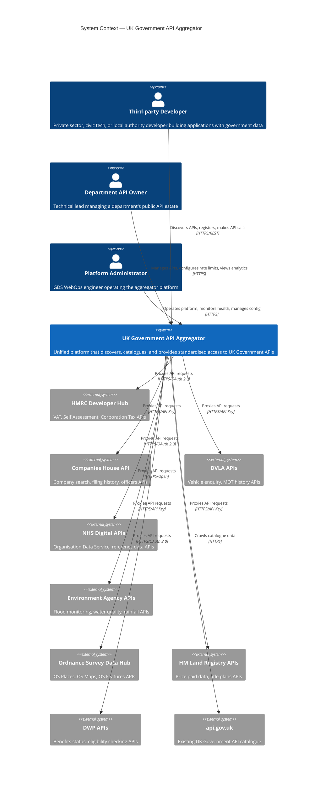
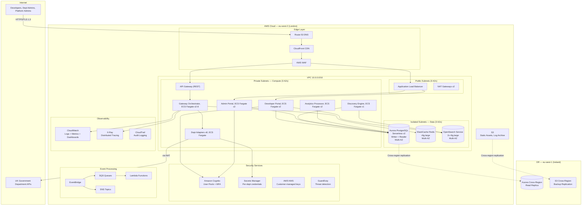
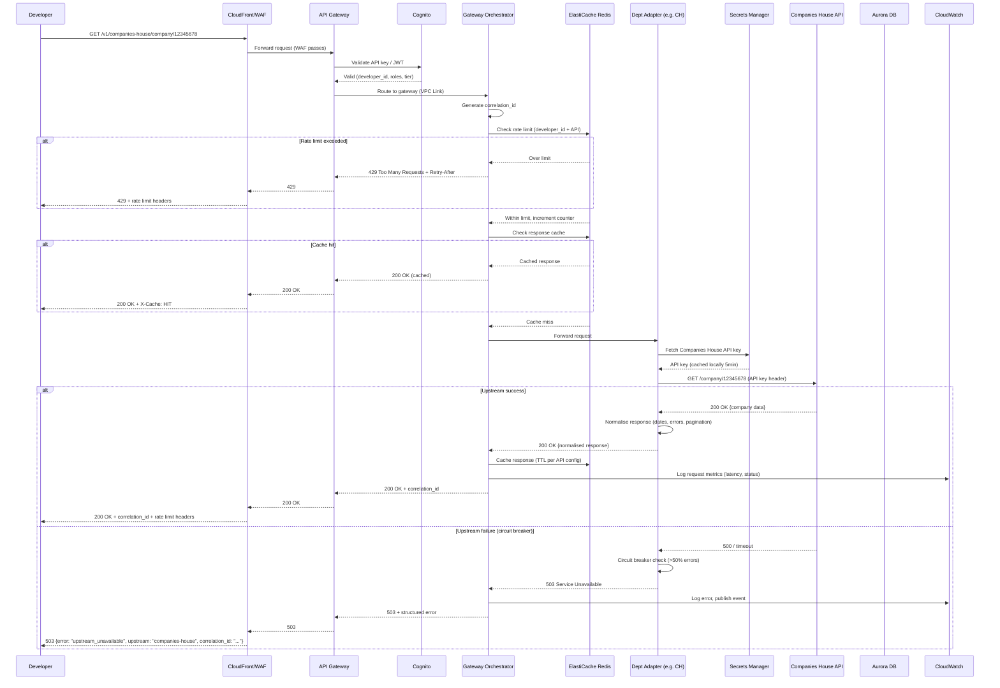

# Architecture Diagram: UK Government API Aggregator — C4 Container

> **Template Status**: Live | **Version**: 1.1.0 | **Command**: `/arckit.diagram`

## Document Control

| Field | Value |
|-------|-------|
| **Document ID** | ARC-001-DIAG-001-v1.0 |
| **Document Type** | Architecture Diagram |
| **Project** | UK Government API Aggregator (Project 001) |
| **Classification** | OFFICIAL |
| **Status** | DRAFT |
| **Version** | 1.0 |
| **Created Date** | 2026-02-01 |
| **Last Modified** | 2026-02-01 |
| **Review Cycle** | Quarterly |
| **Next Review Date** | 2026-05-01 |
| **Owner** | [OWNER_NAME_AND_ROLE] |
| **Reviewed By** | PENDING |
| **Approved By** | PENDING |
| **Distribution** | Programme Board, Architecture Team, Development Teams, GDS Assessors |

## Revision History

| Version | Date | Author | Changes | Approved By | Approval Date |
|---------|------|--------|---------|-------------|---------------|
| 1.0 | 2026-02-01 | ArcKit AI | Initial creation from `/arckit.diagram` command | PENDING | PENDING |

---

## Diagram

### C4 Context Diagram (Level 1)

### C4 Container Diagram (Level 2)

```mermaid
C4Container
    title Container Diagram — UK Government API Aggregator

    Person(developer, "Developer", "Third-party or local authority developer")
    Person(deptAdmin, "Department Admin", "Department API owner")
    Person(platformAdmin, "Platform Admin", "GDS WebOps engineer")

    System_Ext(hmrc, "HMRC APIs", "OAuth 2.0")
    System_Ext(ch, "Companies House API", "API Key")
    System_Ext(dvla, "DVLA APIs", "API Key")
    System_Ext(nhs, "NHS Digital APIs", "OAuth 2.0")
    System_Ext(ea, "Environment Agency APIs", "Open")
    System_Ext(os, "Ordnance Survey APIs", "API Key")
    System_Ext(lr, "Land Registry APIs", "API Key")
    System_Ext(dwp, "DWP APIs", "OAuth 2.0")
    System_Ext(apigovuk, "api.gov.uk", "Catalogue source")

    System_Boundary(platform, "UK Government API Aggregator") {

        Container(cdn, "CloudFront CDN", "AWS CloudFront, WAF", "Edge caching, DDoS protection, OWASP rules [Commodity]")
        Container(apigw, "API Gateway", "Amazon API Gateway REST", "Consumer auth, rate limiting, usage plans, request routing [Commodity]")
        Container(portal, "Developer Portal", "ECS Fargate, GOV.UK Design System", "Registration, API docs, sandbox, key management, dashboards [Custom]")
        Container(adminPortal, "Admin Portal", "ECS Fargate, GOV.UK Design System", "Department and platform administration [Custom]")
        Container(gateway, "Gateway Orchestrator", "ECS Fargate, Node.js", "Request routing to adapters, response aggregation, correlation IDs [Custom]")

        Container(adapterHMRC, "HMRC Adapter", "ECS Fargate", "Auth mapping, circuit breaker, normalisation [Custom]")
        Container(adapterCH, "Companies House Adapter", "ECS Fargate", "Auth mapping, circuit breaker, normalisation [Custom]")
        Container(adapterDVLA, "DVLA Adapter", "ECS Fargate", "Auth mapping, circuit breaker, normalisation [Custom]")
        Container(adapterNHS, "NHS Digital Adapter", "ECS Fargate", "Auth mapping, circuit breaker, normalisation [Custom]")
        Container(adapterEA, "EA Adapter", "ECS Fargate", "Circuit breaker, normalisation [Custom]")
        Container(adapterOS, "OS Adapter", "ECS Fargate", "Auth mapping, circuit breaker, normalisation [Custom]")
        Container(adapterLR, "Land Registry Adapter", "ECS Fargate", "Auth mapping, circuit breaker [Custom]")
        Container(adapterDWP, "DWP Adapter", "ECS Fargate", "Auth mapping, circuit breaker [Custom]")

        Container(crawler, "Discovery Engine", "ECS Fargate, Python", "Crawls api.gov.uk and dept hubs, indexes APIs [Custom]")
        Container(analytics, "Analytics Processor", "ECS Fargate", "Aggregates usage data, generates dashboards [Custom]")
        Container(webhooks, "Webhook Delivery", "AWS Lambda", "Delivers status and deprecation notifications [Commodity]")

        ContainerDb(aurora, "Primary Database", "Aurora PostgreSQL Serverless v2", "Accounts, API keys, catalogue, departments, config [Commodity]")
        ContainerDb(redis, "Cache / Rate Limiter", "ElastiCache Redis", "Rate limit counters, API response cache, circuit breaker state [Commodity]")
        ContainerDb(search, "Search Index", "OpenSearch Service", "Full-text catalogue search with faceted filtering [Commodity]")

        Container(cognito, "Identity Service", "Amazon Cognito", "Developer and admin auth, MFA, OAuth 2.0, RBAC [Commodity]")
        Container(secrets, "Secrets Manager", "AWS Secrets Manager", "Department API credentials, per-dept isolation [Commodity]")
        Container(events, "Event Bus", "Amazon EventBridge", "Status changes, deprecation events, webhook triggers [Commodity]")
    }

    Rel(developer, cdn, "HTTPS requests", "TLS 1.3")
    Rel(deptAdmin, cdn, "HTTPS requests", "TLS 1.3")
    Rel(platformAdmin, cdn, "HTTPS requests", "TLS 1.3")

    Rel(cdn, apigw, "API requests", "HTTPS")
    Rel(cdn, portal, "Portal requests", "HTTPS via ALB")
    Rel(cdn, adminPortal, "Admin requests", "HTTPS via ALB")

    Rel(apigw, cognito, "Validates tokens", "")
    Rel(apigw, gateway, "Routes API calls", "VPC Link")

    Rel(portal, aurora, "Reads/Writes", "SQL/TLS")
    Rel(portal, search, "Searches catalogue", "HTTPS")
    Rel(portal, cognito, "Authenticates users", "OIDC")
    Rel(adminPortal, aurora, "Reads/Writes", "SQL/TLS")
    Rel(adminPortal, cognito, "Authenticates admins", "OIDC + MFA")

    Rel(gateway, redis, "Rate limit checks, response cache", "Redis/TLS")
    Rel(gateway, adapterHMRC, "Routes HMRC requests", "gRPC/HTTP")
    Rel(gateway, adapterCH, "Routes CH requests", "gRPC/HTTP")
    Rel(gateway, adapterDVLA, "Routes DVLA requests", "gRPC/HTTP")
    Rel(gateway, adapterNHS, "Routes NHS requests", "gRPC/HTTP")
    Rel(gateway, adapterEA, "Routes EA requests", "gRPC/HTTP")
    Rel(gateway, adapterOS, "Routes OS requests", "gRPC/HTTP")
    Rel(gateway, adapterLR, "Routes LR requests", "gRPC/HTTP")
    Rel(gateway, adapterDWP, "Routes DWP requests", "gRPC/HTTP")

    Rel(adapterHMRC, secrets, "Fetches credentials", "HTTPS")
    Rel(adapterHMRC, hmrc, "Proxies requests", "HTTPS/OAuth 2.0")
    Rel(adapterCH, ch, "Proxies requests", "HTTPS/API Key")
    Rel(adapterDVLA, dvla, "Proxies requests", "HTTPS/API Key")
    Rel(adapterNHS, nhs, "Proxies requests", "HTTPS/OAuth 2.0")
    Rel(adapterEA, ea, "Proxies requests", "HTTPS")
    Rel(adapterOS, os, "Proxies requests", "HTTPS/API Key")
    Rel(adapterLR, lr, "Proxies requests", "HTTPS/API Key")
    Rel(adapterDWP, dwp, "Proxies requests", "HTTPS/OAuth 2.0")

    Rel(crawler, apigovuk, "Crawls catalogue", "HTTPS")
    Rel(crawler, aurora, "Writes catalogue data", "SQL/TLS")
    Rel(crawler, search, "Indexes catalogue", "HTTPS")

    Rel(analytics, aurora, "Reads usage logs", "SQL/TLS")
    Rel(events, webhooks, "Triggers delivery", "Event")
```

### Deployment Diagram

### API Request Flow — Sequence Diagram

**View these diagrams**:
- **GitHub**: Renders automatically in markdown preview
- **VS Code**: Install Mermaid Preview extension
- **Online**: https://mermaid.live (paste code above)
- **Export**: Use mermaid.live to export as PNG/SVG/PDF

---

## Component Inventory

| Component | Type | Technology | Responsibility | Evolution Stage | Build/Buy |
|-----------|------|------------|----------------|-----------------|-----------|
| CloudFront CDN | Edge | AWS CloudFront | CDN, DDoS protection, static asset caching | Commodity (0.95) | USE |
| AWS WAF | Edge | AWS WAF | OWASP protection, IP blocking, rate limiting | Commodity (0.90) | USE |
| Route 53 | Edge | AWS Route 53 | DNS management, health check routing | Commodity (0.95) | USE |
| API Gateway | Gateway | Amazon API Gateway REST | Consumer auth, rate limiting, usage plans, routing | Commodity (0.85) | USE |
| Gateway Orchestrator | Compute | ECS Fargate, Node.js | Request routing to adapters, correlation IDs, caching | Custom (0.40) | BUILD |
| Department Adapters (x8) | Compute | ECS Fargate | Per-dept auth mapping, circuit breaker, normalisation | Custom (0.35) | BUILD |
| Developer Portal | Web App | ECS Fargate, GOV.UK Design System | Registration, docs, sandbox, key mgmt, dashboards | Custom (0.45) | BUILD |
| Admin Portal | Web App | ECS Fargate, GOV.UK Design System | Department and platform administration | Custom (0.40) | BUILD |
| Discovery Engine | Compute | ECS Fargate, Python | Crawls api.gov.uk and dept hubs, indexes APIs | Custom (0.30) | BUILD |
| Analytics Processor | Compute | ECS Fargate | Aggregates usage data, generates metrics | Custom (0.45) | BUILD |
| Webhook Delivery | Compute | AWS Lambda | Delivers status and deprecation notifications | Commodity (0.85) | USE |
| Aurora PostgreSQL | Database | Aurora Serverless v2 | Accounts, API keys, catalogue, departments, config | Commodity (0.90) | USE |
| ElastiCache Redis | Cache | ElastiCache Redis OSS | Rate limit counters, response cache, circuit state | Commodity (0.90) | USE |
| OpenSearch Service | Search | Amazon OpenSearch | Full-text catalogue search, faceted filtering | Commodity (0.85) | USE |
| Amazon Cognito | Identity | Amazon Cognito | Developer/admin auth, MFA, OAuth 2.0, RBAC | Commodity (0.85) | USE |
| Secrets Manager | Security | AWS Secrets Manager | Dept API credentials, per-dept key isolation | Commodity (0.90) | USE |
| AWS KMS | Security | AWS KMS | Encryption keys, per-department CMKs | Commodity (0.95) | USE |
| EventBridge | Events | Amazon EventBridge | Status changes, deprecation events, webhook triggers | Commodity (0.85) | USE |
| SQS | Messaging | Amazon SQS | Webhook delivery queue with retry/DLQ | Commodity (0.90) | USE |
| CloudWatch + X-Ray | Observability | CloudWatch, X-Ray | Logs, metrics, traces, dashboards, alerting | Commodity (0.90) | USE |
| CloudTrail | Audit | AWS CloudTrail | Tamper-evident administrative audit trail | Commodity (0.95) | USE |

**Evolution Stage Legend**:
- **Genesis (0.0-0.25)**: Novel, unproven, rapidly changing
- **Custom (0.25-0.50)**: Bespoke, emerging practices — the aggregation logic, adapters, and portal
- **Product (0.50-0.75)**: Commercial products with feature differentiation
- **Commodity (0.75-1.0)**: Utility services, standardised — all AWS managed services

**Build/Buy Summary**: BUILD 7 custom components (core platform logic) | USE 14 commodity AWS services

---

## Architecture Decisions

### Key Design Decisions

**Decision 1**: Adapter-per-Department Isolation
- **Context**: Each government department has different authentication, response formats, rate limits, and SLAs
- **Decision**: Deploy a separate ECS Fargate service per department adapter, independently scalable and deployable
- **Rationale**: Meets NFR-S-002 (adapter extensibility without core changes), NFR-A-003 (fault isolation — one department failure cannot cascade), and BR-004 (department control)
- **Consequences**: More ECS services to manage, but each can be deployed, scaled, and circuit-broken independently

**Decision 2**: API Gateway + Custom Gateway Orchestrator
- **Context**: Need consumer auth, rate limiting, and API management (API Gateway) plus complex routing logic, response normalisation, and circuit breaking (custom code)
- **Decision**: Use Amazon API Gateway for standard API management features, with a custom Gateway Orchestrator behind it for adapter routing and orchestration
- **Rationale**: API Gateway handles commodity concerns (auth, throttling, logging) natively; custom code handles the domain-specific aggregation logic
- **Consequences**: Two-layer gateway adds some latency but keeps total overhead within 50ms p95 target (NFR-P-001)

**Decision 3**: Aurora PostgreSQL Serverless v2 over Standard RDS
- **Context**: Variable workload from 1M calls/month (Year 1) to 15M (Year 3); developer accounts growing from 500 to 3,000
- **Decision**: Use Aurora Serverless v2 to auto-scale database capacity with demand
- **Rationale**: Avoids over-provisioning in early phases; scales automatically during peak events (tax deadlines); PostgreSQL is open standard (TC-4, TCoP Point 3)
- **Consequences**: Higher per-ACU cost than provisioned, but eliminates waste during low-usage periods

**Decision 4**: GOV.UK Design System for Portal UI
- **Context**: Developer portal must meet WCAG 2.2 AA, GDS Service Standard, and be familiar to government users
- **Decision**: Use GOV.UK Design System for all user-facing interfaces
- **Rationale**: Meets TCoP Point 8 (Share & Reuse), provides proven accessible patterns, accelerates GDS Service Standard assessment
- **Consequences**: Limited visual customisation; aligns with GDS expectations

### Technology Choices

| Technology | Purpose | Rationale | Evolution Stage |
|------------|---------|-----------|-----------------|
| Amazon API Gateway (REST) | API management | Native rate limiting, API keys, usage plans, WAF integration | Commodity |
| ECS on Fargate | Container compute | Serverless containers, per-service scaling, no EC2 management | Commodity |
| Aurora PostgreSQL Serverless v2 | Primary database | Open standard (PostgreSQL), auto-scaling, Multi-AZ, 99.99% SLA | Commodity |
| ElastiCache Redis | Caching / rate limiting | Sub-ms latency, Redis data structures for sliding window rate limits | Commodity |
| OpenSearch Service | Catalogue search | Full-text search, faceted filtering, <500ms query performance | Commodity |
| Amazon Cognito | Identity / auth | Managed user pools, MFA, OAuth 2.0, API Gateway integration | Commodity |
| GOV.UK Design System | Portal UI | GDS standard, WCAG 2.2 AA, familiar patterns | Product (gov) |
| Node.js | Gateway Orchestrator | High I/O throughput, non-blocking, widely used in GDS | Product |
| Python | Discovery Engine | Strong web scraping libraries (Beautiful Soup, Scrapy), data processing | Product |

---

## Requirements Traceability

| Requirement ID | Description | Component(s) | Coverage |
|----------------|-------------|--------------|----------|
| BR-001 | API Discovery and Cataloguing | Discovery Engine, Aurora, OpenSearch | ✅ |
| BR-002 | Unified API Access Gateway | API Gateway, Gateway Orchestrator, Adapters | ✅ |
| BR-003 | Developer Self-Service Portal | Developer Portal, Cognito, Aurora | ✅ |
| BR-004 | Department Control and Transparency | Admin Portal, Adapters, Analytics Processor | ✅ |
| BR-005 | Value for Money Evidence | Analytics Processor, Aurora, CloudWatch | ✅ |
| FR-001 | API Catalogue Discovery Engine | Discovery Engine, Aurora, OpenSearch | ✅ |
| FR-002 | Catalogue Search and Browse | OpenSearch, Developer Portal | ✅ |
| FR-003 | Developer Registration | Developer Portal, Cognito, Aurora | ✅ |
| FR-004 | API Key Management | API Gateway, Cognito, Aurora | ✅ |
| FR-005 | API Gateway Request Routing | API Gateway, Gateway Orchestrator, Adapters | ✅ |
| FR-006 | Response Normalisation | Department Adapters | ✅ |
| FR-007 | Sandbox Environment | Developer Portal, Gateway Orchestrator | ✅ |
| FR-008 | Usage Analytics Dashboard | Analytics Processor, Developer Portal, Admin Portal | ✅ |
| FR-009 | Department Admin Portal | Admin Portal, Cognito, Aurora | ✅ |
| FR-010 | API Health Monitoring | Gateway Orchestrator, CloudWatch, EventBridge | ✅ |
| FR-011 | API Documentation Rendering | Developer Portal, OpenSearch | ✅ |
| FR-012 | Rate Limiting and Throttling | API Gateway, ElastiCache Redis | ✅ |
| FR-013 | Circuit Breaker | Department Adapters, ElastiCache Redis | ✅ |
| FR-014 | Webhook Notifications | EventBridge, SQS, Lambda (Webhook Delivery) | ✅ |
| FR-015 | API Versioning Support | API Gateway, Gateway Orchestrator | ✅ |
| FR-016 | Platform Administration | Admin Portal, CloudWatch | ✅ |
| NFR-P-001 | <50ms gateway overhead (p95) | API Gateway, Gateway Orchestrator, Redis | ✅ |
| NFR-P-002 | <500ms catalogue search | OpenSearch Service | ✅ |
| NFR-P-004 | 5,000 req/s sustained throughput | ECS Auto Scaling, API Gateway | ✅ |
| NFR-A-001 | 99.9% platform availability | Multi-AZ (Aurora, Redis, OpenSearch, ECS) | ✅ |
| NFR-A-002 | RPO 1hr, RTO 4hr | Aurora backups, cross-region DR (eu-west-1) | ✅ |
| NFR-A-003 | Upstream fault isolation | Per-dept adapters, circuit breakers, bulkheads | ✅ |
| NFR-SEC-001 | Consumer authentication + MFA | API Gateway, Cognito | ✅ |
| NFR-SEC-002 | RBAC (4 roles) | Cognito groups, IAM policies | ✅ |
| NFR-SEC-003 | Encryption (TLS 1.2+, AES-256) | KMS, Aurora encryption, TLS everywhere | ✅ |
| NFR-SEC-004 | Secrets management | AWS Secrets Manager | ✅ |
| NFR-SEC-005 | Credential isolation per dept | Secrets Manager (per-dept secrets + IAM) | ✅ |
| NFR-C-001 | UK GDPR compliance | Aurora (UK data residency), Cognito | ✅ |
| NFR-C-002 | Audit logging | CloudTrail, CloudWatch Logs | ✅ |
| NFR-M-001 | Observability | CloudWatch, X-Ray, structured logging | ✅ |
| INT-001 | HMRC integration | HMRC Adapter | ✅ |
| INT-002 | Companies House integration | CH Adapter | ✅ |
| INT-003 | DVLA integration | DVLA Adapter | ✅ |
| INT-004 | NHS Digital integration | NHS Adapter | ✅ |
| INT-005 | Environment Agency integration | EA Adapter | ✅ |
| INT-006 | Ordnance Survey integration | OS Adapter | ✅ |
| INT-007 | Land Registry integration | LR Adapter | ✅ |
| INT-008 | DWP integration | DWP Adapter | ✅ |
| INT-009 | api.gov.uk catalogue integration | Discovery Engine | ✅ |

**Coverage Summary**:
- Total Requirements Mapped: 41
- Covered: 41 (100%)
- Partially Covered: 0
- Not Covered: 0

---

## Integration Points

### External Systems

| External System | Interface | Protocol | Responsibility | SLA |
|----------------|-----------|----------|----------------|-----|
| HMRC Developer Hub | REST API | HTTPS/OAuth 2.0 | VAT, Self Assessment, Corp Tax, Customs | Dependent on HMRC |
| Companies House | REST API | HTTPS/API Key | Company search, filing history, officers | Dependent on CH |
| DVLA | REST API | HTTPS/API Key | Vehicle enquiry, MOT history | Dependent on DVLA |
| NHS Digital | REST API | HTTPS/OAuth 2.0 | ODS, reference data (Phase 1) | Dependent on NHS |
| Environment Agency | REST API | HTTPS (Open) | Flood monitoring, water quality, rainfall | Dependent on EA |
| Ordnance Survey | REST API | HTTPS/API Key | OS Places, Maps, Features | Dependent on OS |
| HM Land Registry | REST API | HTTPS/API Key | Price paid, title plans | Dependent on LR |
| DWP | REST API | HTTPS/OAuth 2.0 | Benefits status, eligibility | Dependent on DWP |
| api.gov.uk | Web crawl | HTTPS | API catalogue seeding | Best effort |

---

## Security Architecture

### Security Zones

| Zone | Components | Security Level | Controls |
|------|------------|----------------|----------|
| Edge | CloudFront, WAF, Route 53 | Public | WAF rules (OWASP), DDoS protection (Shield), TLS termination |
| DMZ | API Gateway, ALB | Semi-public | API key validation, rate limiting, request validation |
| Application | ECS Fargate services | Private | VPC isolation, Security Groups, IAM task roles |
| Data | Aurora, Redis, OpenSearch | Isolated | Private subnets, no internet access, encryption at rest (KMS) |
| Secrets | Secrets Manager, KMS | Isolated | Per-department IAM policies, automatic rotation, audit logging |

### Authentication & Authorisation

| Component | Authentication | Authorisation | Session Management |
|-----------|----------------|---------------|-------------------|
| API Gateway (consumers) | API keys + JWT (Cognito) | Usage plans + scopes | Stateless (token-based) |
| Developer Portal | Cognito (email + MFA) | Cognito groups (Developer role) | 30 min inactivity, 8 hr absolute |
| Admin Portal | Cognito (email + MFA required) | Cognito groups (Dept Admin / Platform Admin) | 30 min inactivity, 8 hr absolute |
| Upstream APIs | Per-dept credentials (Secrets Manager) | Service-to-service (IAM + dept keys) | Credential cached 5 min |

---

## Deployment Architecture

### Cloud Provider

**Provider**: AWS
**Region**: eu-west-2 (London) — primary
**DR Region**: eu-west-1 (Ireland) — cross-region backup
**Availability Zones**: 3 (eu-west-2a, eu-west-2b, eu-west-2c)

### Network Architecture

| Network Component | CIDR | Purpose | Security Controls |
|------------------|------|---------|-------------------|
| VPC | 10.0.0.0/16 | Main network | VPC Flow Logs enabled |
| Public Subnet (AZ a) | 10.0.1.0/24 | ALB, NAT Gateway | SG: HTTPS inbound only |
| Public Subnet (AZ b) | 10.0.2.0/24 | ALB, NAT Gateway | SG: HTTPS inbound only |
| Public Subnet (AZ c) | 10.0.3.0/24 | ALB | SG: HTTPS inbound only |
| Private Subnet (AZ a) | 10.0.10.0/24 | ECS Fargate tasks | SG: ALB/APIGW inbound only |
| Private Subnet (AZ b) | 10.0.20.0/24 | ECS Fargate tasks | SG: ALB/APIGW inbound only |
| Private Subnet (AZ c) | 10.0.30.0/24 | ECS Fargate tasks | SG: ALB/APIGW inbound only |
| Isolated Subnet (AZ a) | 10.0.100.0/24 | Aurora, Redis, OpenSearch | SG: Private subnets only, no internet |
| Isolated Subnet (AZ b) | 10.0.110.0/24 | Aurora, Redis, OpenSearch | SG: Private subnets only, no internet |
| Isolated Subnet (AZ c) | 10.0.120.0/24 | Aurora, Redis, OpenSearch | SG: Private subnets only, no internet |

---

## Non-Functional Requirements

### Performance

| Requirement | Target | Component(s) | How Achieved |
|-------------|--------|--------------|--------------|
| Gateway overhead | <50ms p95 | API Gateway + Gateway Orchestrator + Redis | API Gateway native pass-through; Redis sub-ms cache/rate check; Fargate co-located in same AZ |
| Catalogue search | <500ms p95 | OpenSearch Service | Dedicated search index, r6g.large instances, Multi-AZ |
| Portal page load | <2s | CloudFront CDN + ECS Fargate | Static assets cached at edge; server-side rendering |
| Throughput | 5,000 req/s sustained | API Gateway + ECS Auto Scaling | API Gateway scales automatically; ECS scales on p95 latency >40ms or CPU >70% |

### Availability & Resilience

| Requirement | Target | Component(s) | How Achieved |
|-------------|--------|--------------|--------------|
| Platform availability | 99.9% | All components | Multi-AZ deployment across 3 AZs; managed services with SLAs |
| RTO | 4 hours | Aurora, S3 | Cross-region Aurora replica (eu-west-1); S3 replication |
| RPO | 1 hour | Aurora | Continuous backup with PITR; hourly snapshots |
| Fault isolation | Per-department | Adapters, circuit breakers | Separate ECS service per dept; circuit breaker in Redis; bulkhead pattern |

---

## UK Government Compliance

### Technology Code of Practice

| TCoP Point | Compliance | Component(s) | Evidence |
|------------|------------|--------------|----------|
| 1. User Needs | ✅ | Developer Portal, Admin Portal | GOV.UK Design System patterns; user research-driven |
| 2. Accessibility | ✅ | Developer Portal | WCAG 2.2 AA; GOV.UK Design System |
| 3. Open Source | ✅ | PostgreSQL, Node.js, Python | Open standards and open source technologies |
| 5. Cloud First | ✅ | All AWS services | 100% cloud-native on AWS eu-west-2 |
| 6. Security | ✅ | WAF, Cognito, KMS, Secrets Manager | Secure by Design; NCSC principles met |
| 7. Privacy | ✅ | Aurora (UK residency), Cognito | UK data residency; minimal PII collection |
| 8. Share & Reuse | ✅ | GOV.UK Design System | Reuses government design patterns |

### GOV.UK Services

| GOV.UK Service | Used | Component | Rationale |
|----------------|------|-----------|-----------|
| GOV.UK Design System | Yes | Developer Portal, Admin Portal | Accessible UI patterns, GDS compliance |
| GOV.UK Notify | Potential | Webhook Delivery | Could replace custom email notifications |
| GOV.UK Pay | No | N/A | No payment processing in scope |
| GOV.UK PaaS | No | N/A | AWS selected based on requirements analysis |

### AI Playbook Compliance

**AI Risk Level**: N/A — no AI/ML components in core architecture.

---

## Wardley Map Integration

**Related Wardley Map**: Not yet created — recommend `/arckit.wardley`

### Component Positioning

| Component | Visibility | Evolution | Stage | Strategic Action |
|-----------|-----------|-----------|-------|------------------|
| Gateway Orchestrator | 0.85 | 0.40 | Custom | BUILD — core differentiator |
| Department Adapters | 0.80 | 0.35 | Custom | BUILD — per-dept integration logic |
| Developer Portal | 0.95 | 0.45 | Custom | BUILD — primary user interface |
| Discovery Engine | 0.70 | 0.30 | Custom | BUILD — unique crawling logic |
| API Gateway | 0.85 | 0.85 | Commodity | USE — Amazon API Gateway |
| Aurora PostgreSQL | 0.40 | 0.90 | Commodity | USE — managed database |
| ElastiCache Redis | 0.50 | 0.90 | Commodity | USE — managed cache |
| OpenSearch | 0.60 | 0.85 | Commodity | USE — managed search |
| Cognito | 0.70 | 0.85 | Commodity | USE — managed identity |
| CloudFront/WAF | 0.90 | 0.95 | Commodity | USE — managed edge security |

### Strategic Alignment

- [x] All BUILD decisions align with Custom stage (core aggregation logic)
- [x] No BUY decisions needed (no Product-stage components)
- [x] All USE decisions align with Commodity stage (AWS managed services)
- [x] No commodity components being built
- [x] No Genesis components being bought

---

## Linked Artifacts

**Requirements**: `projects/001-uk-government-api-aggregator/ARC-001-REQ-v1.0.md`
**Architecture Principles**: `projects/000-global/ARC-000-PRIN-v1.0.md`
**Stakeholder Drivers**: `projects/001-uk-government-api-aggregator/ARC-001-STKE-v1.0.md`
**Secure by Design**: `projects/001-uk-government-api-aggregator/ARC-001-SECD-v1.0.md`
**AWS Research**: `projects/001-uk-government-api-aggregator/research/ARC-001-AWRS-v1.0.md`
**Azure Research**: `projects/001-uk-government-api-aggregator/research/ARC-001-AZRS-v1.0.md`
**Wardley Map**: Not yet created — recommend `/arckit.wardley`
**HLD**: Not yet created — recommend `/arckit.hld-review`
**DLD**: Not yet created — recommend `/arckit.dld-review`
**TCoP Assessment**: Not yet created — recommend `/arckit.tcop`

---

## Change Log

| Version | Date | Author | Changes | Rationale |
|---------|------|--------|---------|-----------|
| v1.0 | 2026-02-01 | ArcKit AI | Initial diagram set: C4 Context, C4 Container, Deployment, Sequence | Visualise architecture from requirements and AWS research |

**Next Review Date**: 2026-05-01

---

**Generated by**: ArcKit `/arckit.diagram` command
**Generated on**: 2026-02-01
**ArcKit Version**: 1.1.0
**Project**: UK Government API Aggregator (Project 001)
**Model**: Claude Opus 4.5 (claude-opus-4-5-20251101)
