# AWS Technology Research: UK Government API Aggregator

> **Template Status**: Experimental | **Version**: 1.1.0 | **Command**: `/arckit.aws-research`

## Document Control

| Field | Value |
|-------|-------|
| **Document ID** | ARC-001-AWRS-v1.1 |
| **Document Type** | AWS Technology Research |
| **Project** | UK Government API Aggregator (Project 001) |
| **Classification** | OFFICIAL |
| **Status** | DRAFT |
| **Version** | 1.1 |
| **Created Date** | 2026-02-01 |
| **Last Modified** | 2026-02-02 |
| **Review Cycle** | Quarterly |
| **Next Review Date** | 2026-05-02 |
| **Owner** | [OWNER_NAME_AND_ROLE] |
| **Reviewed By** | PENDING |
| **Approved By** | PENDING |
| **Distribution** | Programme Board, Architecture Team, Development Teams, GDS Assessors |

## Revision History

| Version | Date | Author | Changes | Approved By | Approval Date |
|---------|------|--------|---------|-------------|---------------|
| 1.0 | 2026-02-01 | ArcKit AI | Initial creation from `/arckit.aws-research` command | PENDING | PENDING |
| 1.1 | 2026-02-02 | ArcKit AI | Refreshed research with new AWS service features: API Gateway Portals, Cognito Managed Login with WAF, ECS built-in blue/green and canary deployments, Aurora Serverless v2 auto-pause, ECS Graviton Spot support, API Gateway direct ALB integration. Updated regional availability, Security Hub CSPM controls, NCSC Config rules mapping, and cost estimates. | PENDING | PENDING |

---

## Executive Summary

### Research Scope

This document presents AWS-specific technology research findings for the UK Government API Aggregator platform. It provides AWS service recommendations, architecture patterns, and implementation guidance based on official AWS documentation retrieved via the AWS Knowledge MCP Server.

**Requirements Analyzed**: 16 functional, 18 non-functional, 9 integration, 5 data entity requirements

**AWS Services Evaluated**: 20 AWS services across 10 categories

**Research Sources**: AWS Documentation (MCP), AWS Architecture Center, AWS Well-Architected Framework, AWS Prescriptive Guidance

### Key Recommendations

| Requirement Category | Recommended AWS Service | Tier | Monthly Estimate |
|---------------------|-------------------------|------|------------------|
| API Gateway | Amazon API Gateway (REST) + Portals | On-Demand | ~GBP 2,625 |
| Compute (Gateway Workers) | Amazon ECS on AWS Fargate | On-Demand | ~GBP 3,200 |
| Primary Database | Amazon Aurora PostgreSQL Serverless v2 | On-Demand/ACU | ~GBP 2,800 |
| Search Engine | Amazon OpenSearch Service | On-Demand | ~GBP 1,200 |
| Caching & Rate Limiting | Amazon ElastiCache (Redis OSS) | Reserved | ~GBP 800 |
| Identity & Authentication | Amazon Cognito (Essentials tier) | On-Demand | ~GBP 200 |
| Edge Security | AWS WAF + Amazon CloudFront | On-Demand | ~GBP 600 |
| Secrets Management | AWS Secrets Manager | On-Demand | ~GBP 100 |
| Observability | Amazon CloudWatch + AWS X-Ray | On-Demand | ~GBP 1,500 |
| Event Processing | Amazon EventBridge + Amazon SQS | On-Demand | ~GBP 200 |

### Architecture Pattern

**Recommended Pattern**: API Gateway Aggregation with ECS Fargate Microservices

**Reference Architecture**: AWS Architecture Blog -- "Using API Gateway as a Single Entry Point for Web Applications and API Microservices" / "Build scalable REST APIs using Amazon API Gateway private integration with Application Load Balancer"

### UK Government Suitability

| Criteria | Status | Notes |
|----------|--------|-------|
| **UK Region Availability** | All 20 services available | eu-west-2 (London) confirmed via MCP regional availability check |
| **G-Cloud Listing** | Available on G-Cloud 14 | Framework: RM1557.14 |
| **Data Classification** | OFFICIAL / OFFICIAL-SENSITIVE | Standard AWS with additional controls |
| **NCSC Cloud Security Principles** | 14/14 principles met | AWS Config conformance pack available |
| **C5 Attestation** | eu-west-2 in scope | 2024 C5 Type 2 attestation, 179 services |

---

## AWS Services Analysis

### Category 1: API Gateway & Request Routing

**Requirements Addressed**: FR-005 (Request Routing), FR-012 (Rate Limiting), FR-015 (API Versioning), NFR-P-001 (< 50ms overhead), BR-002 (Unified Access), BR-003 (Developer Portal)

**Why This Category**: The core of the platform is an API gateway that routes developer requests to upstream government department APIs with consistent authentication, rate limiting, and error handling.

---

#### Recommended: Amazon API Gateway (REST API) with Portals

**Service Overview**:
- **Full Name**: Amazon API Gateway
- **Category**: Networking / API Management
- **Documentation**: https://docs.aws.amazon.com/apigateway/

**Key Features**:
- **REST and HTTP APIs**: Supports REST APIs with full request/response transformation, usage plans, and API keys. REST APIs provide more features than HTTP APIs including per-client throttling, request validation, AWS WAF integration, and private API endpoints.
- **API Gateway Portals (NEW)**: AWS-native developer portals that automatically discover existing APIs, generate documentation, and allow custom documentation. Teams can organise APIs into logical products, customise branding, configure access controls, and use analytics for understanding user engagement. This directly addresses BR-003 (Developer Self-Service Portal) with a managed solution.
- **Proxy Integration with ALB (Enhanced)**: REST APIs now support private integration directly with Application Load Balancers without requiring an intermediary Network Load Balancer. This simplifies architecture, improves scalability, and reduces costs for connecting to ECS Fargate services.
- **Usage Plans & Throttling**: Built-in rate limiting per consumer, per API stage -- directly addresses FR-012.
- **API Key Management**: Native API key creation and validation -- supports FR-004.
- **OpenAPI Import**: Import OpenAPI 3.0 specifications to configure APIs -- supports FR-011.
- **Caching**: Built-in response caching to reduce upstream load.
- **Custom Domain Names**: Single base URL for all aggregated APIs.

**Pricing Model**:

| Pricing Option | Cost | Commitment | Notes |
|----------------|------|------------|-------|
| REST API (per million requests) | $3.50/million | None | First 333 million requests/month |
| REST API (next 667M) | $2.80/million | None | Tiered pricing |
| REST API (over 1B) | $2.38/million | None | Volume discount |
| HTTP API (per million requests) | $1.00/million | None | Simpler, lower cost, fewer features |
| Caching (0.5 GB) | $0.02/hr | None | Optional |
| Data transfer out | $0.09/GB | None | First 10 TB/month |
| Portal (base) | $125/month | None | Includes 10 PortalProducts |
| Portal (additional products) | $12.50/product/month | None | Per additional PortalProduct |

**Estimated Cost for This Project**:

| Resource | Configuration | Monthly Cost | Notes |
|----------|---------------|--------------|-------|
| REST API Requests | 5M requests/month (Year 1) | ~GBP 1,400 | Growing to 15M Year 3 |
| Caching | 1.6 GB cache | ~GBP 600 | Reduces upstream load |
| Data Transfer | 50 GB/month | ~GBP 500 | API responses |
| Portal | 1 portal, 10 products | ~GBP 125 | Developer portal |
| **Total** | | **~GBP 2,625** | Year 1 estimate |

**AWS Well-Architected Assessment**:

| Pillar | Rating | Notes |
|--------|--------|-------|
| **Operational Excellence** | 5/5 | CloudWatch integration, access logging, execution logging, Portals analytics via CloudWatch RUM |
| **Security** | 5/5 | IAM, API keys, OAuth 2.0 authorizers, WAF integration, TLS 1.2+, mutual TLS, resource policies |
| **Reliability** | 5/5 | Multi-AZ by default, automatic scaling, 99.95% SLA |
| **Performance Efficiency** | 4/5 | Sub-millisecond added latency for pass-through; transforms add latency |
| **Cost Optimization** | 4/5 | Pay-per-request; caching reduces upstream calls; Portals reduces custom portal build cost |
| **Sustainability** | 4/5 | Serverless -- no idle compute resources |

**AWS Security Hub Alignment**:

| Control | Status | Implementation |
|---------|--------|----------------|
| APIGateway.1 - Execution logging enabled | Implemented | CloudWatch execution logs for REST and WebSocket APIs |
| APIGateway.2 - REST API stages with SSL | Implemented | Backend connections use TLS |
| APIGateway.3 - X-Ray tracing enabled | Implemented | Active tracing configured |
| APIGateway.4 - WAF associated | Implemented | AWS WAF web ACL attached |
| APIGateway.5 - Cache data encrypted | Implemented | Cache encryption at rest enabled |
| APIGateway.8 - Routes specify auth type | Implemented | API keys + Cognito authorizer |
| APIGateway.9 - Access logging configured | Implemented | CloudWatch access logs |

**Integration Capabilities**:
- **Backend**: HTTP proxy to upstream department APIs, Lambda functions, ECS services via VPC Link (direct ALB integration -- no NLB required)
- **Auth**: Cognito user pools, Lambda authorizers, IAM, JWT authorizers
- **Monitoring**: CloudWatch Logs, CloudWatch Metrics, X-Ray tracing
- **Security**: WAF, resource policies, mutual TLS
- **Developer Portal**: API Gateway Portals with product organisation, documentation, access controls

**UK Region Availability**:
- eu-west-2 (London) -- confirmed available via MCP
- eu-west-1 (Ireland) -- available for DR
- API Gateway Portals -- available in all commercial regions

---

#### Alternative: Application Load Balancer + Custom Gateway

An ALB fronting custom gateway code (e.g., Kong, Tyk on ECS) provides maximum flexibility but increases operational burden and requires managing the API management layer. This is a viable option if API Gateway limitations are encountered.

#### Alternative: AWS App Runner

AWS App Runner provides a simpler fully-managed service for deploying containerised web applications and APIs. However, it lacks the sophisticated API management features (usage plans, API keys, throttling per consumer, OpenAPI import, Portals) that are core requirements for this platform.

#### Comparison Matrix

| Criteria | API Gateway (REST) + Portals | ALB + Custom Gateway | App Runner |
|----------|------------------------------|---------------------|------------|
| Cost (monthly, 5M req) | ~GBP 2,625 | ~GBP 2,000 | ~GBP 1,500 |
| API Management Features | Native | Custom build | None |
| Developer Portal | API Gateway Portals (managed) | Custom build | None |
| Rate Limiting | Built-in per-consumer | Custom (Redis-backed) | None |
| API Key Management | Built-in | Custom | None |
| Operational Overhead | Low (managed) | High | Low |
| UK Availability | eu-west-2 | eu-west-2 | eu-west-2 |
| Feature Match | 95% | 100% (custom) | 40% |

**Recommendation**: Amazon API Gateway (REST API) with Portals -- provides the richest set of API management features natively, directly addressing FR-004, FR-005, FR-012, and FR-015 with minimal custom development. The new Portals feature significantly reduces the effort needed for BR-003 (Developer Portal). For complex routing logic to upstream department APIs, combine with ECS Fargate backend services via VPC Link with direct ALB integration.

---

### Category 2: Compute -- Gateway Workers & Adapters

**Requirements Addressed**: FR-005 (Routing), FR-006 (Normalisation), FR-013 (Circuit Breaker), NFR-S-001 (Horizontal Scaling), NFR-S-002 (Adapter Extensibility), NFR-P-004 (5,000 req/s throughput)

**Why This Category**: Department API adapters -- handling authentication mapping, response normalisation, circuit breaking, and fault isolation -- require container-based compute that can scale independently per department.

---

#### Recommended: Amazon ECS on AWS Fargate

**Service Overview**:
- **Full Name**: Amazon Elastic Container Service (ECS) on AWS Fargate
- **Category**: Compute / Containers
- **Documentation**: https://docs.aws.amazon.com/AmazonECS/latest/developerguide/

**Key Features**:
- **Serverless Containers**: No EC2 instance management -- Fargate manages infrastructure.
- **Task-Level Isolation**: Each adapter runs as a separate ECS service with independent scaling -- directly addresses NFR-S-002.
- **Built-in Blue/Green Deployments (NEW)**: ECS now supports native blue/green deployments with deployment lifecycle hooks, enabling validation before routing production traffic. Supports automatic rollback without downtime. Works with ALB, NLB, and ECS Service Connect.
- **1-Click Rollbacks (NEW)**: The stopDeployment API action automatically rolls back the service to the last stable service revision. Combined with deployment circuit breaker and CloudWatch Alarms for automated failure detection.
- **Linear and Canary Deployments (NEW)**: Traffic shifts from old to new revision in configurable increments, allowing validation with increasing production traffic before full cutover.
- **Service Connect with Envoy Access Logs (NEW)**: Service-to-service communication with detailed per-request telemetry for tracing, debugging, and compliance monitoring. Captures traffic metadata across all protocols (HTTP, HTTP2, gRPC, TCP).
- **Graviton-based Spot (NEW)**: Run fault-tolerant ARM-based applications on Fargate Spot with up to 70% cost savings compared to standard Fargate pricing.
- **Auto Scaling**: Target tracking and step scaling policies -- scales to meet NFR-P-004 throughput requirements.
- **Service Discovery**: AWS Cloud Map integration for service-to-service communication.
- **Graviton Support**: ARM-based Fargate tasks for better price/performance.
- **VPC Integration**: Tasks run in private subnets within VPC for security.

**Pricing Model**:

| Pricing Option | Cost (eu-west-2) | Commitment | Savings |
|----------------|-------------------|------------|---------|
| Fargate x86 (vCPU/hr) | $0.04656/hr | None | Baseline |
| Fargate x86 (GB memory/hr) | $0.00511/hr | None | Baseline |
| Fargate Graviton (vCPU/hr) | ~20% less than x86 | None | ~20% saving |
| Fargate Spot | ~70% less | None | Fault-tolerant workloads |
| Fargate Graviton Spot | ~70% + ~20% combined | None | Maximum saving |
| Compute Savings Plan (1yr) | ~30% less | 1 year | Steady-state |
| Compute Savings Plan (3yr) | ~52% less | 3 years | Long-term |

**Estimated Cost for This Project**:

| Resource | Configuration | Monthly Cost | Notes |
|----------|---------------|--------------|-------|
| Gateway Service | 4 x (1 vCPU, 2 GB) Graviton | ~GBP 640 | Auto-scales 2-8 tasks |
| Department Adapters (8) | 8 x (0.5 vCPU, 1 GB) Graviton | ~GBP 960 | One per department |
| Portal Backend | 2 x (1 vCPU, 2 GB) Graviton | ~GBP 320 | Developer portal API |
| Discovery Engine | 1 x (1 vCPU, 2 GB) | ~GBP 200 | Crawler/indexer |
| Analytics Processor | 2 x (0.5 vCPU, 1 GB) | ~GBP 300 | Usage analytics |
| Load Balancer | ALB (internal) | ~GBP 300 | Routes to ECS services |
| Service Connect | Envoy sidecars | ~GBP 480 | Inter-service communication |
| **Total** | | **~GBP 3,200** | Year 1 On-Demand with Graviton |

**AWS Well-Architected Assessment**:

| Pillar | Rating | Notes |
|--------|--------|-------|
| **Operational Excellence** | 5/5 | ECS Exec for debugging, Container Insights, deployment circuit breaker, built-in blue/green, 1-click rollbacks |
| **Security** | 5/5 | Task-level IAM roles, VPC isolation, Secrets Manager integration, non-root task definitions |
| **Reliability** | 5/5 | Multi-AZ, health checks, auto-replacement of unhealthy tasks, canary deployments |
| **Performance Efficiency** | 5/5 | Graviton for price/performance, right-sizing per service, Service Connect |
| **Cost Optimization** | 4/5 | Savings Plans, Graviton Spot for non-critical; no idle EC2 fleet |
| **Sustainability** | 5/5 | Graviton processors (up to 60% less energy), scale to zero when idle |

**UK Region Availability**:
- eu-west-2 (London) -- confirmed available via MCP
- Full feature parity including Graviton, Service Connect, blue/green deployments

---

#### Alternative: AWS Lambda (Serverless Functions)

Lambda provides per-invocation pricing and automatic scaling, ideal for event-driven workloads. However, the 15-minute execution limit, cold start latency (10-200ms), and 6 MB response payload limit make it less suitable for a high-throughput API gateway that requires consistent sub-50ms overhead. Lambda is better suited for auxiliary functions (webhooks, scheduled crawling, analytics aggregation).

#### Comparison Matrix

| Criteria | ECS Fargate | AWS Lambda | EKS |
|----------|-------------|------------|-----|
| Cost (monthly) | ~GBP 3,200 | ~GBP 2,500 | ~GBP 4,500 |
| Cold Start | None | 10-200ms | None |
| Max Payload | Unlimited | 6 MB | Unlimited |
| Operational Overhead | Low | Lowest | High |
| Adapter Isolation | ECS Service per adapter | Function per adapter | Pod per adapter |
| Blue/Green Deployments | Built-in native | Aliases/versions | Rolling/Blue-Green via Argo |
| Circuit Breaker | Application-level + deployment | Application-level | Application-level |
| UK Availability | eu-west-2 | eu-west-2 | eu-west-2 |

**Recommendation**: Amazon ECS on AWS Fargate -- provides the right balance of operational simplicity, consistent performance (no cold starts), per-adapter isolation, and now includes built-in blue/green and canary deployments for safer releases. Use Lambda for auxiliary workloads (webhooks FR-014, scheduled crawling FR-001, analytics aggregation FR-008).

---

### Category 3: Primary Database

**Requirements Addressed**: DR-001 to DR-005 (Data Entities), NFR-A-001 (99.9% availability), NFR-A-002 (RPO 1 hour, RTO 4 hours), NFR-C-001 (UK data residency), NFR-SEC-003 (AES-256 encryption at rest)

**Why This Category**: The platform needs a relational database for structured data: API catalogue entries, developer accounts, API keys, departments, and configuration data. The data model is relational with foreign key relationships.

---

#### Recommended: Amazon Aurora PostgreSQL Serverless v2

**Service Overview**:
- **Full Name**: Amazon Aurora PostgreSQL-Compatible Edition (Serverless v2)
- **Category**: Database / Relational
- **Documentation**: https://docs.aws.amazon.com/AmazonRDS/latest/AuroraUserGuide/

**Key Features**:
- **PostgreSQL Compatibility**: Fully compatible with PostgreSQL -- open standard, avoids vendor lock-in (TC-4, NFR-C-003).
- **Serverless v2 Scaling**: Scales from 0.5 to 256 ACUs based on demand -- addresses variable workload from 1M to 15M calls/month growth. ACU values configurable in half-step increments.
- **Auto-Pause (NEW)**: For versions supporting auto-pause, Serverless v2 can scale to 0 ACUs after a configurable idle period (300-86,400 seconds), reducing costs during low-traffic periods. Applicable to development and staging environments.
- **Multi-AZ by Default**: 6 copies of data across 3 AZs -- exceeds NFR-A-001 (99.9%) with 99.99% SLA.
- **Automatic Failover**: < 30 seconds failover to read replica -- exceeds NFR-A-002 requirements.
- **Encryption at Rest**: AES-256 via KMS -- meets NFR-SEC-003.
- **JSONB Support**: Native JSONB for API catalogue metadata fields.
- **Up to 15 Read Replicas**: Offload read-heavy catalogue search and analytics queries.
- **Point-in-Time Recovery (PITR)**: Continuous backup enables recovery to any second within the retention window -- supports RPO < 1 hour.

**Pricing Model**:

| Pricing Option | Cost (eu-west-2) | Commitment | Notes |
|----------------|-------------------|------------|-------|
| Aurora Serverless v2 (ACU-hr) | ~$0.12/ACU-hr | None | Scales 0.5-256 ACU |
| Storage | $0.10/GB-month | None | 6-way replicated |
| I/O (Standard) | $0.20/million requests | None | Standard I/O class |
| I/O (Aurora I/O-Optimized) | Included in ACU price | None | Higher ACU rate, predictable costs |
| Backup | Free (up to DB size) | None | Continuous backup |

**Estimated Cost for This Project**:

| Resource | Configuration | Monthly Cost | Notes |
|----------|---------------|--------------|-------|
| Writer Instance | 2-8 ACU (Serverless v2) | ~GBP 1,500 | Scales with traffic |
| Reader Instance | 1-4 ACU (Serverless v2) | ~GBP 800 | Catalogue queries, analytics |
| Storage | 50 GB growing to 200 GB | ~GBP 200 | 6-way replicated |
| I/O | ~100M requests/month | ~GBP 200 | Standard I/O |
| Backups | Included + cross-region | ~GBP 100 | eu-west-1 for DR |
| **Total** | | **~GBP 2,800** | Year 1 estimate |

**AWS Well-Architected Assessment**:

| Pillar | Rating | Notes |
|--------|--------|-------|
| **Operational Excellence** | 5/5 | Automated patching, Performance Insights, Enhanced Monitoring |
| **Security** | 5/5 | KMS encryption, IAM auth, VPC isolation, audit logging |
| **Reliability** | 5/5 | 99.99% SLA, 6 copies across 3 AZs, continuous backup, PITR |
| **Performance Efficiency** | 5/5 | Serverless auto-scaling, read replicas, query caching |
| **Cost Optimization** | 4/5 | Serverless v2 scales to demand; auto-pause for non-production |
| **Sustainability** | 4/5 | Scales down during low usage periods; auto-pause reduces idle compute |

**UK Region Availability**:
- eu-west-2 (London) -- confirmed available via MCP
- Cross-region replication to eu-west-1 (Ireland) for DR

---

### Category 4: Search Engine -- API Catalogue

**Requirements Addressed**: FR-002 (Catalogue Search), NFR-P-002 (< 500ms search), BR-001 (Discovery and Cataloguing)

**Why This Category**: Full-text search across 500-2000 API catalogue entries with faceted filtering by department, status, data domain, and keyword requires a dedicated search engine.

---

#### Recommended: Amazon OpenSearch Service

**Service Overview**:
- **Full Name**: Amazon OpenSearch Service
- **Category**: Analytics / Search
- **Documentation**: https://docs.aws.amazon.com/opensearch-service/

**Key Features**:
- **Full-Text Search**: BM25 ranking, synonym handling, fuzzy matching -- addresses FR-002 search requirements.
- **Faceted Search**: Aggregations for filtering by department, status, authentication type.
- **Auto-Tuning**: Automatic performance optimisation.
- **Multi-AZ with Standby**: High availability deployment with resilience to single AZ failures.
- **OpenSearch Dashboards**: Built-in visualisation for analytics.
- **Serverless Option**: OpenSearch Serverless available for variable workloads -- uses OCUs (OpenSearch Compute Units) with independent scaling of indexing and search. Charges for compute and storage only.
- **OR1 Instances**: Optimised instances offering improved performance and cost savings with automatic data recovery.
- **Security Analytics**: Built-in security log analysis with out-of-box rules.

**Estimated Cost for This Project**:

| Resource | Configuration | Monthly Cost | Notes |
|----------|---------------|--------------|-------|
| Data Nodes | 2 x r6g.large.search (Multi-AZ) | ~GBP 800 | 2 vCPU, 16 GB each |
| Storage | 100 GB GP3 | ~GBP 200 | API catalogue + analytics |
| Data Transfer | Minimal (internal VPC) | ~GBP 50 | Internal traffic |
| Dashboards | Included | GBP 0 | No additional cost |
| **Total** | | **~GBP 1,200** | Year 1 estimate |

**UK Region Availability**:
- eu-west-2 (London) -- confirmed available via MCP (both managed and serverless)

**Recommendation**: Amazon OpenSearch Service -- purpose-built for the catalogue search use case with sub-500ms query performance. For smaller initial catalogue (< 1000 entries), PostgreSQL full-text search in Aurora could defer this cost to Phase 2.

---

### Category 5: Caching & Rate Limiting

**Requirements Addressed**: FR-012 (Rate Limiting), FR-013 (Circuit Breaker), NFR-P-001 (< 50ms gateway overhead), NFR-A-003 (Fault Isolation)

**Why This Category**: Low-latency caching for API responses, session data, and rate limit counters. Redis data structures (sorted sets, counters) are ideal for rate limiting.

---

#### Recommended: Amazon ElastiCache (Redis OSS)

**Service Overview**:
- **Full Name**: Amazon ElastiCache for Redis OSS
- **Category**: Database / In-Memory
- **Documentation**: https://docs.aws.amazon.com/AmazonElastiCache/

**Key Features**:
- **Sub-Millisecond Latency**: In-memory data store for rate limit counters and API response cache.
- **Redis Data Structures**: Sorted sets for sliding window rate limiting, counters for request tracking, hash maps for circuit breaker state.
- **Multi-AZ Replication**: Automatic failover with read replicas.
- **Cluster Mode**: Horizontal scaling for larger datasets.
- **Encryption**: In-transit (TLS) and at-rest encryption via KMS.

**Estimated Cost for This Project**:

| Resource | Configuration | Monthly Cost | Notes |
|----------|---------------|--------------|-------|
| Primary + Replica | 2 x cache.r6g.large | ~GBP 700 | Multi-AZ, 13 GB memory |
| Backup | Daily snapshots | ~GBP 100 | 7-day retention |
| **Total** | | **~GBP 800** | Year 1 (Reserved: ~GBP 560) |

**UK Region Availability**:
- eu-west-2 (London) -- confirmed available via MCP

---

### Category 6: Identity & Authentication

**Requirements Addressed**: FR-003 (Developer Registration), NFR-SEC-001 (Consumer Authentication, MFA), NFR-SEC-002 (RBAC), FR-009 (Department Admin Portal)

**Why This Category**: Developer registration, MFA, OAuth 2.0 for machine-to-machine access, and role-based access control across four user roles.

---

#### Recommended: Amazon Cognito (Essentials Tier)

**Service Overview**:
- **Full Name**: Amazon Cognito
- **Category**: Security / Identity
- **Documentation**: https://docs.aws.amazon.com/cognito/

**Key Features**:
- **User Pools**: Managed user directory for developer and department admin accounts.
- **Managed Login (NEW)**: Fully-managed hosted sign-in and sign-up experience with no-code visual editor for customising branding. Supports GOV.UK Design System branding customisation. Available in Essentials tier.
- **AWS WAF Integration for Managed Login (NEW)**: Protect Managed Login endpoints against unwanted or malicious requests, enforce rate limits, and control access based on security requirements.
- **Terms of Use and Privacy Policy (NEW)**: Configure terms of use and privacy policy documents for Managed Login pages per app client, with multi-language support -- directly supports UK GDPR compliance (NFR-C-001).
- **MFA Support**: TOTP authenticator apps, SMS, email OTP, WebAuthn passkeys -- meets NFR-SEC-001.
- **Passwordless Authentication**: Sign-in with passkeys, email, or text message via Managed Login.
- **OAuth 2.0 / OIDC**: Client credentials flow for machine-to-machine access.
- **Groups & RBAC**: User groups for Developer, Department Admin, Platform Admin, Read-Only roles -- meets NFR-SEC-002.
- **Lambda Triggers**: Custom authentication flows, pre-sign-up validation, post-authentication hooks.
- **API Gateway Integration**: Native authorizer for API Gateway -- zero-code auth validation.
- **Advanced Security Features (ASF)**: Password reuse prevention, security event streaming for compliance monitoring.

**Estimated Cost for This Project**:

| Resource | Configuration | Monthly Cost | Notes |
|----------|---------------|--------------|-------|
| MAU (Monthly Active Users) | 500 MAU Year 1 | ~GBP 200 | Essentials tier pricing |
| MFA (SMS) | Minimal | ~GBP 50 | Most users use TOTP/passkeys |
| **Total** | | **~GBP 200** | Year 1 estimate |

**UK Region Availability**:
- eu-west-2 (London) -- confirmed available via MCP

---

### Category 7: Edge Security & CDN

**Requirements Addressed**: NFR-SEC-007 (Input Validation), NFR-P-003 (Portal < 2s load), NFR-A-001 (99.9% availability)

**Why This Category**: DDoS protection, WAF rules for OWASP API Security Top 10, and CDN for the developer portal static assets.

---

#### Recommended: AWS WAF + Amazon CloudFront

**Key Features**:
- **AWS WAF**: Web ACL rules for SQL injection, XSS, rate-based rules, IP blocking, managed rule groups (OWASP Top 10). Bot Control for managed bot detection.
- **CloudFront**: Global CDN for developer portal assets; origin shield for API caching. London edge location.
- **Shield Standard**: Included DDoS protection for L3/L4.
- **WAF for Cognito Managed Login**: Additional protection for authentication endpoints.

**Estimated Cost for This Project**:

| Resource | Configuration | Monthly Cost | Notes |
|----------|---------------|--------------|-------|
| CloudFront | 100 GB transfer, 10M requests | ~GBP 200 | Developer portal + docs |
| WAF | Web ACL + managed rules | ~GBP 300 | AWS Managed Rules |
| Shield Standard | Included | GBP 0 | L3/L4 DDoS protection |
| **Total** | | **~GBP 600** | Year 1 estimate |

**UK Region Availability**:
- CloudFront: Global edge locations including London
- WAF: eu-west-2 (London) -- confirmed available via MCP

---

### Category 8: Secrets Management

**Requirements Addressed**: NFR-SEC-004 (Secrets Management), NFR-SEC-005 (Credential Isolation)

---

#### Recommended: AWS Secrets Manager

**Key Features**:
- **Automatic Rotation**: Managed rotation for supported services; custom rotation for department API credentials.
- **Per-Department Isolation**: Separate secrets per department with IAM resource policies -- meets NFR-SEC-005.
- **Encryption**: AES-256 via KMS with customer-managed keys per department.
- **Audit Trail**: CloudTrail logging for all secret access.
- **Cross-Region Replication**: For DR to eu-west-1.

**Estimated Cost for This Project**:

| Resource | Configuration | Monthly Cost | Notes |
|----------|---------------|--------------|-------|
| Secrets | ~50 secrets (8 depts + platform) | ~GBP 40 | $0.40/secret/month |
| API Calls | ~500K/month | ~GBP 60 | $0.05/10K calls |
| **Total** | | **~GBP 100** | Year 1 estimate |

**UK Region Availability**:
- eu-west-2 (London) -- confirmed available via MCP

---

### Category 9: Observability

**Requirements Addressed**: NFR-M-001 (Observability), NFR-C-002 (Audit Logging), FR-008 (Usage Analytics), FR-010 (Health Monitoring)

---

#### Recommended: Amazon CloudWatch + AWS X-Ray

**Key Features**:
- **CloudWatch Logs**: Structured JSON logging with Log Insights for querying -- correlation ID support.
- **CloudWatch Metrics**: Custom metrics for per-API, per-consumer, per-endpoint tracking.
- **CloudWatch Alarms**: SLO-based alerting with SNS notification. Integration with ECS deployment circuit breaker for automated rollbacks.
- **Container Insights**: ECS Fargate performance monitoring.
- **X-Ray Tracing**: Distributed tracing across API Gateway to ECS to upstream API -- measures gateway overhead vs upstream latency.
- **CloudWatch Dashboards**: Real-time operational dashboards.
- **CloudWatch RUM**: Real user monitoring for API Gateway Portals developer portal analytics.
- **CloudTrail**: API-level audit logging for all administrative actions -- tamper-evident.

**Estimated Cost for This Project**:

| Resource | Configuration | Monthly Cost | Notes |
|----------|---------------|--------------|-------|
| CloudWatch Logs | 50 GB/month ingestion | ~GBP 600 | $0.76/GB ingested (eu-west-2) |
| CloudWatch Metrics | 200 custom metrics | ~GBP 200 | Per-API, per-consumer |
| CloudWatch Dashboards | 5 dashboards | ~GBP 50 | Operational views |
| X-Ray Tracing | 5M traces/month | ~GBP 350 | Sampled at 10% |
| CloudTrail | Management + data events | ~GBP 200 | Audit trail |
| Log Retention | 2 years (audit), 90 days (operational) | ~GBP 100 | S3 archival for long-term |
| **Total** | | **~GBP 1,500** | Year 1 estimate |

**UK Region Availability**:
- All confirmed available in eu-west-2 via MCP

---

### Category 10: Event Processing & Messaging

**Requirements Addressed**: FR-014 (Webhook Notifications), FR-001 (Discovery Engine scheduling), FR-010 (Status notifications)

---

#### Recommended: Amazon EventBridge + Amazon SQS + AWS Lambda

**Key Features**:
- **EventBridge**: Event bus for API status changes, deprecation events, rate limit alerts -- supports FR-014 webhook triggers.
- **SQS**: Message queuing for webhook delivery with retry/DLQ -- reliable delivery with exponential backoff.
- **Lambda**: Event-driven functions for webhook delivery, scheduled crawling, analytics aggregation.
- **SNS**: Fan-out notifications for status page updates, email alerts.

**Estimated Cost for This Project**:

| Resource | Configuration | Monthly Cost | Notes |
|----------|---------------|--------------|-------|
| EventBridge | 5M events/month | ~GBP 50 | $1/million events |
| SQS | 10M messages/month | ~GBP 40 | Webhook delivery queue |
| Lambda | 2M invocations, 128 MB | ~GBP 50 | Webhook + crawling |
| SNS | 100K notifications/month | ~GBP 10 | Status alerts |
| **Total** | | **~GBP 200** | Year 1 estimate (growing with usage) |

---

## Architecture Pattern

### Recommended AWS Reference Architecture

**Pattern Name**: API Gateway Aggregation with ECS Fargate Microservices

**AWS Architecture Center References**:
- https://aws.amazon.com/blogs/architecture/using-api-gateway-as-a-single-entry-point-for-web-applications-and-api-microservices/
- https://aws.amazon.com/blogs/compute/build-scalable-rest-apis-using-amazon-api-gateway-private-integration-with-application-load-balancer/
- https://docs.aws.amazon.com/whitepapers/latest/microservices-on-aws/microservices-on-aws.html

**Pattern Description**:

This architecture uses Amazon API Gateway as the single entry point for all developer API requests, fronted by CloudFront and WAF for edge security. API Gateway handles consumer authentication (API keys validated against Cognito), rate limiting (usage plans), and request routing to backend ECS Fargate services via VPC Link with direct ALB integration (no NLB required).

Each government department has a dedicated adapter service running as an independent ECS service on Fargate with Graviton processors, enabling independent scaling and deployment (NFR-S-002). ECS Service Connect provides service-to-service communication with Envoy access logs for observability. Adapters implement circuit breaker patterns (FR-013), upstream authentication mapping, and response normalisation (FR-006). ElastiCache (Redis) provides the shared rate limiting counter store and response cache.

The developer portal combines API Gateway Portals (for API discovery, documentation, and product organisation) with a custom ECS Fargate service (for account management, sandbox, and analytics) served by Aurora PostgreSQL and OpenSearch. Cognito Managed Login provides the authentication experience with GOV.UK Design System branding. EventBridge orchestrates asynchronous events (status changes, webhook triggers, scheduled crawling). ECS deployments use built-in blue/green and canary strategies with CloudWatch Alarm-based rollback for safe releases.

### Architecture Diagram

```mermaid
graph TB
    subgraph "Internet"
        DEV[Developers]
        DEPT_ADMIN[Department Admins]
    end

    subgraph "AWS Edge - Global"
        R53[Route 53<br/>DNS]
        CF[CloudFront<br/>CDN]
        WAF[AWS WAF<br/>OWASP Rules<br/>Bot Control]
    end

    subgraph "AWS eu-west-2 London"
        subgraph "Public Subnet"
            ALB_PUB[Application Load Balancer<br/>Developer Portal]
        end

        subgraph "API Layer"
            APIGW[Amazon API Gateway<br/>REST API<br/>Rate Limiting + API Keys]
            PORTAL_GW[API Gateway Portals<br/>Developer Portal<br/>API Discovery + Docs]
        end

        subgraph "Private Subnets - Compute"
            subgraph "Gateway Services"
                GW[Gateway Service<br/>ECS Fargate Graviton<br/>Request Orchestration]
            end

            subgraph "Department Adapters - Service Connect"
                AD_HMRC[HMRC Adapter<br/>ECS Fargate Graviton]
                AD_CH[Companies House<br/>ECS Fargate Graviton]
                AD_DVLA[DVLA Adapter<br/>ECS Fargate Graviton]
                AD_NHS[NHS Digital<br/>ECS Fargate Graviton]
                AD_EA[Environment Agency<br/>ECS Fargate Graviton]
                AD_OS[Ordnance Survey<br/>ECS Fargate Graviton]
                AD_LR[Land Registry<br/>ECS Fargate Graviton]
                AD_DWP[DWP Adapter<br/>ECS Fargate Graviton]
            end

            subgraph "Portal Services"
                PORTAL[Developer Portal Backend<br/>ECS Fargate Graviton]
                ADMIN[Admin Portal<br/>ECS Fargate Graviton]
            end

            subgraph "Background Services"
                CRAWLER[Discovery Engine<br/>ECS Fargate]
                ANALYTICS[Analytics Processor<br/>ECS Fargate]
                WEBHOOK[Webhook Delivery<br/>Lambda]
            end
        end

        subgraph "Data Layer"
            AURORA[(Aurora PostgreSQL<br/>Serverless v2<br/>Multi-AZ<br/>Auto-Pause non-prod)]
            REDIS[(ElastiCache Redis OSS<br/>Rate Limits + Cache)]
            OPENSEARCH[(OpenSearch Service<br/>API Catalogue Search)]
            S3[(S3<br/>Static Assets +<br/>Log Archive)]
        end

        subgraph "Security"
            COGNITO[Amazon Cognito<br/>Managed Login + MFA<br/>WAF Protected]
            SM[Secrets Manager<br/>Per-Dept Credentials]
            KMS[AWS KMS<br/>Per-Dept Encryption Keys]
            GD[GuardDuty<br/>Threat Detection]
            SH[Security Hub CSPM<br/>FSBP + CIS + NIST]
        end

        subgraph "Observability"
            CW[CloudWatch<br/>Logs + Metrics + Alarms]
            XRAY[X-Ray<br/>Distributed Tracing]
            CT[CloudTrail<br/>Audit Logging]
            RUM[CloudWatch RUM<br/>Portal Analytics]
        end

        subgraph "Events"
            EB[EventBridge<br/>Event Bus]
            SQS[SQS<br/>Webhook Queue + DLQ]
            SNS[SNS<br/>Notifications]
        end
    end

    subgraph "Upstream Government APIs"
        HMRC_API[HMRC APIs]
        CH_API[Companies House API]
        DVLA_API[DVLA APIs]
        NHS_API[NHS Digital APIs]
        EA_API[Environment Agency APIs]
        OS_API[Ordnance Survey APIs]
        LR_API[Land Registry APIs]
        DWP_API[DWP APIs]
    end

    subgraph "DR Region eu-west-1 Ireland"
        AURORA_DR[(Aurora Read Replica<br/>Cross-Region)]
        S3_DR[(S3 Cross-Region<br/>Replication)]
        SM_DR[Secrets Manager<br/>Replica]
    end

    DEV --> R53
    DEPT_ADMIN --> R53
    R53 --> CF
    CF --> WAF
    WAF --> APIGW
    WAF --> ALB_PUB
    WAF --> PORTAL_GW
    WAF --> COGNITO
    APIGW --> GW
    ALB_PUB --> PORTAL
    ALB_PUB --> ADMIN
    GW --> AD_HMRC & AD_CH & AD_DVLA & AD_NHS & AD_EA & AD_OS & AD_LR & AD_DWP
    GW --> REDIS
    GW --> AURORA
    PORTAL --> AURORA
    PORTAL --> OPENSEARCH
    PORTAL --> COGNITO
    ADMIN --> AURORA
    ADMIN --> COGNITO
    CRAWLER --> AURORA
    CRAWLER --> OPENSEARCH
    ANALYTICS --> AURORA
    ANALYTICS --> OPENSEARCH
    AD_HMRC --> SM
    AD_CH --> SM
    AD_HMRC --> HMRC_API
    AD_CH --> CH_API
    AD_DVLA --> DVLA_API
    AD_NHS --> NHS_API
    AD_EA --> EA_API
    AD_OS --> OS_API
    AD_LR --> LR_API
    AD_DWP --> DWP_API
    GW --> CW
    GW --> XRAY
    EB --> SQS
    SQS --> WEBHOOK
    EB --> SNS
    APIGW --> COGNITO
    AURORA --> AURORA_DR
    S3 --> S3_DR
    SM --> SM_DR
```



### Component Mapping

| Component | AWS Service | Purpose | Configuration |
|-----------|-------------|---------|---------------|
| DNS | Route 53 | DNS management, health checks | Hosted zone, failover routing |
| CDN | CloudFront | Portal static assets, API caching | London edge, origin shield |
| Firewall | AWS WAF | OWASP protection, IP blocking, rate limiting, bot control | Managed rule groups |
| API Gateway | API Gateway (REST) | Consumer auth, rate limiting, routing | Usage plans, API keys, direct ALB VPC Link |
| Developer Portal | API Gateway Portals | API discovery, docs, products | Managed portal, CloudWatch RUM |
| Gateway Workers | ECS Fargate Graviton | Request orchestration, adapter routing | 1 vCPU, 2 GB, auto-scale 2-8, blue/green deploy |
| Dept Adapters | ECS Fargate Graviton (per dept) | Auth mapping, normalisation, circuit breaker | 0.5 vCPU, 1 GB each, Service Connect |
| Portal Backend | ECS Fargate Graviton | Account mgmt, sandbox, analytics | 1 vCPU, 2 GB |
| Admin Portal | ECS Fargate Graviton | Department and platform admin | 1 vCPU, 2 GB |
| Primary Database | Aurora PostgreSQL Serverless v2 | Accounts, keys, catalogue, config | 2-8 ACU writer + 1-4 ACU reader, auto-pause non-prod |
| Cache / Rate Limit | ElastiCache Redis OSS | Rate limit counters, API response cache | r6g.large Multi-AZ |
| Search | OpenSearch Service | Catalogue full-text search | 2 x r6g.large Multi-AZ |
| Object Storage | S3 | Static assets, log archive, backups | Standard + Intelligent-Tiering |
| Identity | Cognito Essentials | Developer/admin auth, Managed Login, MFA, OAuth 2.0 | User pools + groups, WAF protected |
| Secrets | Secrets Manager | Department API credentials | Per-department isolation, auto-rotation |
| Encryption | KMS | Encryption keys (per-department) | Customer-managed CMKs |
| Monitoring | CloudWatch + X-Ray | Logs, metrics, traces, dashboards, deployment alarms | Container Insights, custom metrics |
| Portal Analytics | CloudWatch RUM | Developer portal user analytics | Via API Gateway Portals |
| Audit | CloudTrail | Administrative audit trail | Multi-region, S3 archival |
| Threat Detection | GuardDuty | Automated threat detection | All accounts |
| Posture Management | Security Hub CSPM | Compliance monitoring | FSBP + CIS + NIST standards |
| Events | EventBridge | Status changes, webhooks, scheduling | Custom event bus |
| Queuing | SQS | Webhook delivery, async processing | Standard + DLQ |
| Notifications | SNS | Status alerts, email notifications | Topic per event type |
| Webhooks | Lambda | Webhook delivery to developer endpoints | 128 MB, 30s timeout |
| Crawling | Lambda (scheduled) | Periodic API discovery | EventBridge schedule |

---

## Security & Compliance

### AWS Security Hub Controls

| Control Category | Controls Implemented | AWS Services |
|------------------|---------------------|--------------|
| **Identity and Access Management** | IAM.1-IAM.21 | IAM, Cognito, Organizations |
| **Detection** | CloudTrail.1-5, GuardDuty.1 | CloudTrail, GuardDuty, Security Hub CSPM |
| **Infrastructure Protection** | EC2.1-25, VPC.1-4 | VPC, Security Groups, NACLs, WAF |
| **Data Protection** | S3.1-14, RDS.1-25, KMS.1-4 | KMS, S3 encryption, Aurora encryption |
| **API Gateway** | APIGateway.1-5, APIGateway.8-9 | API Gateway REST APIs |
| **Containers** | ECS.1-12 | ECS Fargate task definitions, clusters |
| **Incident Response** | EventBridge, SNS rules | EventBridge, SNS, Lambda auto-remediation |
| **Logging and Monitoring** | CloudWatch.1-4, CT.1-5 | CloudWatch, CloudTrail, Config |

### AWS Security Hub CSPM

Security Hub CSPM provides a comprehensive view of security posture with automated checks against resources. Recommended standards to enable:

- **AWS Foundational Security Best Practices (FSBP)**: Core standard covering all AWS services used in this architecture. Automatically enables controls for account, DynamoDB, EC2, IAM, Lambda, RDS, and S3 resources.
- **CIS AWS Foundations Benchmark**: Industry standard security controls aligned with CIS.
- **NIST SP 800-53 Rev 5**: Federal compliance framework, applicable for government workloads.
- **AWS Resource Tagging**: Ensure all resources tagged for cost allocation and governance.

Additional recommendations:
- Enable Amazon Inspector for vulnerability scanning of container images and Lambda functions.
- Enable Amazon Macie for S3 sensitive data discovery.
- Configure automated remediation via EventBridge and Lambda.

### AWS Config Rules -- NCSC Cloud Security Principles Mapping

AWS provides a managed Config conformance pack mapping AWS Config rules to NCSC Cloud Security Principles:

| NCSC Principle | AWS Config Rules | Key Services |
|----------------|------------------|--------------|
| 1. Data in transit | elb-tls-https-listeners-only, api-gw-ssl-enabled, opensearch-node-to-node-encryption-check, s3-bucket-ssl-requests-only | ELB, API Gateway, OpenSearch, S3 |
| 2. Asset protection and resilience | codebuild-project-artifact-encryption, dynamodb-table-encrypted-kms, ebs-snapshot-public-restorable-check, rds-multi-az-support | CodeBuild, DynamoDB, EBS, RDS |
| 3. Separation between users | iam-policy-no-statements-with-admin-access, iam-user-no-policies-check, vpc-sg-open-only-to-authorized-ports | IAM, VPC |
| 4. Governance framework | iam-root-access-key-check, guardduty-enabled-centralized, securityhub-enabled | IAM, GuardDuty, Security Hub |
| 5. Operational security | cloudtrail-enabled, cloudwatch-log-group-encrypted, guardduty-enabled-centralized | CloudTrail, CloudWatch, GuardDuty |
| 6. Personnel security | (AWS responsibility) | AWS personnel controls |
| 7. Secure development | codebuild-project-environment-privileged-check | CodeBuild |
| 8. Supply chain security | (AWS responsibility) | AWS supply chain controls |
| 9. Secure user management | iam-user-mfa-enabled, iam-password-policy, root-account-mfa-enabled | IAM, Cognito |
| 10. Identity and authentication | iam-user-mfa-enabled, mfa-enabled-for-iam-console-access | IAM |
| 11. External interface protection | restricted-ssh, vpc-default-security-group-closed, alb-waf-enabled | VPC, WAF |
| 12. Secure service administration | iam-root-access-key-check, restricted-common-ports | IAM, VPC |
| 13. Audit information for users | cloudtrail-enabled, cloud-trail-log-file-validation-enabled, cloudwatch-log-group-encrypted | CloudTrail, CloudWatch |
| 14. Secure use of the service | (shared responsibility) | Customer responsibility with AWS guidance |

### UK Government Security Alignment

| Framework | Alignment | Notes |
|-----------|-----------|-------|
| **NCSC Cloud Security Principles** | 14/14 | AWS Config conformance pack available; AWS attestation covers all 14 principles |
| **NCSC Cyber Assessment Framework** | Mapped | AWS Config conformance pack for NCSC CAF controls |
| **C5 Type 2 Attestation** | eu-west-2 in scope | 2024 attestation covers 179 services including eu-west-2 (London) |
| **Cyber Essentials Plus** | Certified | AWS controls map to CE+ requirements |
| **UK GDPR** | Compliant | UK data residency (eu-west-2), DPA signed |
| **NHS Cloud Security** | Guidance available | AWS whitepaper for NHS cloud security context |
| **OFFICIAL** | Suitable | Standard AWS services |
| **OFFICIAL-SENSITIVE** | Suitable | With additional controls (encryption, access logging, WAF, Cognito MFA) |
| **SECRET** | Not suitable | AWS GovCloud is US-only; not available in UK |

### AWS GuardDuty & Security Hub

**Recommendations**:
- Enable GuardDuty in all accounts for threat detection (EU-west-2)
- Enable Security Hub CSPM with AWS Foundational Security Best Practices standard
- Enable Amazon Inspector for container image and Lambda vulnerability scanning
- Configure automated remediation via EventBridge and Lambda
- Enable AWS Config with NCSC Cloud Security Principles conformance pack
- Use AWS Organizations for centralised security management with SCPs
- Enable VPC Flow Logs for network monitoring
- Enable Macie for S3 sensitive data discovery

---

## Implementation Guidance

### Infrastructure as Code

**Recommended Approach**: AWS CDK (TypeScript) -- provides type-safe infrastructure definitions, unit testing, and aligns with TCoP open source requirements.

#### AWS CDK Example (TypeScript)

```typescript
// lib/api-aggregator-stack.ts
import * as cdk from 'aws-cdk-lib';
import * as ec2 from 'aws-cdk-lib/aws-ec2';
import * as ecs from 'aws-cdk-lib/aws-ecs';
import * as ecs_patterns from 'aws-cdk-lib/aws-ecs-patterns';
import * as rds from 'aws-cdk-lib/aws-rds';
import * as apigateway from 'aws-cdk-lib/aws-apigateway';
import * as cognito from 'aws-cdk-lib/aws-cognito';
import * as elasticache from 'aws-cdk-lib/aws-elasticache';
import * as secretsmanager from 'aws-cdk-lib/aws-secretsmanager';

export class ApiAggregatorStack extends cdk.Stack {
  constructor(scope: cdk.App, id: string, props?: cdk.StackProps) {
    super(scope, id, {
      ...props,
      env: { region: 'eu-west-2' },
    });

    // VPC with 3 AZs
    const vpc = new ec2.Vpc(this, 'AggregatorVpc', {
      maxAzs: 3,
      natGateways: 2,
      subnetConfiguration: [
        { name: 'Public', subnetType: ec2.SubnetType.PUBLIC },
        { name: 'Private', subnetType: ec2.SubnetType.PRIVATE_WITH_EGRESS },
        { name: 'Isolated', subnetType: ec2.SubnetType.PRIVATE_ISOLATED },
      ],
    });

    // Enable VPC Flow Logs (NCSC Principle 5)
    vpc.addFlowLog('FlowLog', {
      destination: ec2.FlowLogDestination.toCloudWatchLogs(),
    });

    // Aurora PostgreSQL Serverless v2
    const cluster = new rds.DatabaseCluster(this, 'Database', {
      engine: rds.DatabaseClusterEngine.auroraPostgres({
        version: rds.AuroraPostgresEngineVersion.VER_16_4,
      }),
      vpc,
      vpcSubnets: { subnetType: ec2.SubnetType.PRIVATE_ISOLATED },
      serverlessV2MinCapacity: 0.5,
      serverlessV2MaxCapacity: 8,
      writer: rds.ClusterInstance.serverlessV2('Writer'),
      readers: [rds.ClusterInstance.serverlessV2('Reader')],
      storageEncrypted: true,
      deletionProtection: true,
    });

    // ECS Cluster with Container Insights
    const ecsCluster = new ecs.Cluster(this, 'EcsCluster', {
      vpc,
      containerInsights: true,
    });

    // Cognito User Pool with Managed Login
    const userPool = new cognito.UserPool(this, 'DeveloperPool', {
      selfSignUpEnabled: true,
      signInAliases: { email: true },
      mfa: cognito.Mfa.OPTIONAL,
      mfaSecondFactor: { sms: false, otp: true },
      passwordPolicy: {
        minLength: 12,
        requireLowercase: true,
        requireUppercase: true,
        requireDigits: true,
        requireSymbols: true,
      },
      accountRecovery: cognito.AccountRecovery.EMAIL_ONLY,
    });

    // API Gateway with X-Ray tracing
    const api = new apigateway.RestApi(this, 'AggregatorApi', {
      restApiName: 'UK Government API Aggregator',
      description: 'Unified gateway for UK Government APIs',
      deployOptions: {
        stageName: 'v1',
        tracingEnabled: true, // X-Ray
        loggingLevel: apigateway.MethodLoggingLevel.INFO,
      },
    });

    // VPC Link for direct ALB integration (no NLB required)
    // Note: REST API VPC Link v2 supports direct ALB integration
  }
}
```

#### CDK Example -- API Gateway to ECS Fargate Pattern

Reference: https://github.com/aws-samples/serverless-patterns/tree/main/apigw-fargate-cdk

This serverless pattern demonstrates deploying an ECS Fargate service with a private ALB, integrated with API Gateway HTTP API via VPC Link. The pattern uses `ecs.ContainerImage.fromAsset` for building container images without pre-pushing to ECR.

#### Terraform Example

```hcl
# main.tf
provider "aws" {
  region = "eu-west-2"
}

module "vpc" {
  source  = "terraform-aws-modules/vpc/aws"
  version = "5.0.0"

  name = "api-aggregator-vpc"
  cidr = "10.0.0.0/16"

  azs             = ["eu-west-2a", "eu-west-2b", "eu-west-2c"]
  private_subnets = ["10.0.1.0/24", "10.0.2.0/24", "10.0.3.0/24"]
  public_subnets  = ["10.0.101.0/24", "10.0.102.0/24", "10.0.103.0/24"]
  database_subnets = ["10.0.201.0/24", "10.0.202.0/24", "10.0.203.0/24"]

  enable_nat_gateway   = true
  single_nat_gateway   = false
  enable_dns_hostnames = true
  enable_flow_log      = true
}

module "aurora" {
  source  = "terraform-aws-modules/rds-aurora/aws"
  version = "9.0.0"

  name           = "api-aggregator-db"
  engine         = "aurora-postgresql"
  engine_version = "16.4"
  engine_mode    = "provisioned"

  vpc_id  = module.vpc.vpc_id
  subnets = module.vpc.database_subnets

  serverlessv2_scaling_configuration = {
    min_capacity = 0.5
    max_capacity = 8
  }

  storage_encrypted   = true
  deletion_protection = true

  instances = {
    writer = { instance_class = "db.serverless" }
    reader = { instance_class = "db.serverless" }
  }
}
```

### AWS CodePipeline

```yaml
# buildspec.yml
version: 0.2

phases:
  install:
    runtime-versions:
      nodejs: 20
    commands:
      - npm install -g aws-cdk

  pre_build:
    commands:
      - npm ci
      - npm run lint
      - npm run test
      - npm audit --audit-level=high

  build:
    commands:
      - cdk synth
      - cdk deploy --require-approval never

artifacts:
  files:
    - cdk.out/**/*
```

### Code Samples

**Official AWS Samples**:

| Sample | Description | GitHub Link |
|--------|-------------|-------------|
| API Gateway to Fargate CDK | API Gateway HTTP API with ECS Fargate via VPC Link | https://github.com/aws-samples/serverless-patterns/tree/main/apigw-fargate-cdk |
| CodePipeline Build Deploy | CI/CD pipeline for ECS Fargate with CodePipeline | https://github.com/aws-samples/aws-cdk-examples/tree/main/typescript/codepipeline-build-deploy |
| API Gateway to SQS CDK | API Gateway REST API with SQS queue integration | https://github.com/aws-samples/serverless-patterns/tree/main/apigw-sqs-cdk-typescript |

---

## Cost Estimate

### Monthly Cost Summary

| Category | AWS Service | Configuration | Monthly Cost |
|----------|-------------|---------------|--------------|
| API Gateway | API Gateway (REST) + Portals | 5M requests, 1.6 GB cache, 1 portal | GBP 2,625 |
| Compute | ECS Fargate (Graviton) | 17 tasks across services + Service Connect | GBP 3,200 |
| Database | Aurora PostgreSQL Serverless v2 | Writer + Reader, Multi-AZ | GBP 2,800 |
| Search | OpenSearch Service | 2 x r6g.large, Multi-AZ | GBP 1,200 |
| Cache | ElastiCache Redis OSS | r6g.large Multi-AZ | GBP 800 |
| Identity | Cognito Essentials | 500 MAU, Managed Login | GBP 200 |
| Edge/Security | CloudFront + WAF | CDN + managed rules | GBP 600 |
| Secrets | Secrets Manager | 50 secrets | GBP 100 |
| Observability | CloudWatch + X-Ray + CloudTrail | Logs, metrics, traces, audit | GBP 1,500 |
| Events | EventBridge + SQS + Lambda + SNS | Async processing | GBP 200 |
| **Total** | | | **GBP 13,225/month** |

### 3-Year TCO

| Year | Monthly | Annual | Cumulative | Notes |
|------|---------|--------|------------|-------|
| Year 1 | GBP 13,225 | GBP 158,700 | GBP 158,700 | On-Demand pricing with Graviton, 8 departments |
| Year 2 | GBP 16,500 | GBP 198,000 | GBP 356,700 | Growth to 5M calls/month, 15 depts; Savings Plans applied (~20% saving) |
| Year 3 | GBP 19,800 | GBP 237,600 | GBP 594,300 | Growth to 15M calls/month, 25 depts; Reserved + Savings Plans (~25% saving) |
| **Total** | | | **GBP 594,300** | 3-year TCO |

### Cost Optimization Recommendations

1. **Graviton Processors**: Use Graviton-based Fargate tasks and Aurora instances for ~20% better price/performance -- already incorporated in estimates above.
2. **Graviton-based Fargate Spot**: For fault-tolerant workloads (discovery engine, analytics processor), use Graviton Spot for up to 70% savings -- estimated GBP 3,600/year saving.
3. **Compute Savings Plans (1yr)**: Save ~30% on Fargate compute -- estimated GBP 11,500/year saving.
4. **Aurora Reserved Capacity**: Save ~30% on Aurora with 1-year reservation -- estimated GBP 10,000/year saving.
5. **Aurora Serverless v2 Auto-Pause**: Enable auto-pause for development and staging environments to reduce non-production costs.
6. **ElastiCache Reserved Nodes**: Save ~30% with 1-year reservation -- estimated GBP 2,900/year saving.
7. **S3 Intelligent-Tiering**: Automatic cost optimisation for log archives and static assets.
8. **OpenSearch Serverless**: Consider for variable search workloads to avoid over-provisioning.
9. **Right-Sizing Reviews**: Use AWS Compute Optimizer quarterly to identify over-provisioned resources.

**Estimated Annual Savings with Optimizations**: ~GBP 28,000/year (15-20% reduction)

---

## UK Government Considerations

### G-Cloud Procurement

**AWS on G-Cloud 14**:
- **Framework**: RM1557.14
- **Supplier**: Amazon Web Services EMEA SARL
- **Procurement Route**: Direct award or further competition via Digital Marketplace

**Procurement Steps**:
1. Search Digital Marketplace for "Amazon Web Services"
2. Review service description and pricing document
3. Direct award if requirements are clear and single supplier meets needs
4. Use call-off contract under G-Cloud 14 terms

### Data Residency

| Data Type | Storage Location | Replication | Notes |
|-----------|------------------|-------------|-------|
| Primary Data (Aurora) | eu-west-2 (London) | Cross-AZ (3 AZs) | UK GDPR compliant |
| Cache (ElastiCache) | eu-west-2 | Cross-AZ | In-memory, non-persistent |
| Search Index (OpenSearch) | eu-west-2 | Cross-AZ | Rebuilt from Aurora |
| Backups | eu-west-2 + eu-west-1 | Cross-region | DR to Ireland (within EEA) |
| Logs (CloudWatch) | eu-west-2 | N/A | Archived to S3 eu-west-2 |
| Static Assets (S3) | eu-west-2 | Cross-AZ | Portal assets |
| Secrets (Secrets Manager) | eu-west-2 + eu-west-1 | Cross-region replica | DR for credentials |

### Regional Availability Check

**All services confirmed available in eu-west-2 (London) via AWS Knowledge MCP regional availability check (2026-02-02)**:

| Service | Availability | Notes |
|---------|--------------|-------|
| Amazon API Gateway | Available | Full feature parity including Portals |
| Amazon ECS / Fargate | Available | Full feature parity including Graviton, Service Connect, blue/green |
| Amazon Aurora PostgreSQL | Available | Serverless v2 supported with auto-pause |
| Amazon OpenSearch Service | Available | Managed + Serverless |
| Amazon ElastiCache | Available | Redis OSS |
| Amazon Cognito | Available | Essentials tier, Managed Login |
| AWS WAF | Available | Full managed rules |
| Amazon CloudFront | Available | London edge location |
| AWS Secrets Manager | Available | Auto-rotation supported |
| Amazon CloudWatch | Available | Container Insights, RUM |
| AWS X-Ray | Available | Full tracing support |
| Amazon EventBridge | Available | Custom event bus |
| AWS Lambda | Available | Graviton supported |
| Amazon DynamoDB | Available | Global Tables supported |
| Amazon S3 | Available | All storage classes |
| Amazon Route 53 | Available | Global service |
| AWS KMS | Available | Customer-managed CMKs |
| AWS Security Hub | Available | CSPM with FSBP, CIS, NIST |
| Amazon GuardDuty | Available | Threat detection |
| Amazon Inspector | Available | Container + Lambda scanning |

---

## References

### AWS Documentation

| Topic | Link |
|-------|------|
| Amazon API Gateway | https://docs.aws.amazon.com/apigateway/ |
| API Gateway REST vs HTTP APIs | https://docs.aws.amazon.com/apigateway/latest/developerguide/http-api-vs-rest.html |
| API Gateway Portals | https://aws.amazon.com/about-aws/whats-new/2025/11/api-gateway-developer-portal-capabilities/ |
| Amazon ECS / Fargate | https://docs.aws.amazon.com/AmazonECS/latest/developerguide/ |
| ECS Built-in Blue/Green | https://aws.amazon.com/about-aws/whats-new/2025/07/amazon-ecs-built-in-blue-green-deployments/ |
| ECS Linear and Canary Deployments | https://aws.amazon.com/about-aws/whats-new/2025/10/amazon-ecs-built-in-linear-canary-deployments/ |
| ECS Graviton Spot | https://aws.amazon.com/about-aws/whats-new/2024/09/amazon-ecs-graviton-based-spot-compute-fargate/ |
| Amazon Aurora | https://docs.aws.amazon.com/AmazonRDS/latest/AuroraUserGuide/ |
| Aurora Serverless v2 Auto-Pause | https://docs.aws.amazon.com/AmazonRDS/latest/APIReference/API_ServerlessV2ScalingConfiguration.html |
| Amazon OpenSearch Service | https://docs.aws.amazon.com/opensearch-service/ |
| OpenSearch Serverless | https://docs.aws.amazon.com/opensearch-service/latest/developerguide/serverless.html |
| Amazon ElastiCache | https://docs.aws.amazon.com/AmazonElastiCache/ |
| Amazon Cognito | https://docs.aws.amazon.com/cognito/ |
| Cognito Managed Login | https://aws.amazon.com/about-aws/whats-new/2024/11/amazon-cognito-managed-login/ |
| Cognito WAF for Managed Login | https://aws.amazon.com/about-aws/whats-new/2025/06/amazon-cognito-aws-waf-managed-login/ |
| AWS WAF | https://docs.aws.amazon.com/waf/ |
| AWS Secrets Manager | https://docs.aws.amazon.com/secretsmanager/ |
| Amazon CloudWatch | https://docs.aws.amazon.com/AmazonCloudWatch/ |
| AWS X-Ray | https://docs.aws.amazon.com/xray/ |
| AWS Security Hub CSPM | https://aws.amazon.com/security-hub/cspm/features/ |
| AWS Security Hub FSBP | https://docs.aws.amazon.com/securityhub/latest/userguide/fsbp-standard.html |

### AWS Architecture Center References

| Reference Architecture | Link |
|------------------------|------|
| Using API Gateway as Single Entry Point | https://aws.amazon.com/blogs/architecture/using-api-gateway-as-a-single-entry-point-for-web-applications-and-api-microservices/ |
| REST APIs with API Gateway Private ALB Integration | https://aws.amazon.com/blogs/compute/build-scalable-rest-apis-using-amazon-api-gateway-private-integration-with-application-load-balancer/ |
| Microservices on AWS Whitepaper | https://docs.aws.amazon.com/whitepapers/latest/microservices-on-aws/ |
| Serverless Multi-Tier Architectures | https://docs.aws.amazon.com/whitepapers/latest/serverless-multi-tier-architectures-api-gateway-lambda/ |
| RESTful Microservices (Serverless Lens) | https://docs.aws.amazon.com/wellarchitected/latest/serverless-applications-lens/restful-microservices.html |
| Protecting API Endpoints (DDoS) | https://docs.aws.amazon.com/whitepapers/latest/aws-best-practices-ddos-resiliency/protecting-api-endpoints-bp4.html |
| Database Caching with Redis | https://docs.aws.amazon.com/whitepapers/latest/database-caching-strategies-using-redis/ |
| NHS Cloud Security on AWS | https://docs.aws.amazon.com/whitepapers/latest/nhs-cloud-security-guidance-using-aws/ |
| AWS Sustainability Pillar | https://docs.aws.amazon.com/wellarchitected/latest/sustainability-pillar/sustainability-pillar.html |
| NCSC Config Rules | https://docs.aws.amazon.com/config/latest/developerguide/operational-best-practices-for-ncsc.html |
| NCSC CAF Config Rules | https://docs.aws.amazon.com/config/latest/developerguide/operational-best-practices-for-ncsc_cafv3.html |
| C5 Attestation 2024 | https://aws.amazon.com/blogs/security/2024-c5-type-2-attestation-report-available-with-179-services-in-scope/ |

---

## Next Steps

### Immediate Actions

1. **Review Findings**: Share with architecture team and stakeholders for validation
2. **Validate Costs**: Use AWS Pricing Calculator for detailed estimates based on projected workload
3. **Security Review**: Engage NCSC advisor for Security Hub baseline and threat model review
4. **POC Planning**: Prototype API Gateway (with Portals) + ECS Fargate + Aurora with 1 department adapter (Companies House)
5. **Evaluate API Gateway Portals**: Assess whether Portals meets BR-003 developer portal requirements or if custom portal build is still needed

### Integration with Other ArcKit Commands

- Run `/arckit.diagram` to create detailed AWS architecture diagrams (C4 model)
- Run `/arckit.secure` to validate against UK Secure by Design framework
- Run `/arckit.devops` to plan CI/CD with AWS CodePipeline or GitHub Actions
- Run `/arckit.finops` to create detailed AWS cost management strategy
- Run `/arckit.tcop` to validate Technology Code of Practice compliance

---

**Generated by**: ArcKit `/arckit.aws-research` agent
**Generated on**: 2026-02-02
**ArcKit Version**: 1.1.0
**Project**: UK Government API Aggregator (Project 001)
**AI Model**: Claude Opus 4.5 (claude-opus-4-5-20251101)
**MCP Sources**: AWS Knowledge MCP Server (https://knowledge-mcp.global.api.aws)
