# Azure Technology Research: UK Government API Aggregator

> **Template Status**: Experimental | **Version**: 1.1.0 | **Command**: `/arckit.azure-research`

## Document Control

| Field | Value |
|-------|-------|
| **Document ID** | ARC-001-AZRS-v1.1 |
| **Document Type** | Azure Technology Research |
| **Project** | UK Government API Aggregator (Project 001) |
| **Classification** | OFFICIAL |
| **Status** | DRAFT |
| **Version** | 1.1 |
| **Created Date** | 2026-02-01 |
| **Last Modified** | 2026-02-02 |
| **Review Cycle** | Monthly |
| **Next Review Date** | 2026-03-02 |
| **Owner** | [OWNER_NAME_AND_ROLE] |
| **Reviewed By** | PENDING |
| **Approved By** | PENDING |
| **Distribution** | Programme Board, Architecture Team, GDS, Department API Owners, Security Team |

## Revision History

| Version | Date | Author | Changes | Approved By | Approval Date |
|---------|------|--------|---------|-------------|---------------|
| 1.0 | 2026-02-01 | ArcKit AI | Initial creation from `/arckit.azure-research` command | PENDING | PENDING |
| 1.1 | 2026-02-02 | AI Agent | Refreshed MCP research: updated APIM v2 tier details (Premium v2 GA with workspaces, availability zones), updated Entra External ID pricing (50,000 MAU free tier, MAU-based billing), refreshed PostgreSQL Flexible Server region availability (UK South zone-redundant HA, AMD v5 compute), updated Front Door WAF Bot Manager 1.1 ruleset, refined Well-Architected and Security Benchmark alignment with latest guidance | PENDING | PENDING |

---

## Executive Summary

### Research Scope

This document presents Azure-specific technology research findings for the UK Government API Aggregator platform. It provides Azure service recommendations, architecture patterns, and implementation guidance based on official Microsoft documentation accessed via the Microsoft Learn MCP Server.

**Requirements Analyzed**: 16 functional, 18 non-functional, 9 integration, 5 data entity requirements

**Azure Services Evaluated**: 12 Azure services across 8 categories

**Research Sources**: Microsoft Learn, Azure Architecture Center, Azure Well-Architected Framework, Azure Security Benchmark

### Key Recommendations

| Requirement Category | Recommended Azure Service | Tier | Monthly Estimate |
|---------------------|---------------------------|------|------------------|
| API Gateway | Azure API Management | Premium v2 | ~£2,500 |
| Container Platform | Azure Container Apps | Consumption | ~£800 |
| Primary Database | Azure Database for PostgreSQL | General Purpose | ~£600 |
| Caching | Azure Managed Redis | Standard C2 | ~£350 |
| Search | Azure AI Search | Standard S1 | ~£250 |
| Developer Portal Frontend | Azure Static Web Apps | Standard | ~£10 |
| Secrets Management | Azure Key Vault | Standard | ~£50 |
| Identity | Microsoft Entra ID + External ID | P1 + MAU | ~£200 |
| Edge Security | Azure Front Door + WAF | Premium | ~£500 |
| Observability | Azure Monitor + Application Insights | Standard | ~£400 |
| Blob Storage | Azure Blob Storage | Hot | ~£50 |
| Event Messaging | Azure Service Bus | Standard | ~£100 |

### Architecture Pattern

**Recommended Pattern**: API Gateway with Microservices Backend on Azure Container Apps

**Reference Architecture**: [Microservices architecture on Azure Container Apps](https://learn.microsoft.com/azure/architecture/example-scenario/serverless/microservices-with-container-apps)

### UK Government Suitability

| Criteria | Status | Notes |
|----------|--------|-------|
| **UK Region Availability** | Available | Primary: UK South, DR: UK West |
| **G-Cloud Listing** | Available | Framework: RM1557.14 |
| **Data Classification** | Suitable | OFFICIAL / OFFICIAL-SENSITIVE |
| **NCSC Cloud Security Principles** | Met | 14/14 principles attested |

---

## Azure Services Analysis

### Category 1: API Gateway

**Requirements Addressed**: FR-005, FR-006, FR-012, FR-013, FR-015, NFR-P-001, NFR-SEC-001, NFR-SEC-007, BR-002

**Why This Category**: The unified API gateway is the core component of the platform. It must route requests to 8+ upstream government APIs with consistent authentication, rate limiting, response normalisation, circuit breaking, and <50ms p95 added latency.

---

#### Recommended: Azure API Management (APIM) - Premium v2

**Service Overview**:
- **Full Name**: Azure API Management
- **Category**: Integration / API Gateway
- **Documentation**: https://learn.microsoft.com/azure/api-management/

**Key Features**:
- **Gateway routing and offloading**: Layer 7 routing, SSL termination, authentication, IP allowlists, rate limiting, response caching, GZIP compression -- all configurable via policies without code changes (addresses FR-005, FR-012, FR-006)
- **Built-in developer portal**: Self-service developer portal with API documentation, interactive "Try it" capability, account management, and API key issuance (addresses BR-003, FR-003, FR-004, FR-011)
- **Policy engine**: XML-based policy expressions for request/response transformation, enabling response normalisation across upstream APIs (addresses FR-006)
- **Circuit breaker support**: Backend circuit breaker policies to isolate upstream API failures (addresses FR-013, NFR-A-003)
- **Rate limiting**: Multi-tier rate limiting with configurable quotas per subscription/product (addresses FR-012)
- **Versioning and revision support**: API versioning schemes (URL path, header, query string) supporting multiple upstream API versions simultaneously (addresses FR-015)
- **Analytics and monitoring**: Built-in analytics dashboards, Application Insights integration for distributed tracing (addresses FR-008, NFR-M-001)
- **Identity integration**: OAuth 2.0, API keys, JWT validation, and Microsoft Entra ID integration (addresses NFR-SEC-001)
- **Federated management with workspaces**: Workspaces enable department-level autonomy for managing their APIs while maintaining central governance and a unified developer portal -- directly supporting BR-004 (department control). Each department API team can manage their APIs independently within a workspace.
- **MCP Server support**: APIM now supports Model Context Protocol (MCP) server management for AI gateway scenarios, future-proofing the platform for AI-augmented API interactions.
- **Premium v2 tier (GA)**: The new Premium v2 tier offers faster deployment, VNet injection, availability zones, workspaces, and up to 30 scale units. It provides enterprise features with improved provisioning speed compared to classic Premium.

**Pricing Tiers**:

| Tier | Monthly Cost | Features | Use Case |
|------|--------------|----------|----------|
| Developer | ~£40 | No SLA, 1 unit | Dev/Test |
| Standard v2 | ~£250 | SLA, VNet integration, auto-scale to 10 units | Small production |
| Premium v2 | ~£2,500 | VNet injection, availability zones, workspaces, up to 30 units | Enterprise production |
| Classic Premium | ~£2,500 | VNet injection, multi-region, availability zones | Legacy enterprise |

**Estimated Cost for This Project**:

| Resource | Configuration | Monthly Cost | Notes |
|----------|---------------|--------------|-------|
| APIM Premium v2 | 1 unit, UK South | £2,500 | Required for VNet injection, workspaces, availability zones |
| Additional unit (DR) | UK West standby | £2,500 | Active-passive DR (Phase 2) |
| **Production Total** | | **~£2,500** | Single region initially |

**Azure Well-Architected Assessment**:

| Pillar | Rating | Notes |
|--------|--------|-------|
| **Reliability** | 5/5 | 99.99% SLA (Premium v2), availability zones, circuit breaker policies, retry/rate-limit/quota policies for backend resilience |
| **Security** | 5/5 | OAuth 2.0, JWT validation, IP filtering, mutual TLS, WAF integration, managed identity support |
| **Cost Optimization** | 3/5 | Premium v2 is expensive; Standard v2 (£250/month) viable for Alpha/Beta phases before upgrading |
| **Operational Excellence** | 5/5 | Azure Monitor integration, built-in analytics, GitOps via APIOps tooling, faster provisioning than classic tiers |
| **Performance Efficiency** | 5/5 | Response caching, connection pooling, <10ms gateway overhead achievable, auto-scaling with Azure Monitor |

**Azure Security Benchmark Alignment**:

| Control | Status | Implementation |
|---------|--------|----------------|
| NS-1: Network Security | Implemented | VNet injection (Premium v2), Private Link for backend services, NSGs |
| IM-1: Identity Management | Implemented | OAuth 2.0, API keys, Entra ID integration, managed identity |
| DP-1: Data Protection | Implemented | TLS 1.2+ enforced by default, encrypted backend connections |
| DP-3: Encrypt in transit | Implemented | Management plane via ARM over TLS with JWT; data plane secured with TLS and client certificates |
| LT-1: Logging & Threat Detection | Implemented | Application Insights, Azure Monitor, Defender for APIs |

**UK Region Availability**:
- UK South: Available (all tiers including Premium v2)
- UK West: Available (all tiers including Premium v2)

---

#### Alternative: Azure Container Apps with Custom Gateway (Envoy/NGINX)

A custom API gateway built on Envoy or NGINX deployed to Container Apps would provide more control but significantly increase operational overhead. Not recommended for this project given the requirements for a built-in developer portal, analytics, rate limiting, and department-level workspaces -- all provided out-of-the-box by APIM.

#### Comparison Matrix

| Criteria | API Management (Premium v2) | Custom Gateway on Container Apps |
|----------|--------------------------|----------------------------------|
| Cost (monthly) | £2,500 | ~£800 (compute) + dev effort |
| Developer Portal | Built-in | Must build custom |
| Rate Limiting | Built-in, configurable | Must implement |
| Circuit Breaker | Built-in backend policy | Must implement |
| Department Workspaces | Built-in (Premium v2) | Must build custom |
| Operational Overhead | Low (managed) | High |
| UK Availability | UK South, UK West | UK South, UK West |

**Recommendation**: Azure API Management (Premium v2) -- provides the full API gateway feature set required by the requirements with minimal custom development. The built-in developer portal addresses BR-003 directly, and workspaces address BR-004 (department control).

---

### Category 2: Container Platform (Backend Microservices)

**Requirements Addressed**: NFR-S-001, NFR-S-002, NFR-P-004, NFR-M-003, FR-001, FR-013

**Why This Category**: The platform requires horizontally scalable, independently deployable microservices for: API catalogue discovery engine, adapter management, webhook delivery, and background processing.

---

#### Recommended: Azure Container Apps

**Service Overview**:
- **Full Name**: Azure Container Apps
- **Category**: Compute / Serverless Containers
- **Documentation**: https://learn.microsoft.com/azure/container-apps/

**Key Features**:
- **Serverless containers**: No cluster management, automatic scaling including scale-to-zero (addresses NFR-S-001)
- **Built-in service discovery**: Internal DNS-based service discovery between containers (addresses microservice communication)
- **Dapr integration**: Sidecar-based distributed application runtime for pub/sub, state management, service invocation -- enables event-driven patterns for webhook delivery and inter-service communication
- **KEDA scaling**: Event-driven autoscaling from Service Bus queues, HTTP traffic, custom metrics. Scale out to 1,000 instances per app. KEDA runs automatically -- no manual configuration needed (addresses NFR-P-004)
- **Revision management**: Traffic splitting, blue-green deployments, A/B testing (addresses NFR-S-002)
- **Managed identity**: Passwordless authentication to Azure services (addresses NFR-SEC-004)
- **VNet integration**: Access private resources securely via internal endpoints and private databases
- **Envoy proxy**: Built-in traffic splitting and ingress via Envoy proxy
- **GPU support**: Available for future AI-augmented API processing scenarios
- **Azure Functions integration**: Can run Azure Functions on Container Apps for event-driven workloads with KEDA scaling

**Estimated Cost for This Project**:

| Resource | Configuration | Monthly Cost | Notes |
|----------|---------------|--------------|-------|
| Discovery Engine | 2 vCPU, 4GB RAM, 2 replicas | £200 | Scheduled crawling workload |
| Adapter Service | 1 vCPU, 2GB RAM, 2-10 replicas | £300 | Auto-scales with traffic via KEDA |
| Webhook Service | 0.5 vCPU, 1GB RAM, 1-5 replicas | £150 | Event-driven via Service Bus, scales to zero |
| Background Workers | 1 vCPU, 2GB RAM, 2 replicas | £150 | Analytics aggregation, health checks |
| **Total** | | **~£800** | Consumption plan, no charges at scale-to-zero |

**Azure Well-Architected Assessment**:

| Pillar | Rating | Notes |
|--------|--------|-------|
| **Reliability** | 4/5 | Availability zones, auto-restart, health probes, revision management |
| **Security** | 4/5 | Managed identity, VNet integration, secrets management, mTLS via Dapr |
| **Cost Optimization** | 5/5 | Pay-per-use, scale to zero for batch workloads, no idle capacity charges |
| **Operational Excellence** | 5/5 | Managed platform, integrated logging, zero cluster management, Dapr sidecar observability |
| **Performance Efficiency** | 4/5 | KEDA-based autoscaling up to 1,000 instances, rapid scale-out, cold start mitigation available |

**UK Region Availability**: UK South (available), UK West (available)

---

#### Alternative: Azure Kubernetes Service (AKS)

AKS provides full Kubernetes API access and greater control over networking, but requires cluster management expertise. Given the GDS WebOps constraint (TC-5) and the need to minimise operational burden (SD-8), Container Apps is preferred for this project. AKS should be considered if the project later requires custom networking configurations or Kubernetes-native tooling.

---

### Category 3: Primary Database

**Requirements Addressed**: Data Entities 1-5, NFR-A-002, NFR-SEC-003, NFR-C-001

**Why This Category**: The platform requires relational storage for API catalogue entries, developer accounts, API keys, departments, and configuration data with ACID compliance, UK GDPR data residency, and encryption at rest.

---

#### Recommended: Azure Database for PostgreSQL Flexible Server

**Service Overview**:
- **Full Name**: Azure Database for PostgreSQL - Flexible Server
- **Category**: Database / Relational
- **Documentation**: https://learn.microsoft.com/azure/postgresql/

**Key Features**:
- **PostgreSQL compatibility**: Full PostgreSQL engine (versions 12-18) with extensions (JSONB for metadata, full-text search)
- **Zone-redundant HA**: Automatic failover across availability zones in UK South with 99.99% SLA (addresses NFR-A-001)
- **Geo-redundant backup**: Backup replication to UK West (addresses NFR-A-002)
- **Encryption**: AES-256 at rest, TLS 1.2+ in transit, customer-managed keys supported (addresses NFR-SEC-003)
- **Read replicas**: Scale read workloads for analytics dashboards (addresses FR-008)
- **Point-in-time restore**: Granular backup recovery within 35-day window (addresses NFR-A-002)
- **Long-term backup retention**: Up to 10 years for audit compliance
- **Entra ID authentication**: Native Microsoft Entra ID auth for production use
- **Cost optimization**: Reserved capacity pricing saves up to 40% (1-year) or 60% (3-year); start/stop capability for non-production

**Compute Tiers**:

| Tier | vCores | Use Case |
|------|--------|----------|
| Burstable | 1-20 | Dev/Test, proof-of-concept |
| General Purpose | 2-192 | Production workloads, balanced CPU/memory |
| Memory Optimized | 2-192 | High-performance analytics, real-time processing |

**Estimated Cost for This Project**:

| Resource | Configuration | Monthly Cost | Notes |
|----------|---------------|--------------|-------|
| Primary Instance | General Purpose, 4 vCores (Ddsv5), 128GB storage, Zone-redundant HA | £400 | UK South, 99.99% SLA |
| Read Replica | General Purpose, 2 vCores | £200 | Analytics queries |
| **Total** | | **~£600** | |

**Azure Well-Architected Assessment**:

| Pillar | Rating | Notes |
|--------|--------|-------|
| **Reliability** | 5/5 | Zone-redundant HA (UK South), geo-redundant backup (UK West), 99.99% SLA, point-in-time restore |
| **Security** | 5/5 | Encryption at rest/transit, VNet integration, Entra ID auth, customer-managed keys |
| **Cost Optimization** | 4/5 | Right-sized tiers, reserved capacity up to 60% savings, start/stop for non-prod |
| **Operational Excellence** | 5/5 | Managed patching, monitoring, automated backups, long-term retention |
| **Performance Efficiency** | 4/5 | Read replicas, connection pooling via PgBouncer, AMD v5 compute available in UK South |

**UK Region Availability**:
- UK South: Intel v3/v4/v5 + AMD v5 compute, Zone-Redundant HA, Geo-Redundant backup
- UK West: Intel v3/v4/v5 + AMD v5 compute, Same-Zone HA, Geo-Redundant backup

---

### Category 4: Caching

**Requirements Addressed**: NFR-P-001, NFR-P-002, FR-012, NFR-A-003

**Why This Category**: The gateway requires sub-50ms overhead (NFR-P-001), which necessitates caching for rate limit counters, API catalogue lookups, and response caching. Circuit breaker state must be shared across gateway instances.

---

#### Recommended: Azure Managed Redis

**Service Overview**:
- **Full Name**: Azure Managed Redis (replacing Azure Cache for Redis)
- **Category**: Database / Caching
- **Documentation**: https://learn.microsoft.com/azure/azure-cache-for-redis/

**Key Features**:
- **Sub-millisecond latency**: In-memory data store for rate limit counters and session data
- **Zone redundancy**: Enterprise tier supports zone-redundant deployment (addresses NFR-A-001)
- **Data structures**: Sorted sets for rate limiting, pub/sub for circuit breaker state propagation
- **Active geo-replication**: Enterprise tier supports cross-region replication (DR)
- **KEDA integration**: Can serve as a scaling trigger for Container Apps via KEDA

**Estimated Cost for This Project**:

| Resource | Configuration | Monthly Cost | Notes |
|----------|---------------|--------------|-------|
| Primary Cache | Standard C2 (6GB) | £350 | Rate limits, session cache, response cache |
| **Total** | | **~£350** | |

**UK Region Availability**: UK South, UK West (both available)

---

### Category 5: Search

**Requirements Addressed**: FR-002, NFR-P-002

**Why This Category**: The API catalogue must support full-text search with faceted browsing by department, data domain, status, and authentication type, returning results in <500ms (p95).

---

#### Recommended: Azure AI Search

**Service Overview**:
- **Full Name**: Azure AI Search (formerly Azure Cognitive Search)
- **Category**: AI + Machine Learning / Search
- **Documentation**: https://learn.microsoft.com/azure/search/

**Key Features**:
- **Full-text search**: Lucene-based with language analysers, fuzzy matching, and synonyms
- **Faceted navigation**: Built-in faceting for department, status, auth type filtering (addresses FR-002)
- **Autocomplete and suggestions**: Type-ahead search for API discovery
- **Indexers**: Automated index refresh from PostgreSQL via change tracking
- **Relevance tuning**: Scoring profiles to boost results by popularity, recency

**Estimated Cost for This Project**:

| Resource | Configuration | Monthly Cost | Notes |
|----------|---------------|--------------|-------|
| Search Service | Standard S1, 1 replica | £250 | Sufficient for ~2000 API catalogue entries |
| **Total** | | **~£250** | |

**UK Region Availability**: UK South, UK West (both available)

---

### Category 6: Identity and Authentication

**Requirements Addressed**: NFR-SEC-001, NFR-SEC-002, FR-003, FR-009

**Why This Category**: The platform requires multi-tier authentication: developer self-registration with MFA, department admin access via government identity, and platform admin RBAC.

---

#### Recommended: Microsoft Entra ID + External ID

**Service Overview**:
- **Full Name**: Microsoft Entra ID (formerly Azure AD) with External ID
- **Category**: Identity / IAM
- **Documentation**: https://learn.microsoft.com/entra/external-id/

**Key Features**:
- **External ID**: Self-service developer registration with email/social sign-up (addresses FR-003). Free for first 50,000 monthly active users (MAU), then per-MAU billing.
- **MFA**: Built-in multi-factor authentication for all user tiers (addresses NFR-SEC-001). SMS for second-factor available at additional cost.
- **RBAC**: Role-based access control with custom roles: Developer, Department Admin, Platform Admin, Read-Only (addresses NFR-SEC-002)
- **Conditional Access**: Location-based and risk-based access policies (requires P1 licence)
- **OIDC/OAuth 2.0**: Standards-based authentication for API gateway integration
- **APIM integration**: Native integration with API Management developer portal. External identity providers (Google, Facebook) supported for developer sign-up via workforce tenant configuration.
- **MAU-based billing**: Combines MAUs from all workforce and external tenants linked to a subscription. First 50,000 MAU free.

**Important Note**: As of May 2025, Azure AD B2C is no longer available for new customers. Microsoft Entra External ID is the recommended replacement for consumer-facing identity scenarios.

**Estimated Cost for This Project**:

| Resource | Configuration | Monthly Cost | Notes |
|----------|---------------|--------------|-------|
| Entra ID P1 | Per-user licensing for admins | £150 | MFA, Conditional Access for admin users |
| External ID | MAU-based pricing | £50 | Developer self-service sign-up; first 50,000 MAU free |
| **Total** | | **~£200** | |

---

### Category 7: Edge Security and CDN

**Requirements Addressed**: NFR-SEC-007, NFR-P-003, NFR-A-001

**Why This Category**: The platform needs DDoS protection, WAF for OWASP API Security Top 10, and CDN for developer portal performance (<2s page load).

---

#### Recommended: Azure Front Door Premium + WAF

**Service Overview**:
- **Full Name**: Azure Front Door Premium
- **Category**: Networking / CDN + Security
- **Documentation**: https://learn.microsoft.com/azure/frontdoor/

**Key Features**:
- **Global load balancing**: Anycast routing to nearest edge PoP
- **WAF managed rules**: OWASP Top 10 protection, Bot Manager 1.1 ruleset with JavaScript Challenge for advanced bot mitigation, custom rules (addresses NFR-SEC-007)
- **DDoS protection**: Layer 3/4/7 DDoS protection built-in. Infrastructure DDoS monitors and mitigates network layer attacks in real-time using Azure's global network scale.
- **Rate limiting**: WAF rate limit rules as additional layer of defence (addresses FR-012)
- **Private Link origins**: Secure backend connectivity without public IPs -- embraces zero-trust access model
- **TLS termination**: Managed certificates with auto-renewal
- **Caching**: Static content caching for developer portal performance (addresses NFR-P-003)
- **Geo-filtering**: Block or redirect traffic from specific geographic regions
- **Origin security**: Configure origins to accept traffic only from Front Door using managed identities or IP filtering with AzureFrontDoor.Backend service tag

**Estimated Cost for This Project**:

| Resource | Configuration | Monthly Cost | Notes |
|----------|---------------|--------------|-------|
| Front Door Premium | Base fee + per-request | £400 | Global edge security |
| WAF Policy | Managed + custom rules + Bot Manager 1.1 | £100 | OWASP protection, bot mitigation |
| **Total** | | **~£500** | |

**UK Region Availability**: Global service with UK South/West PoPs

---

### Category 8: Observability

**Requirements Addressed**: NFR-M-001, NFR-C-002, FR-008, FR-010

**Why This Category**: The platform requires structured logging with correlation IDs, distributed tracing, real-time dashboards, SLO-based alerting, and tamper-evident audit trails.

---

#### Recommended: Azure Monitor + Application Insights + Log Analytics

**Service Overview**:
- **Full Name**: Azure Monitor (Application Insights, Log Analytics, Alerts)
- **Category**: Management + Governance / Monitoring
- **Documentation**: https://learn.microsoft.com/azure/azure-monitor/

**Key Features**:
- **Application Insights**: Distributed tracing with OpenTelemetry support, correlation IDs spanning consumer-gateway-upstream (addresses NFR-M-001)
- **Log Analytics**: Centralised structured JSON logging with KQL queries (addresses NFR-C-002)
- **Metrics**: Request rate, error rate, latency percentiles per API, per consumer
- **Dashboards**: Azure Workbooks for real-time operational dashboards
- **Alerts**: SLO-based alerting with Action Groups for PagerDuty/email/webhook integration
- **Immutable storage**: Log Analytics with immutable retention for tamper-evident audit (addresses NFR-C-002)
- **Application Map**: Visual dependency mapping for troubleshooting

**Estimated Cost for This Project**:

| Resource | Configuration | Monthly Cost | Notes |
|----------|---------------|--------------|-------|
| Application Insights | Standard ingestion | £200 | Distributed tracing, APM |
| Log Analytics | 10GB/day retention 90 days | £150 | Structured logs, audit trail |
| Alerts | 10 alert rules | £50 | SLO-based alerting |
| **Total** | | **~£400** | |

---

### Supporting Services

#### Azure Key Vault (Secrets Management)

**Requirements Addressed**: NFR-SEC-004, NFR-SEC-005

- Stores upstream API credentials with per-department isolation (separate Key Vaults per department)
- Automatic secret rotation every 90 days
- RBAC access control with audit logging
- Managed identity integration (no secrets in code)
- **Monthly Cost**: ~£50

#### Azure Service Bus (Messaging)

**Requirements Addressed**: FR-014, FR-013

- Asynchronous messaging for webhook delivery, event processing
- Dead-letter queue for failed deliveries
- Topic/subscription pattern for event fan-out
- KEDA integration for auto-scaling Container Apps based on queue depth
- **Monthly Cost**: ~£100

#### Azure Blob Storage (Document Storage)

**Requirements Addressed**: FR-001, NFR-A-002

- OpenAPI specification storage
- Backup storage for configuration
- Immutable storage for audit logs (WORM)
- **Monthly Cost**: ~£50

#### Azure Static Web Apps (Developer Portal Frontend)

**Requirements Addressed**: BR-003, NFR-U-001, NFR-P-003

- GOV.UK Design System compatible static frontend
- Globally distributed CDN
- Integrated API backend via Functions or linked backend
- **Monthly Cost**: ~£10

---

## Architecture Pattern

### Recommended Azure Reference Architecture

**Pattern Name**: API Gateway with Microservices Backend on Container Apps

**Azure Architecture Center Reference**: https://learn.microsoft.com/azure/architecture/example-scenario/serverless/microservices-with-container-apps

**Pattern Description**:

This architecture places Azure API Management as the unified entry point for all developer-facing API traffic. APIM handles authentication, rate limiting, circuit breaking, and response transformation before routing requests to backend microservices running on Azure Container Apps.

The microservices layer consists of independently deployable adapters for each upstream government API (HMRC, Companies House, DVLA, NHS Digital, Environment Agency, Ordnance Survey, Land Registry, DWP), plus shared services for catalogue management, developer account management, and analytics aggregation. Dapr sidecars provide pub/sub messaging, state management, and service invocation. KEDA provides event-driven auto-scaling from Service Bus queues and HTTP traffic, including scale-to-zero for batch workloads.

Azure Front Door sits in front of APIM providing CDN caching for the developer portal, WAF protection (including Bot Manager 1.1), and DDoS mitigation. All data resides in UK South with geo-redundant backups to UK West.

APIM workspaces (Premium v2) enable federated API management where each department team can independently manage their APIs while the central platform team retains governance and oversight.

### Architecture Diagram

```mermaid
graph TB
    subgraph "Internet"
        Devs[Third-Party Developers]
        DeptAdmins[Department Admins]
        PlatformAdmins[Platform Admins]
    end

    subgraph "Azure Front Door Premium"
        FD[Azure Front Door<br/>CDN + WAF + DDoS<br/>Bot Manager 1.1]
    end

    subgraph "Azure UK South - Primary Region"
        subgraph "Identity Layer"
            EntraID[Microsoft Entra ID<br/>+ External ID<br/>50K MAU Free]
        end

        subgraph "API Gateway Layer"
            APIM[Azure API Management<br/>Premium v2<br/>with Workspaces]
            DevPortal[APIM Developer Portal]
        end

        subgraph "Frontend"
            SWA[Azure Static Web Apps<br/>GOV.UK Design System]
        end

        subgraph "Microservices - Container Apps Environment"
            CatalogSvc[Catalogue<br/>Service]
            AdapterHMRC[HMRC<br/>Adapter]
            AdapterCH[Companies House<br/>Adapter]
            AdapterDVLA[DVLA<br/>Adapter]
            AdapterNHS[NHS Digital<br/>Adapter]
            AdapterEA[Environment Agency<br/>Adapter]
            AdapterOS[Ordnance Survey<br/>Adapter]
            WebhookSvc[Webhook<br/>Service]
            AnalyticsSvc[Analytics<br/>Aggregation]
        end

        subgraph "Data Layer"
            PgSQL[(Azure PostgreSQL<br/>Flexible Server<br/>Zone-Redundant HA)]
            Redis[(Azure Managed<br/>Redis)]
            Search[Azure AI Search]
            Blob[(Azure Blob<br/>Storage)]
        end

        subgraph "Messaging"
            SB[Azure Service Bus]
        end

        subgraph "Security"
            KV[Azure Key Vault<br/>Per-Department Isolation]
        end

        subgraph "Observability"
            Monitor[Azure Monitor]
            AppIns[Application Insights]
            LogAn[Log Analytics]
        end
    end

    subgraph "Upstream Government APIs"
        HMRC_API[HMRC Developer Hub]
        CH_API[Companies House API]
        DVLA_API[DVLA API]
        NHS_API[NHS Digital API]
        EA_API[Environment Agency API]
        OS_API[Ordnance Survey API]
    end

    Devs --> FD
    DeptAdmins --> FD
    PlatformAdmins --> FD
    FD --> APIM
    FD --> SWA
    APIM --> EntraID
    APIM --> CatalogSvc
    APIM --> AdapterHMRC
    APIM --> AdapterCH
    APIM --> AdapterDVLA
    APIM --> AdapterNHS
    APIM --> AdapterEA
    APIM --> AdapterOS
    SWA --> APIM
    DevPortal --> APIM

    CatalogSvc --> PgSQL
    CatalogSvc --> Search
    CatalogSvc --> Blob
    AdapterHMRC --> Redis
    AdapterHMRC --> KV
    AdapterHMRC --> HMRC_API
    AdapterCH --> Redis
    AdapterCH --> KV
    AdapterCH --> CH_API
    AdapterDVLA --> KV
    AdapterDVLA --> DVLA_API
    AdapterNHS --> KV
    AdapterNHS --> NHS_API
    AdapterEA --> EA_API
    AdapterOS --> KV
    AdapterOS --> OS_API

    WebhookSvc --> SB
    AnalyticsSvc --> PgSQL
    AnalyticsSvc --> LogAn

    APIM --> Redis
    APIM --> Monitor
    CatalogSvc --> AppIns
    AdapterHMRC --> AppIns
```



### Component Mapping

| Component | Azure Service | Purpose | Tier |
|-----------|---------------|---------|------|
| Edge Security | Azure Front Door | CDN, WAF, DDoS protection, bot management | Premium |
| API Gateway | API Management | Request routing, auth, rate limiting, workspaces | Premium v2 |
| Developer Portal | API Management (built-in) + Static Web Apps | Self-service portal | Standard |
| Microservices | Container Apps | Backend services, adapters, Dapr sidecars | Consumption |
| Primary Database | PostgreSQL Flexible Server | Catalogue, accounts, keys | General Purpose |
| Cache | Azure Managed Redis | Rate limits, session, response cache | Standard C2 |
| Search Engine | Azure AI Search | API catalogue search | Standard S1 |
| Secrets | Azure Key Vault | Upstream credentials, API keys | Standard |
| Identity | Microsoft Entra ID + External ID | Authentication, RBAC | P1 + MAU |
| Messaging | Azure Service Bus | Webhooks, async processing, KEDA scaling | Standard |
| Monitoring | Azure Monitor + App Insights | Logs, metrics, traces, alerts | Standard |
| Storage | Azure Blob Storage | OpenAPI specs, backups | Hot |

---

## Security & Compliance

### Azure Security Benchmark Mapping

| ASB Control Domain | Controls Implemented | Azure Services |
|-------------------|---------------------|----------------|
| **Network Security (NS)** | NS-1, NS-2, NS-3, NS-5 | Front Door WAF, VNet injection, Private Link, NSGs, DDoS Protection |
| **Identity Management (IM)** | IM-1, IM-2, IM-3, IM-7 | Entra ID, Managed Identities, MFA, Conditional Access |
| **Privileged Access (PA)** | PA-1, PA-2, PA-7 | Entra ID PIM, JIT access, RBAC, least privilege role assignments |
| **Data Protection (DP)** | DP-1, DP-2, DP-3, DP-4 | TLS 1.2+, AES-256, Key Vault CMK, PostgreSQL encryption at rest |
| **Asset Management (AM)** | AM-1, AM-2 | Resource Graph, Azure Policy, Tags |
| **Logging & Threat Detection (LT)** | LT-1, LT-2, LT-3, LT-4 | Azure Monitor, Sentinel, Defender for Cloud, Defender for APIs |
| **Incident Response (IR)** | IR-1, IR-2, IR-3 | Defender, Action Groups, Runbooks |
| **Posture & Vulnerability (PV)** | PV-1, PV-2, PV-5 | Defender for Cloud, Container scanning, DAST |
| **Endpoint Security (ES)** | ES-1 | Managed platform (no endpoints to manage -- serverless and PaaS) |
| **Backup & Recovery (BR)** | BR-1, BR-2, BR-3 | PostgreSQL geo-backup, Blob immutable storage, long-term retention |
| **DevOps Security (DS)** | DS-1, DS-2, DS-6 | GitHub Advanced Security, SAST, dependency scanning |
| **Governance & Strategy (GS)** | GS-1, GS-2, GS-3, GS-6, GS-9 | Azure Policy, Management Groups, Security Benchmark, data protection strategy, endpoint security strategy |

### UK Government Security Alignment

| Framework | Alignment | Notes |
|-----------|-----------|-------|
| **NCSC Cloud Security Principles** | 14/14 | Full Azure attestation: https://learn.microsoft.com/azure/compliance/offerings/offering-uk-ncsc |
| **Cyber Essentials Plus** | Certified | Azure controls map to CE+ requirements |
| **UK GDPR** | Compliant | UK data residency (UK South/West), DPA signed with Microsoft |
| **OFFICIAL** | Suitable | Standard Azure public cloud services |
| **OFFICIAL-SENSITIVE** | Suitable | With additional controls: Private Link, CMK encryption, Conditional Access |
| **SECRET** | Not Required | Out of scope per requirements (TC-4) |

### Microsoft Defender for Cloud

**Recommendations**:
- Enable Defender for Cloud on all subscriptions
- Enable Defender plans for: Container Apps, PostgreSQL, Key Vault, Service Bus
- Enable Defender for APIs to monitor APIM for anomalous behaviour
- Configure Security Policy aligned to Azure Security Benchmark
- Enable Continuous Export to Log Analytics for SIEM integration
- Use Azure Policy regulatory compliance built-in initiative for UK OFFICIAL and UK NHS

### Credential Isolation Architecture (NFR-SEC-005)

Azure Key Vault implements per-department credential isolation:

```
Key Vault: kv-api-agg-hmrc     -> HMRC upstream credentials only
Key Vault: kv-api-agg-ch       -> Companies House credentials only
Key Vault: kv-api-agg-dvla     -> DVLA credentials only
Key Vault: kv-api-agg-nhs      -> NHS Digital credentials only
Key Vault: kv-api-agg-ea       -> Environment Agency credentials only
Key Vault: kv-api-agg-os       -> Ordnance Survey credentials only
```

Each adapter container has a managed identity with access ONLY to its department's Key Vault. No single identity can access all upstream credentials, directly addressing NFR-SEC-005 and SD-4 (NCSC concern about high-value target).

---

## Implementation Guidance

### Infrastructure as Code

**Recommended Approach**: Bicep (Azure-native IaC)

#### Bicep Example

```bicep
// main.bicep - UK Government API Aggregator Infrastructure
targetScope = 'subscription'

param location string = 'uksouth'
param environment string = 'prod'
param projectName string = 'govapiagg'

@description('The email address of the publisher for APIM')
@minLength(1)
param publisherEmail string

@description('The name of the publisher for APIM')
@minLength(1)
param publisherName string

// Resource Group
resource rg 'Microsoft.Resources/resourceGroups@2023-07-01' = {
  name: 'rg-${projectName}-${environment}'
  location: location
  tags: {
    project: 'UK Government API Aggregator'
    environment: environment
    classification: 'OFFICIAL'
    costCentre: 'GDS-API-AGG'
  }
}

// Deploy modules
module networking 'modules/networking.bicep' = {
  name: 'networking'
  scope: rg
  params: {
    location: location
    environment: environment
    projectName: projectName
  }
}

module database 'modules/postgresql.bicep' = {
  name: 'database'
  scope: rg
  params: {
    location: location
    environment: environment
    subnetId: networking.outputs.dbSubnetId
    administratorLogin: 'pgadmin'
  }
}

module apim 'modules/apim.bicep' = {
  name: 'apim'
  scope: rg
  params: {
    location: location
    environment: environment
    subnetId: networking.outputs.apimSubnetId
    publisherEmail: publisherEmail
    publisherName: publisherName
  }
}

module containerApps 'modules/container-apps.bicep' = {
  name: 'containerApps'
  scope: rg
  params: {
    location: location
    environment: environment
    subnetId: networking.outputs.appSubnetId
  }
}

module keyVaults 'modules/keyvaults.bicep' = {
  name: 'keyVaults'
  scope: rg
  params: {
    location: location
    environment: environment
    departments: ['hmrc', 'ch', 'dvla', 'nhs', 'ea', 'os']
  }
}
```

#### APIM Bicep Module Example

```bicep
// modules/apim.bicep - API Management Premium v2
@description('The name of the API Management service instance')
param apiManagementServiceName string = 'apiservice${uniqueString(resourceGroup().id)}'

@description('The email address of the owner of the service')
@minLength(1)
param publisherEmail string

@description('The name of the owner of the service')
@minLength(1)
param publisherName string

@description('Location for all resources.')
param location string = resourceGroup().location

param environment string
param subnetId string

resource apiManagementService 'Microsoft.ApiManagement/service@2023-05-01-preview' = {
  name: apiManagementServiceName
  location: location
  sku: {
    name: 'Premiumv2'
    capacity: 1
  }
  properties: {
    publisherEmail: publisherEmail
    publisherName: publisherName
  }
  identity: {
    type: 'SystemAssigned'
  }
  tags: {
    project: 'UK Government API Aggregator'
    environment: environment
    classification: 'OFFICIAL'
  }
}
```

### Azure DevOps Pipeline

```yaml
# azure-pipelines.yml - UK Government API Aggregator CI/CD
trigger:
  branches:
    include:
      - main

pool:
  vmImage: 'ubuntu-latest'

stages:
  - stage: Validate
    jobs:
      - job: ValidateBicep
        steps:
          - task: AzureCLI@2
            displayName: 'Validate Bicep templates'
            inputs:
              azureSubscription: 'GDS-API-Aggregator'
              scriptType: 'bash'
              scriptLocation: 'inlineScript'
              inlineScript: |
                az bicep build --file infra/main.bicep
                az deployment sub validate \
                  --location uksouth \
                  --template-file infra/main.bicep \
                  --parameters environment=prod

  - stage: SecurityScan
    dependsOn: Validate
    jobs:
      - job: SAST
        steps:
          - task: CredScan@3
            displayName: 'Credential scanning'
          - task: Bandit@1
            displayName: 'Python SAST'

  - stage: Deploy
    dependsOn: SecurityScan
    jobs:
      - deployment: DeployInfrastructure
        environment: 'production'
        strategy:
          runOnce:
            deploy:
              steps:
                - task: AzureCLI@2
                  displayName: 'Deploy infrastructure'
                  inputs:
                    azureSubscription: 'GDS-API-Aggregator'
                    scriptType: 'bash'
                    scriptLocation: 'inlineScript'
                    inlineScript: |
                      az deployment sub create \
                        --location uksouth \
                        --template-file infra/main.bicep \
                        --parameters environment=prod
```

---

## Cost Estimate

### Monthly Cost Summary

| Category | Azure Service | Configuration | Monthly Cost |
|----------|---------------|---------------|--------------|
| API Gateway | API Management | Premium v2, 1 unit | £2,500 |
| Container Platform | Container Apps | Consumption plan | £800 |
| Primary Database | PostgreSQL Flexible Server | GP, 4 vCores, Zone-Redundant HA | £600 |
| Caching | Azure Managed Redis | Standard C2 | £350 |
| Search | Azure AI Search | Standard S1 | £250 |
| Identity | Entra ID + External ID | P1 + MAU-based | £200 |
| Edge Security | Front Door + WAF | Premium | £500 |
| Observability | Monitor + App Insights | Standard | £400 |
| Secrets | Key Vault (x6) | Standard | £50 |
| Messaging | Service Bus | Standard | £100 |
| Storage | Blob Storage | Hot | £50 |
| Developer Portal | Static Web Apps | Standard | £10 |
| **Total** | | | **~£5,810** |

### 3-Year TCO

| Year | Monthly | Annual | Cumulative | Notes |
|------|---------|--------|------------|-------|
| Year 1 | £5,810 | £69,720 | £69,720 | Full production setup |
| Year 2 | £5,640 | £67,680 | £137,400 | 3% savings via reserved instances (PostgreSQL, Redis) |
| Year 3 | £6,390 | £76,680 | £214,080 | Growth to 15M calls/month, additional adapter instances |
| **Total** | | | **~£214,080** | |

### Cost Optimization Recommendations

1. **Reserved Instances**: Save up to 40% (1-year) or 60% (3-year) on PostgreSQL and Redis with reserved capacity (~£340/month savings at 1-year)
2. **APIM Standard v2**: Consider Standard v2 tier for Alpha/Beta phases (£250/month vs £2,500/month), upgrading to Premium v2 for production when VNet injection and workspaces are required
3. **Container Apps Consumption**: Pay-per-use pricing with scale-to-zero for batch workloads minimises waste; no charges when scaled to zero
4. **Front Door caching**: Cache static API catalogue responses at edge to reduce backend load
5. **Log Analytics data tiers**: Move logs older than 30 days to archive tier (90% cost reduction on storage)
6. **Dev/Test pricing**: Use Developer tier APIM and Burstable PostgreSQL for non-production environments
7. **PostgreSQL start/stop**: Stop non-production database instances when not in use
8. **Entra External ID free tier**: First 50,000 MAU free -- sufficient for Year 1 and Year 2 developer volumes

**Estimated Savings with Optimizations**: ~£800/month (14% reduction in steady state)

**Alpha/Beta Phase Cost**: ~£1,500/month using Standard v2 APIM, Burstable PostgreSQL, and reduced replicas

---

## UK Government Considerations

### G-Cloud Procurement

**Azure on G-Cloud**:
- **Framework**: RM1557.14
- **Supplier**: Microsoft Limited
- **Service**: Microsoft Azure (IaaS, PaaS, SaaS components)

**G-Cloud Overview**: G-Cloud is a UK government initiative that eases procurement of cloud services through the Digital Marketplace. The process relies on self-attestation of compliance with NCSC 14 Cloud Security Principles, followed by verification by GDS. Azure is listed and can be procured via direct award or further competition under G-Cloud terms.

**Procurement Steps**:
1. Search Digital Marketplace for "Microsoft Azure"
2. Review service description and pricing document
3. Direct award (if requirements are clear and Azure is the only viable option) or further competition
4. Use call-off contract under G-Cloud terms
5. No minimum commitment required

**Azure Policy Compliance**: Azure provides built-in regulatory compliance initiative for UK OFFICIAL and UK NHS that maps to compliance domains and controls. This can be used to continuously assess compliance posture.

### Data Residency

| Data Type | Storage Location | Replication | Notes |
|-----------|------------------|-------------|-------|
| API Catalogue | UK South (PostgreSQL) | UK West (geo-backup) | No cross-border replication |
| Developer Accounts | UK South (PostgreSQL) | UK West (geo-backup) | PII -- UK GDPR compliant |
| API Keys (hashed) | UK South (PostgreSQL) | UK West (geo-backup) | OFFICIAL-SENSITIVE |
| Upstream Credentials | UK South (Key Vault) | UK West (geo-backup) | Per-department isolation |
| Request Logs | UK South (Log Analytics) | N/A | No PII in logs |
| Cached Responses | UK South (Redis) | N/A | TTL-based expiry, no PII caching |
| Search Index | UK South (AI Search) | N/A | Public catalogue metadata only |

### NCSC Cloud Security Principles Alignment

Azure attests against all 14 NCSC Cloud Security Principles. Key mappings for this project:

| Principle | Azure Implementation |
|-----------|---------------------|
| 1. Data in transit | TLS 1.2+ enforced, Front Door SSL termination |
| 2. Asset protection | UK South/West data residency, encryption at rest |
| 3. Separation | Per-department Key Vaults, managed identity isolation, APIM workspaces |
| 4. Governance | Azure Policy, Management Groups, RBAC, UK OFFICIAL compliance initiative |
| 5. Operational security | Defender for Cloud, automated patching |
| 6. Personnel security | Microsoft background checks, no customer data access |
| 7. Secure development | SDL, GitHub Advanced Security for IaC scanning |
| 8. Supply chain | Microsoft supply chain security programme |
| 9. Secure user management | Entra ID, MFA, Conditional Access |
| 10. Identity and authentication | OAuth 2.0, managed identities, certificate auth |
| 11. External interface protection | Front Door WAF (Bot Manager 1.1), NSGs, Private Link |
| 12. Secure service administration | PIM, JIT access, audit logging |
| 13. Audit information | Log Analytics immutable storage, 2-year retention |
| 14. Secure use of service | Azure Well-Architected review, security baselines |

---

## References

### Microsoft Learn Documentation

| Topic | Link |
|-------|------|
| Azure API Management | https://learn.microsoft.com/azure/api-management/ |
| APIM v2 Tiers | https://learn.microsoft.com/azure/api-management/v2-service-tiers-overview |
| APIM Feature Comparison | https://learn.microsoft.com/azure/api-management/api-management-features |
| APIM Well-Architected | https://learn.microsoft.com/azure/well-architected/service-guides/azure-api-management |
| APIM Reliability | https://learn.microsoft.com/azure/reliability/reliability-api-management |
| Azure Container Apps | https://learn.microsoft.com/azure/container-apps/ |
| Container Apps Dapr + KEDA | https://learn.microsoft.com/azure/container-apps/dapr-keda-scaling |
| Azure Database for PostgreSQL | https://learn.microsoft.com/azure/postgresql/ |
| PostgreSQL Compute Options | https://learn.microsoft.com/azure/postgresql/compute-storage/concepts-compute |
| Azure Managed Redis | https://learn.microsoft.com/azure/azure-cache-for-redis/ |
| Azure AI Search | https://learn.microsoft.com/azure/search/ |
| Azure Key Vault | https://learn.microsoft.com/azure/key-vault/ |
| Microsoft Entra External ID | https://learn.microsoft.com/entra/external-id/ |
| External ID Pricing | https://learn.microsoft.com/entra/external-id/external-identities-pricing |
| APIM + Entra External ID | https://learn.microsoft.com/azure/api-management/api-management-howto-entra-external-id |
| Azure Front Door | https://learn.microsoft.com/azure/frontdoor/ |
| Front Door DDoS Protection | https://learn.microsoft.com/azure/frontdoor/front-door-ddos |
| WAF on Front Door | https://learn.microsoft.com/azure/web-application-firewall/afds/afds-overview |
| Azure Monitor | https://learn.microsoft.com/azure/azure-monitor/ |
| Azure Architecture Center | https://learn.microsoft.com/azure/architecture/ |
| Azure Well-Architected Framework | https://learn.microsoft.com/azure/well-architected/ |
| Azure Security Benchmark v3 | https://learn.microsoft.com/security/benchmark/azure/overview-v3 |
| APIM Security Baseline | https://learn.microsoft.com/security/benchmark/azure/baselines/api-management-security-baseline |

### Azure Architecture Center References

| Reference Architecture | Link |
|------------------------|------|
| Microservices on Container Apps | https://learn.microsoft.com/azure/architecture/example-scenario/serverless/microservices-with-container-apps |
| Microservices with Container Apps and Dapr | https://learn.microsoft.com/azure/architecture/example-scenario/serverless/microservices-with-container-apps-dapr |
| API gateways in microservices | https://learn.microsoft.com/azure/architecture/microservices/design/gateway |
| APIM Landing Zone | https://learn.microsoft.com/azure/architecture/example-scenario/integration/app-gateway-internal-api-management-function |
| Caching guidance | https://learn.microsoft.com/azure/architecture/best-practices/caching |

### UK Government Compliance

| Reference | Link |
|-----------|------|
| UK G-Cloud | https://learn.microsoft.com/azure/compliance/offerings/offering-uk-g-cloud |
| UK Cyber Essentials Plus | https://learn.microsoft.com/azure/compliance/offerings/offering-uk-cyber-essentials-plus |
| UK OFFICIAL Policy Initiative | https://learn.microsoft.com/azure/governance/policy/samples/ukofficial-uknhs |
| Digital Marketplace | https://www.digitalmarketplace.service.gov.uk/ |
| NCSC Cloud Security Principles | https://www.ncsc.gov.uk/collection/cloud-security/implementing-the-cloud-security-principles |

---

## Next Steps

### Immediate Actions

1. **Review Findings**: Share with architecture team and GDS stakeholders
2. **Validate Costs**: Use Azure Pricing Calculator for detailed estimates based on projected usage
3. **Security Review**: Engage NCSC advisor for credential isolation architecture review
4. **POC Planning**: Deploy APIM Standard v2 + Container Apps with 1 upstream API adapter (Companies House) as proof of concept
5. **G-Cloud Procurement**: Initiate G-Cloud call-off for Azure services

### Integration with Other ArcKit Commands

- Run `/arckit.diagram` to create detailed Azure architecture diagrams (C4 model)
- Run `/arckit.secure` to validate against UK Secure by Design framework
- Run `/arckit.devops` to plan Azure DevOps / GitHub Actions CI/CD pipelines
- Run `/arckit.finops` to create Azure cost management and FinOps strategy
- Run `/arckit.data-model` to design the PostgreSQL schema for catalogue and accounts

---

**Generated by**: ArcKit `/arckit.azure-research` agent
**Generated on**: 2026-02-02
**ArcKit Version**: 1.1.0
**Project**: UK Government API Aggregator (Project 001)
**AI Model**: Claude Opus 4.5 (claude-opus-4-5-20251101)
**MCP Sources**: Microsoft Learn MCP Server (https://learn.microsoft.com/api/mcp)
