# Azure Technology Research: UK Government API Aggregator

> **Template Status**: Experimental | **Version**: 1.1.0 | **Command**: `/arckit.azure-research`

## Document Control

| Field | Value |
|-------|-------|
| **Document ID** | ARC-001-AZRS-v1.2 |
| **Document Type** | Azure Technology Research |
| **Project** | UK Government API Aggregator (Project 001) |
| **Classification** | OFFICIAL |
| **Status** | DRAFT |
| **Version** | 1.2 |
| **Created Date** | 2026-02-01 |
| **Last Modified** | 2026-02-04 |
| **Review Cycle** | Monthly |
| **Next Review Date** | 2026-03-04 |
| **Owner** | [OWNER_NAME_AND_ROLE] |
| **Reviewed By** | PENDING |
| **Approved By** | PENDING |
| **Distribution** | Programme Board, Architecture Team, GDS, Department API Owners, Security Team |

## Revision History

| Version | Date | Author | Changes | Approved By | Approval Date |
|---------|------|--------|---------|-------------|---------------|
| 1.0 | 2026-02-01 | ArcKit AI | Initial creation from `/arckit.azure-research` command | PENDING | PENDING |
| 1.1 | 2026-02-02 | AI Agent | Refreshed MCP research: updated APIM v2 tier details, Entra External ID pricing, PostgreSQL Flexible Server region availability, Front Door WAF Bot Manager 1.1, refined Well-Architected and Security Benchmark alignment | PENDING | PENDING |
| 1.2 | 2026-02-04 | AI Agent | Corrected APIM Premium v2 UK region availability (UK South only for Premium v2, UK West limited to Basic/Standard v2), updated Azure Managed Redis to GA with new tier structure (Memory Optimized/Balanced/Compute Optimized/Flash Optimized), noted MCSB v2 preview with AI Security domain, clarified workspace gateway constraints (no managed identity or Key Vault support), updated APIM Premium v2 DR strategy (no multi-region support), refreshed cost estimates and added Alpha/Beta phase guidance | PENDING | PENDING |

---

## Executive Summary

### Research Scope

This document presents Azure-specific technology research findings for the UK Government API Aggregator platform. It provides Azure service recommendations, architecture patterns, and implementation guidance based on official Microsoft documentation accessed via the Microsoft Learn MCP Server.

**Requirements Analyzed**: 16 functional, 18 non-functional, 9 integration, 5 data entity requirements

**Azure Services Evaluated**: 12 Azure services across 8 categories

**Research Sources**: Microsoft Learn, Azure Architecture Center, Azure Well-Architected Framework, Azure Security Benchmark, Microsoft Cloud Security Benchmark v2 (preview)

### Key Recommendations

| Requirement Category | Recommended Azure Service | Tier | Monthly Estimate |
|---------------------|---------------------------|------|------------------|
| API Gateway | Azure API Management | Premium v2 | ~£2,500 |
| Container Platform | Azure Container Apps | Consumption | ~£800 |
| Primary Database | Azure Database for PostgreSQL | General Purpose | ~£600 |
| Caching | Azure Managed Redis | Balanced B6 (6GB) | ~£350 |
| Search | Azure AI Search | Standard S1 | ~£250 |
| Developer Portal Frontend | Azure Static Web Apps | Standard | ~£10 |
| Secrets Management | Azure Key Vault | Standard | ~£50 |
| Identity | Microsoft Entra ID + External ID | P1 + MAU | ~£200 |
| Edge Security | Azure Front Door + WAF | Premium | ~£500 |
| Observability | Azure Monitor + Application Insights | Standard | ~£400 |
| Blob Storage | Azure Blob Storage | Hot | ~£50 |
| Event Messaging | Azure Service Bus | Standard | ~£100 |

### Architecture Pattern

**Recommended Pattern**: API Gateway with Microservices Backend on Azure Container Apps

**Reference Architecture**: [Microservices architecture on Azure Container Apps](https://learn.microsoft.com/azure/architecture/example-scenario/serverless/microservices-with-container-apps)

### UK Government Suitability

| Criteria | Status | Notes |
|----------|--------|-------|
| **UK Region Availability** | Available | Primary: UK South, DR: UK West |
| **G-Cloud Listing** | Available | Framework: RM1557.14, DTA21 MOU pricing |
| **Data Classification** | Suitable | OFFICIAL / OFFICIAL-SENSITIVE |
| **NCSC Cloud Security Principles** | Met | 14/14 principles attested |

---

## Azure Services Analysis

### Category 1: API Gateway

**Requirements Addressed**: FR-005, FR-006, FR-012, FR-013, FR-015, NFR-P-001, NFR-SEC-001, NFR-SEC-007, BR-002

**Why This Category**: The unified API gateway is the core component of the platform. It must route requests to 8+ upstream government APIs with consistent authentication, rate limiting, response normalisation, circuit breaking, and <50ms p95 added latency.

---

#### Recommended: Azure API Management (APIM) - Premium v2

**Service Overview**:
- **Full Name**: Azure API Management
- **Category**: Integration / API Gateway
- **Documentation**: https://learn.microsoft.com/azure/api-management/

**Key Features**:
- **Gateway routing and offloading**: Layer 7 routing, SSL termination, authentication, IP allowlists, rate limiting, response caching, GZIP compression -- all configurable via policies without code changes (addresses FR-005, FR-012, FR-006)
- **Built-in developer portal**: Self-service developer portal with API documentation, interactive "Try it" capability, account management, and API key issuance (addresses BR-003, FR-003, FR-004, FR-011)
- **Policy engine**: XML-based policy expressions for request/response transformation, enabling response normalisation across upstream APIs (addresses FR-006)
- **Circuit breaker support**: Backend circuit breaker policies to isolate upstream API failures (addresses FR-013, NFR-A-003)
- **Rate limiting**: Multi-tier rate limiting with configurable quotas per subscription/product (addresses FR-012)
- **Versioning and revision support**: API versioning schemes (URL path, header, query string) supporting multiple upstream API versions simultaneously (addresses FR-015)
- **Analytics and monitoring**: Azure Monitor-based dashboards (replacing legacy built-in analytics in v2 tiers), Application Insights integration for distributed tracing (addresses FR-008, NFR-M-001)
- **Identity integration**: OAuth 2.0, API keys, JWT validation, and Microsoft Entra ID integration (addresses NFR-SEC-001)
- **Federated management with workspaces**: Workspaces enable department-level autonomy for managing their APIs while maintaining central governance and a unified developer portal -- directly supporting BR-004 (department control). Multiple workspaces can now share a single workspace gateway for cost efficiency (feature rolling out since December 2024).
- **Premium v2 tier (GA)**: Offers faster deployment, VNet injection, availability zones, workspaces, and up to 30 scale units. Each unit contains two compute resources providing built-in redundancy.
- **Gateway health check**: Built-in `/status-0123456789abcdef` health check endpoint for continuous SLA monitoring and integration with custom monitoring tools.

**Important v1.2 Corrections -- UK Region Availability**:

| Region | Basic v2 | Standard v2 | Premium v2 | Workspace Gateway |
|--------|----------|-------------|------------|-------------------|
| **UK South** | Available | Available | **Available** | **Available** |
| **UK West** | Available | Available | **Not Available** | **Not Available** |

This is a significant finding: Premium v2 and workspace gateways are only available in UK South. For disaster recovery to UK West, the options are:
1. Use Classic Premium tier (supports multi-region) instead of Premium v2
2. Use Standard v2 in UK West as a warm standby with reduced capabilities
3. Accept UK South as single-region with availability zones for resilience

**Recommendation**: Deploy Premium v2 in UK South with availability zones (zone-redundant deployment). For DR, use a separate Standard v2 instance in UK West with essential API routing only. This provides 99.99% SLA within UK South via availability zones while maintaining a UK West fallback.

**Pricing Tiers**:

| Tier | Monthly Cost | Features | Use Case |
|------|--------------|----------|----------|
| Developer | ~£40 | No SLA, 1 unit | Dev/Test |
| Basic v2 | ~£125 | SLA, 1 unit | Small dev/test |
| Standard v2 | ~£250 | SLA, VNet integration, private endpoints, auto-scale to 10 units | Small production / DR standby |
| Premium v2 | ~£2,500 | VNet injection, availability zones, workspaces, up to 30 units | Enterprise production |
| Classic Premium | ~£2,500 | VNet injection, multi-region, availability zones | Legacy enterprise / multi-region DR |

**Estimated Cost for This Project**:

| Resource | Configuration | Monthly Cost | Notes |
|----------|---------------|--------------|-------|
| APIM Premium v2 | 1 unit, UK South, zone-redundant | £2,500 | Required for VNet injection, workspaces, availability zones |
| APIM Standard v2 (DR) | 1 unit, UK West | £250 | Warm standby with essential routes (Phase 2) |
| **Production Total** | | **~£2,500** | Single region initially; £2,750 with DR |

**Azure Well-Architected Assessment**:

| Pillar | Rating | Notes |
|--------|--------|-------|
| **Reliability** | 5/5 | 99.99% SLA (Premium v2), availability zones, circuit breaker policies, retry/rate-limit/quota policies. Each unit has 2 compute resources for built-in redundancy. |
| **Security** | 5/5 | OAuth 2.0, JWT validation, IP filtering, mutual TLS, WAF integration, managed identity support |
| **Cost Optimization** | 3/5 | Premium v2 is expensive; Standard v2 (£250/month) viable for Alpha/Beta phases. Shared workspace gateways reduce per-department costs. |
| **Operational Excellence** | 5/5 | Azure Monitor integration, built-in health check endpoint, GitOps via APIOps tooling, faster provisioning than classic tiers |
| **Performance Efficiency** | 5/5 | Response caching, connection pooling, <10ms gateway overhead achievable, auto-scaling with Azure Monitor |

**Azure Security Benchmark Alignment**:

| Control | Status | Implementation |
|---------|--------|----------------|
| NS-1: Network Security | Implemented | VNet injection (Premium v2), Private Link for backend services, NSGs |
| IM-1: Identity Management | Implemented | OAuth 2.0, API keys, Entra ID integration, managed identity |
| DP-1: Data Protection | Implemented | TLS 1.2+ enforced by default, encrypted backend connections |
| DP-3: Encrypt in transit | Implemented | Management plane via ARM over TLS with JWT; data plane secured with TLS and client certificates |
| LT-1: Logging and Threat Detection | Implemented | Application Insights, Azure Monitor, Defender for APIs |

**Workspace Gateway Constraints (v1.2 Update)**:
The following limitations apply to workspace gateways and should be factored into architecture decisions:
- Workspace gateways do NOT support managed identities or Key Vault integration
- Workspace gateways are NOT covered by Defender for APIs
- Workspace gateways do NOT support MCP servers
- Workspace gateways do NOT support CA certificates
- Workspace gateways can only be created in the instance's primary Azure region
- Request metrics cannot be split by workspace in Azure Monitor (aggregated at service level)

**Impact on Architecture**: Because workspace gateways lack managed identity and Key Vault support, upstream API credentials must be managed at the service level (not workspace level). The per-department Key Vault isolation pattern remains valid but access must be configured through service-level managed identity, not workspace gateway identity.

---

#### Alternative: Classic Premium (for Multi-Region DR)

If multi-region deployment is a hard requirement, Classic Premium tier remains the only option. It supports deployment to UK South (primary) and UK West (DR) with automatic traffic routing. However, Classic Premium lacks the faster provisioning and simplified networking of Premium v2. Consider Classic Premium only if the 99.99% SLA with availability zones in UK South is insufficient.

#### Alternative: Azure Container Apps with Custom Gateway (Envoy/NGINX)

A custom API gateway built on Envoy or NGINX deployed to Container Apps would provide more control but significantly increase operational overhead. Not recommended for this project given the requirements for a built-in developer portal, analytics, rate limiting, and department-level workspaces -- all provided out-of-the-box by APIM.

#### Comparison Matrix

| Criteria | API Management (Premium v2) | Classic Premium | Custom Gateway on Container Apps |
|----------|--------------------------|-----------------|----------------------------------|
| Cost (monthly) | £2,500 | £2,500 | ~£800 (compute) + dev effort |
| Developer Portal | Built-in | Built-in | Must build custom |
| Rate Limiting | Built-in, configurable | Built-in, configurable | Must implement |
| Circuit Breaker | Built-in backend policy | Built-in backend policy | Must implement |
| Department Workspaces | Built-in (Premium v2) | Built-in (Classic Premium) | Must build custom |
| Multi-Region DR | Not supported | Supported | Supported |
| Availability Zones | Supported (UK South) | Supported (UK South) | Supported |
| VNet Injection | Simplified (Premium v2) | Requires route tables | Via environment config |
| Operational Overhead | Low (managed) | Low (managed) | High |
| UK South | Available | Available | Available |
| UK West | Not Available (Premium v2) | Available | Available |

**Recommendation**: Azure API Management (Premium v2) in UK South -- provides the full API gateway feature set required by the requirements with minimal custom development. Accept UK South as the sole Premium v2 region and use availability zones for resilience. Consider Standard v2 in UK West as a DR fallback for essential routes.

---

### Category 2: Container Platform (Backend Microservices)

**Requirements Addressed**: NFR-S-001, NFR-S-002, NFR-P-004, NFR-M-003, FR-001, FR-013

**Why This Category**: The platform requires horizontally scalable, independently deployable microservices for: API catalogue discovery engine, adapter management, webhook delivery, and background processing.

---

#### Recommended: Azure Container Apps

**Service Overview**:
- **Full Name**: Azure Container Apps
- **Category**: Compute / Serverless Containers
- **Documentation**: https://learn.microsoft.com/azure/container-apps/

**Key Features**:
- **Serverless containers**: No cluster management, automatic scaling including scale-to-zero (addresses NFR-S-001)
- **Built-in service discovery**: Internal DNS-based service discovery between containers (addresses microservice communication)
- **Dapr integration**: Sidecar-based distributed application runtime for pub/sub, state management, service invocation -- enables event-driven patterns for webhook delivery and inter-service communication
- **KEDA scaling**: Event-driven autoscaling from Service Bus queues, HTTP traffic, custom metrics. Scale out to 1,000 instances per app. KEDA polling interval is 30 seconds with 300-second cool-down period. Scale-up step progression: 1, 4, 8, 16, 32 up to max replicas (addresses NFR-P-004)
- **Revision management**: Traffic splitting, blue-green deployments, A/B testing (addresses NFR-S-002)
- **Managed identity**: Passwordless authentication to Azure services (addresses NFR-SEC-004)
- **VNet integration**: Access private resources securely via internal endpoints and private databases
- **Envoy proxy**: Built-in traffic splitting and ingress via Envoy proxy
- **Azure Functions integration**: Can run Azure Functions on Container Apps for event-driven workloads with KEDA scaling, enabling hybrid serverless/container architectures
- **GPU support**: Available for future AI-augmented API processing scenarios
- **mTLS**: Dapr sidecars support mutual TLS for secure inter-service communication

**Estimated Cost for This Project**:

| Resource | Configuration | Monthly Cost | Notes |
|----------|---------------|--------------|-------|
| Discovery Engine | 2 vCPU, 4GB RAM, 2 replicas | £200 | Scheduled crawling workload |
| Adapter Service | 1 vCPU, 2GB RAM, 2-10 replicas | £300 | Auto-scales with traffic via KEDA |
| Webhook Service | 0.5 vCPU, 1GB RAM, 1-5 replicas | £150 | Event-driven via Service Bus, scales to zero |
| Background Workers | 1 vCPU, 2GB RAM, 2 replicas | £150 | Analytics aggregation, health checks |
| **Total** | | **~£800** | Consumption plan, no charges at scale-to-zero |

**Azure Well-Architected Assessment**:

| Pillar | Rating | Notes |
|--------|--------|-------|
| **Reliability** | 4/5 | Availability zones, auto-restart, health probes, revision management |
| **Security** | 4/5 | Managed identity, VNet integration, secrets management, mTLS via Dapr |
| **Cost Optimization** | 5/5 | Pay-per-use, scale to zero for batch workloads, no idle capacity charges |
| **Operational Excellence** | 5/5 | Managed platform, integrated logging, zero cluster management, Dapr sidecar observability |
| **Performance Efficiency** | 4/5 | KEDA-based autoscaling up to 1,000 instances, rapid scale-out (1-4-8-16-32 progression), cold start mitigation available |

**UK Region Availability**: UK South (available), UK West (available)

---

#### Alternative: Azure Kubernetes Service (AKS)

AKS provides full Kubernetes API access and greater control over networking, but requires cluster management expertise. Given the GDS WebOps constraint (TC-5) and the need to minimise operational burden (SD-8), Container Apps is preferred for this project. AKS should be considered if the project later requires custom networking configurations or Kubernetes-native tooling.

---

### Category 3: Primary Database

**Requirements Addressed**: Data Entities 1-5, NFR-A-002, NFR-SEC-003, NFR-C-001

**Why This Category**: The platform requires relational storage for API catalogue entries, developer accounts, API keys, departments, and configuration data with ACID compliance, UK GDPR data residency, and encryption at rest.

---

#### Recommended: Azure Database for PostgreSQL Flexible Server

**Service Overview**:
- **Full Name**: Azure Database for PostgreSQL - Flexible Server
- **Category**: Database / Relational
- **Documentation**: https://learn.microsoft.com/azure/postgresql/

**Key Features**:
- **PostgreSQL compatibility**: Full PostgreSQL engine (versions 12-18) with extensions (JSONB for metadata, full-text search)
- **Zone-redundant HA**: Automatic failover across availability zones in UK South with 99.99% SLA (addresses NFR-A-001). Uses synchronous replication with WAL recovery at 40-200 MB/s.
- **Geo-redundant backup**: Backup replication to UK West (addresses NFR-A-002)
- **Encryption**: AES-256 at rest, TLS 1.2+ in transit, customer-managed keys supported (addresses NFR-SEC-003)
- **Read replicas**: Scale read workloads for analytics dashboards (addresses FR-008)
- **Point-in-time restore**: Granular backup recovery within 35-day window (addresses NFR-A-002)
- **Long-term backup retention**: Up to 10 years for audit compliance
- **Entra ID authentication**: Native Microsoft Entra ID auth for production use
- **PostgreSQL 17 slot synchronisation**: Native logical replication slot preservation after failover (no extension required)
- **Business Critical HA**: Portal now offers simplified "Zonal Resiliency" toggle with Enabled/Disabled options for configuring zone-redundant HA
- **Cost optimization**: Reserved capacity pricing saves up to 40% (1-year) or 60% (3-year); start/stop capability for non-production

**UK Region Availability (v1.2 Updated)**:

| Region | Intel Compute | AMD Compute | Confidential | Zone-Redundant HA | Same-Zone HA | Geo-Redundant Backup |
|--------|---------------|-------------|-------------|-------------------|--------------|---------------------|
| **UK South** | v3/v4/v5 | v5 | No | **Yes** | Yes | Yes |
| **UK West** | v3/v4/v5 | v5 | No | **No** | Yes | Yes |

**Note**: UK West does NOT support zone-redundant HA, only same-zone HA. This reinforces UK South as the primary region with geo-redundant backup to UK West.

**Compute Tiers**:

| Tier | vCores | Use Case |
|------|--------|----------|
| Burstable | 1-20 | Dev/Test, proof-of-concept (no HA support) |
| General Purpose | 2-192 | Production workloads, balanced CPU/memory |
| Memory Optimized | 2-192 | High-performance analytics, real-time processing |

**Estimated Cost for This Project**:

| Resource | Configuration | Monthly Cost | Notes |
|----------|---------------|--------------|-------|
| Primary Instance | General Purpose, 4 vCores (Ddsv5), 128GB storage, Zone-redundant HA | £400 | UK South, 99.99% SLA |
| Read Replica | General Purpose, 2 vCores | £200 | Analytics queries |
| **Total** | | **~£600** | |

**Azure Well-Architected Assessment**:

| Pillar | Rating | Notes |
|--------|--------|-------|
| **Reliability** | 5/5 | Zone-redundant HA (UK South), geo-redundant backup (UK West), 99.99% SLA, point-in-time restore |
| **Security** | 5/5 | Encryption at rest/transit, VNet integration, Entra ID auth, customer-managed keys |
| **Cost Optimization** | 4/5 | Right-sized tiers, reserved capacity up to 60% savings, start/stop for non-prod |
| **Operational Excellence** | 5/5 | Managed patching, monitoring, automated backups, long-term retention |
| **Performance Efficiency** | 4/5 | Read replicas, connection pooling via PgBouncer, AMD v5 compute available in UK South |

---

### Category 4: Caching

**Requirements Addressed**: NFR-P-001, NFR-P-002, FR-012, NFR-A-003

**Why This Category**: The gateway requires sub-50ms overhead (NFR-P-001), which necessitates caching for rate limit counters, API catalogue lookups, and response caching. Circuit breaker state must be shared across gateway instances.

---

#### Recommended: Azure Managed Redis (v1.2 Updated)

**Service Overview**:
- **Full Name**: Azure Managed Redis (GA since May 2025, replacing Azure Cache for Redis Enterprise)
- **Category**: Database / Caching
- **Documentation**: https://learn.microsoft.com/azure/redis/

**v1.2 Update**: Azure Managed Redis is now a fully GA first-party Azure service, replacing the previous Azure Cache for Redis Enterprise which required Marketplace transactions. Azure Managed Redis removes the unused "quorum node" for better cost efficiency and is zone-redundant by default when HA is enabled.

**Key Features**:
- **Sub-millisecond latency**: In-memory data store for rate limit counters and session data
- **New tier structure**: Four tiers -- Memory Optimized (8:1 memory:vCPU), Balanced (4:1), Compute Optimized (2:1), Flash Optimized (RAM + NVMe)
- **Zone redundancy by default**: When HA is enabled, automatically distributes nodes across availability zones
- **Redis modules**: JSON, Search (vector search), Bloom filters, TimeSeries -- all built-in
- **Active geo-replication**: Supported for Memory Optimized, Balanced, and Compute Optimized tiers (not Flash)
- **Entra ID authentication**: Native Microsoft Entra ID auth supported
- **Reservations**: Available for cost savings in UK West region
- **HA toggle**: Can disable HA for dev/test to halve costs
- **KEDA integration**: Can serve as a scaling trigger for Container Apps via KEDA

**Tier Selection for This Project**: Balanced B6 (6GB) -- provides a good ratio of memory and compute for rate limiting, session caching, and response caching at the gateway level.

**Estimated Cost for This Project**:

| Resource | Configuration | Monthly Cost | Notes |
|----------|---------------|--------------|-------|
| Primary Cache | Balanced B6 (6GB), HA enabled | £350 | Rate limits, session cache, response cache |
| **Total** | | **~£350** | |

**UK Region Availability**: UK South (available, zone-redundant with HA), UK West (available, reservations supported)

---

### Category 5: Search

**Requirements Addressed**: FR-002, NFR-P-002

**Why This Category**: The API catalogue must support full-text search with faceted browsing by department, data domain, status, and authentication type, returning results in <500ms (p95).

---

#### Recommended: Azure AI Search

**Service Overview**:
- **Full Name**: Azure AI Search (formerly Azure Cognitive Search)
- **Category**: AI + Machine Learning / Search
- **Documentation**: https://learn.microsoft.com/azure/search/

**Key Features**:
- **Full-text search**: Lucene-based with language analysers, fuzzy matching, and synonyms
- **Faceted navigation**: Built-in faceting for department, status, auth type filtering (addresses FR-002)
- **Autocomplete and suggestions**: Type-ahead search for API discovery
- **Indexers**: Automated index refresh from PostgreSQL via change tracking
- **Relevance tuning**: Scoring profiles to boost results by popularity, recency

**Estimated Cost for This Project**:

| Resource | Configuration | Monthly Cost | Notes |
|----------|---------------|--------------|-------|
| Search Service | Standard S1, 1 replica | £250 | Sufficient for ~2000 API catalogue entries |
| **Total** | | **~£250** | |

**UK Region Availability**: UK South, UK West (both available)

---

### Category 6: Identity and Authentication

**Requirements Addressed**: NFR-SEC-001, NFR-SEC-002, FR-003, FR-009

**Why This Category**: The platform requires multi-tier authentication: developer self-registration with MFA, department admin access via government identity, and platform admin RBAC.

---

#### Recommended: Microsoft Entra ID + External ID

**Service Overview**:
- **Full Name**: Microsoft Entra ID (formerly Azure AD) with External ID
- **Category**: Identity / IAM
- **Documentation**: https://learn.microsoft.com/entra/external-id/

**Key Features**:
- **External ID**: Self-service developer registration with email/social sign-up (addresses FR-003). Free for first 50,000 monthly active users (MAU), then per-MAU billing. MAU counts combine all workforce and external tenants linked to a subscription.
- **MFA**: Built-in multi-factor authentication for all user tiers (addresses NFR-SEC-001). SMS for second-factor available at additional cost in external tenants.
- **RBAC**: Role-based access control with custom roles: Developer, Department Admin, Platform Admin, Read-Only (addresses NFR-SEC-002)
- **Conditional Access**: Location-based and risk-based access policies (requires P1 licence)
- **OIDC/OAuth 2.0**: Standards-based authentication for API gateway integration
- **APIM integration**: Native integration with API Management developer portal
- **MAU-based billing**: First 50,000 MAU free; core offer includes authentication and self-service sign-up

**Important Note**: Azure AD B2C is no longer available for new customers as of May 2025. Microsoft Entra External ID is the required replacement for consumer-facing identity scenarios.

**Estimated Cost for This Project**:

| Resource | Configuration | Monthly Cost | Notes |
|----------|---------------|--------------|-------|
| Entra ID P1 | Per-user licensing for admins | £150 | MFA, Conditional Access for admin users |
| External ID | MAU-based pricing | £50 | Developer self-service sign-up; first 50,000 MAU free |
| **Total** | | **~£200** | |

---

### Category 7: Edge Security and CDN

**Requirements Addressed**: NFR-SEC-007, NFR-P-003, NFR-A-001

**Why This Category**: The platform needs DDoS protection, WAF for OWASP API Security Top 10, and CDN for developer portal performance (<2s page load).

---

#### Recommended: Azure Front Door Premium + WAF

**Service Overview**:
- **Full Name**: Azure Front Door Premium
- **Category**: Networking / CDN + Security
- **Documentation**: https://learn.microsoft.com/azure/frontdoor/

**Key Features**:
- **Global load balancing**: Anycast routing to nearest edge PoP (192 edge Points of Presence worldwide)
- **WAF managed rules**: OWASP Top 10 protection with DRS 2.0 ruleset (supports application/json, application/xml, multipart/form-data content types), Bot Manager ruleset for known bad bots, custom rules (addresses NFR-SEC-007)
- **Infrastructure DDoS protection**: Built-in layer 3/4/7 DDoS protection monitors and mitigates network layer attacks in real-time using Azure's global network scale. Protocol blocking ensures only HTTP/HTTPS with valid Host headers are accepted (addresses NFR-A-001)
- **Rate limiting**: WAF rate limit rules as additional layer of defence (addresses FR-012)
- **Private Link origins**: Secure backend connectivity without public IPs -- embraces zero-trust access model
- **TLS termination**: Managed certificates with auto-renewal
- **Caching**: Static content caching for developer portal performance; even short TTLs (seconds/minutes) significantly reduce backend load during traffic spikes (addresses NFR-P-003)
- **Geo-filtering**: Block or redirect traffic from specific geographic regions
- **Origin security**: Configure origins to accept traffic only from Front Door using `AzureFrontDoor.Backend` service tag and X-Azure-FDID header validation

**Estimated Cost for This Project**:

| Resource | Configuration | Monthly Cost | Notes |
|----------|---------------|--------------|-------|
| Front Door Premium | Base fee + per-request | £400 | Global edge security |
| WAF Policy | Managed DRS 2.0 + custom rules + Bot Manager | £100 | OWASP protection, bot mitigation |
| **Total** | | **~£500** | |

**UK Region Availability**: Global service with UK South/West PoPs

---

### Category 8: Observability

**Requirements Addressed**: NFR-M-001, NFR-C-002, FR-008, FR-010

**Why This Category**: The platform requires structured logging with correlation IDs, distributed tracing, real-time dashboards, SLO-based alerting, and tamper-evident audit trails.

---

#### Recommended: Azure Monitor + Application Insights + Log Analytics

**Service Overview**:
- **Full Name**: Azure Monitor (Application Insights, Log Analytics, Alerts)
- **Category**: Management + Governance / Monitoring
- **Documentation**: https://learn.microsoft.com/azure/azure-monitor/

**Key Features**:
- **Application Insights**: Distributed tracing with OpenTelemetry support, correlation IDs spanning consumer-gateway-upstream (addresses NFR-M-001). APIM health check endpoint integration for availability monitoring.
- **Log Analytics**: Centralised structured JSON logging with KQL queries (addresses NFR-C-002)
- **Metrics**: Request rate, error rate, latency percentiles per API, per consumer
- **Dashboards**: Azure Workbooks for real-time operational dashboards
- **Alerts**: SLO-based alerting with Action Groups for PagerDuty/email/webhook integration
- **Immutable storage**: Log Analytics with immutable retention for tamper-evident audit (addresses NFR-C-002)
- **Application Map**: Visual dependency mapping for troubleshooting

**Estimated Cost for This Project**:

| Resource | Configuration | Monthly Cost | Notes |
|----------|---------------|--------------|-------|
| Application Insights | Standard ingestion | £200 | Distributed tracing, APM |
| Log Analytics | 10GB/day retention 90 days | £150 | Structured logs, audit trail |
| Alerts | 10 alert rules | £50 | SLO-based alerting |
| **Total** | | **~£400** | |

---

### Supporting Services

#### Azure Key Vault (Secrets Management)

**Requirements Addressed**: NFR-SEC-004, NFR-SEC-005

- Stores upstream API credentials with per-department isolation (separate Key Vaults per department)
- Automatic secret rotation every 90 days
- RBAC access control with audit logging
- Managed identity integration (no secrets in code)
- **Note**: Workspace gateways in APIM do NOT support managed identities. Key Vault access must be configured through the service-level managed identity, not workspace gateway identity.
- **Monthly Cost**: ~£50

#### Azure Service Bus (Messaging)

**Requirements Addressed**: FR-014, FR-013

- Asynchronous messaging for webhook delivery, event processing
- Dead-letter queue for failed deliveries
- Topic/subscription pattern for event fan-out
- KEDA integration for auto-scaling Container Apps based on queue depth (30-second polling interval)
- **Monthly Cost**: ~£100

#### Azure Blob Storage (Document Storage)

**Requirements Addressed**: FR-001, NFR-A-002

- OpenAPI specification storage
- Backup storage for configuration
- Immutable storage for audit logs (WORM)
- **Monthly Cost**: ~£50

#### Azure Static Web Apps (Developer Portal Frontend)

**Requirements Addressed**: BR-003, NFR-U-001, NFR-P-003

- GOV.UK Design System compatible static frontend
- Globally distributed CDN
- Integrated API backend via Functions or linked backend
- **Monthly Cost**: ~£10

---

## Architecture Pattern

### Recommended Azure Reference Architecture

**Pattern Name**: API Gateway with Microservices Backend on Container Apps

**Azure Architecture Center Reference**: https://learn.microsoft.com/azure/architecture/example-scenario/serverless/microservices-with-container-apps

**Pattern Description**:

This architecture places Azure API Management as the unified entry point for all developer-facing API traffic. APIM handles authentication, rate limiting, circuit breaking, and response transformation before routing requests to backend microservices running on Azure Container Apps.

The microservices layer consists of independently deployable adapters for each upstream government API (HMRC, Companies House, DVLA, NHS Digital, Environment Agency, Ordnance Survey, Land Registry, DWP), plus shared services for catalogue management, developer account management, and analytics aggregation. Dapr sidecars provide pub/sub messaging, state management, and service invocation with mTLS. KEDA provides event-driven auto-scaling from Service Bus queues and HTTP traffic, including scale-to-zero for batch workloads.

Azure Front Door sits in front of APIM providing CDN caching for the developer portal, WAF protection (including DRS 2.0 managed rules and Bot Manager), and infrastructure DDoS mitigation across 192 global edge PoPs. All data resides in UK South with geo-redundant backups to UK West.

APIM workspaces (Premium v2) enable federated API management where each department team can independently manage their APIs while the central platform team retains governance and oversight. Note that workspace gateways have constraints (no managed identity, no Key Vault, no Defender for APIs) which require credential management at the service level.

### Architecture Diagram

```mermaid
graph TB
    subgraph "Internet"
        Devs[Third-Party Developers]
        DeptAdmins[Department Admins]
        PlatformAdmins[Platform Admins]
    end

    subgraph "Azure Front Door Premium"
        FD[Azure Front Door<br/>CDN + WAF DRS 2.0 + DDoS<br/>192 Edge PoPs]
    end

    subgraph "Azure UK South - Primary Region"
        subgraph "Identity Layer"
            EntraID[Microsoft Entra ID<br/>+ External ID<br/>50K MAU Free]
        end

        subgraph "API Gateway Layer"
            APIM[Azure API Management<br/>Premium v2<br/>Zone-Redundant<br/>with Workspaces]
            DevPortal[APIM Developer Portal]
        end

        subgraph "Frontend"
            SWA[Azure Static Web Apps<br/>GOV.UK Design System]
        end

        subgraph "Microservices - Container Apps Environment"
            CatalogSvc[Catalogue<br/>Service]
            AdapterHMRC[HMRC<br/>Adapter]
            AdapterCH[Companies House<br/>Adapter]
            AdapterDVLA[DVLA<br/>Adapter]
            AdapterNHS[NHS Digital<br/>Adapter]
            AdapterEA[Environment Agency<br/>Adapter]
            AdapterOS[Ordnance Survey<br/>Adapter]
            WebhookSvc[Webhook<br/>Service]
            AnalyticsSvc[Analytics<br/>Aggregation]
        end

        subgraph "Data Layer"
            PgSQL[(Azure PostgreSQL<br/>Flexible Server<br/>Zone-Redundant HA<br/>99.99% SLA)]
            Redis[(Azure Managed<br/>Redis<br/>Balanced B6)]
            Search[Azure AI Search]
            Blob[(Azure Blob<br/>Storage)]
        end

        subgraph "Messaging"
            SB[Azure Service Bus]
        end

        subgraph "Security"
            KV[Azure Key Vault<br/>Per-Department Isolation<br/>Service-Level Managed Identity]
        end

        subgraph "Observability"
            Monitor[Azure Monitor]
            AppIns[Application Insights]
            LogAn[Log Analytics<br/>Immutable Storage]
        end
    end

    subgraph "Azure UK West - DR Region"
        APIM_DR[APIM Standard v2<br/>Warm Standby]
        PgSQL_DR[(PostgreSQL<br/>Geo-Redundant<br/>Backup)]
    end

    subgraph "Upstream Government APIs"
        HMRC_API[HMRC Developer Hub]
        CH_API[Companies House API]
        DVLA_API[DVLA API]
        NHS_API[NHS Digital API]
        EA_API[Environment Agency API]
        OS_API[Ordnance Survey API]
    end

    Devs --> FD
    DeptAdmins --> FD
    PlatformAdmins --> FD
    FD --> APIM
    FD --> SWA
    APIM --> EntraID
    APIM --> CatalogSvc
    APIM --> AdapterHMRC
    APIM --> AdapterCH
    APIM --> AdapterDVLA
    APIM --> AdapterNHS
    APIM --> AdapterEA
    APIM --> AdapterOS
    SWA --> APIM
    DevPortal --> APIM

    CatalogSvc --> PgSQL
    CatalogSvc --> Search
    CatalogSvc --> Blob
    AdapterHMRC --> Redis
    AdapterHMRC --> KV
    AdapterHMRC --> HMRC_API
    AdapterCH --> Redis
    AdapterCH --> KV
    AdapterCH --> CH_API
    AdapterDVLA --> KV
    AdapterDVLA --> DVLA_API
    AdapterNHS --> KV
    AdapterNHS --> NHS_API
    AdapterEA --> EA_API
    AdapterOS --> KV
    AdapterOS --> OS_API

    WebhookSvc --> SB
    AnalyticsSvc --> PgSQL
    AnalyticsSvc --> LogAn

    APIM --> Redis
    APIM --> Monitor
    CatalogSvc --> AppIns
    AdapterHMRC --> AppIns

    PgSQL -.-> PgSQL_DR
    APIM -.-> APIM_DR
```



### Component Mapping

| Component | Azure Service | Purpose | Tier |
|-----------|---------------|---------|------|
| Edge Security | Azure Front Door | CDN, WAF (DRS 2.0), DDoS protection (192 PoPs) | Premium |
| API Gateway | API Management | Request routing, auth, rate limiting, workspaces | Premium v2 (UK South) |
| DR Gateway | API Management | Warm standby essential routes | Standard v2 (UK West) |
| Developer Portal | API Management (built-in) + Static Web Apps | Self-service portal | Standard |
| Microservices | Container Apps | Backend services, adapters, Dapr sidecars, KEDA scaling | Consumption |
| Primary Database | PostgreSQL Flexible Server | Catalogue, accounts, keys | General Purpose, Zone-Redundant HA |
| Cache | Azure Managed Redis | Rate limits, session, response cache | Balanced B6 (6GB) |
| Search Engine | Azure AI Search | API catalogue search | Standard S1 |
| Secrets | Azure Key Vault | Upstream credentials, API keys | Standard |
| Identity | Microsoft Entra ID + External ID | Authentication, RBAC | P1 + MAU |
| Messaging | Azure Service Bus | Webhooks, async processing, KEDA scaling | Standard |
| Monitoring | Azure Monitor + App Insights | Logs, metrics, traces, alerts | Standard |
| Storage | Azure Blob Storage | OpenAPI specs, backups, WORM audit logs | Hot |

---

## Security and Compliance

### Azure Security Benchmark Mapping

The following mapping references Azure Security Benchmark v3 (current GA) and notes where Microsoft Cloud Security Benchmark v2 (preview, announced late 2025) introduces new domains including AI Security.

| ASB Control Domain | Controls Implemented | Azure Services |
|-------------------|---------------------|----------------|
| **Network Security (NS)** | NS-1, NS-2, NS-3, NS-5 | Front Door WAF, VNet injection, Private Link, NSGs, DDoS Protection |
| **Identity Management (IM)** | IM-1, IM-2, IM-3, IM-7 | Entra ID, Managed Identities, MFA, Conditional Access |
| **Privileged Access (PA)** | PA-1, PA-2, PA-7 | Entra ID PIM, JIT access, RBAC, least privilege role assignments |
| **Data Protection (DP)** | DP-1, DP-2, DP-3, DP-4 | TLS 1.2+, AES-256, Key Vault CMK, PostgreSQL encryption at rest |
| **Asset Management (AM)** | AM-1, AM-2 | Resource Graph, Azure Policy, Tags |
| **Logging and Threat Detection (LT)** | LT-1, LT-2, LT-3, LT-4 | Azure Monitor, Sentinel, Defender for Cloud, Defender for APIs |
| **Incident Response (IR)** | IR-1, IR-2, IR-3 | Defender, Action Groups, Runbooks |
| **Posture and Vulnerability (PV)** | PV-1, PV-2, PV-5 | Defender for Cloud, Container scanning, DAST |
| **Endpoint Security (ES)** | ES-1 | Managed platform (no endpoints to manage -- serverless and PaaS) |
| **Backup and Recovery (BR)** | BR-1, BR-2, BR-3 | PostgreSQL geo-backup, Blob immutable storage, long-term retention |
| **DevOps Security (DS)** | DS-1, DS-2, DS-6 | GitHub Advanced Security, SAST, dependency scanning |
| **Governance and Strategy (GS)** | GS-1, GS-2, GS-3, GS-6, GS-9 | Azure Policy, Management Groups, Security Benchmark, data protection strategy |

**MCSB v2 Preview Note**: Microsoft Cloud Security Benchmark v2 (preview) introduces an **Artificial Intelligence Security** domain with 7 recommendations. While not directly applicable to the current API aggregator scope, this should be considered for future AI-augmented features. MCSB v2 also introduces over 420 Azure Policy built-in definitions for automated compliance monitoring.

### UK Government Security Alignment

| Framework | Alignment | Notes |
|-----------|-----------|-------|
| **NCSC Cloud Security Principles** | 14/14 | Full Azure attestation. Self-certification with GDS verification. |
| **Cyber Essentials Plus** | Certified | Azure controls map to CE+ requirements |
| **UK GDPR** | Compliant | UK data residency (UK South/West), DPA signed with Microsoft |
| **OFFICIAL** | Suitable | Standard Azure public cloud services |
| **OFFICIAL-SENSITIVE** | Suitable | With additional controls: Private Link, CMK encryption, Conditional Access. Note: OFFICIAL-SENSITIVE is a handling caveat, not a separate classification. |
| **SECRET** | Not Required | Out of scope per requirements (TC-4). Standard Azure is NOT suitable for SECRET. |

### Microsoft Defender for Cloud

**Recommendations**:
- Enable Defender for Cloud on all subscriptions
- Enable Defender plans for: Container Apps, PostgreSQL, Key Vault, Service Bus
- Enable Defender for APIs to monitor APIM for anomalous behaviour (**Note**: Defender for APIs does NOT cover workspace gateways -- only service-level gateway)
- Configure Security Policy aligned to Azure Security Benchmark
- Enable Continuous Export to Log Analytics for SIEM integration
- Use Azure Policy regulatory compliance built-in initiative for **UK OFFICIAL and UK NHS** -- maps to compliance domains and controls with automated assessment

### Credential Isolation Architecture (NFR-SEC-005)

Azure Key Vault implements per-department credential isolation:

```
Key Vault: kv-api-agg-hmrc     -> HMRC upstream credentials only
Key Vault: kv-api-agg-ch       -> Companies House credentials only
Key Vault: kv-api-agg-dvla     -> DVLA credentials only
Key Vault: kv-api-agg-nhs      -> NHS Digital credentials only
Key Vault: kv-api-agg-ea       -> Environment Agency credentials only
Key Vault: kv-api-agg-os       -> Ordnance Survey credentials only
```

Each adapter container has a managed identity with access ONLY to its department's Key Vault. No single identity can access all upstream credentials, directly addressing NFR-SEC-005 and SD-4 (NCSC concern about high-value target).

**v1.2 Note**: Because workspace gateways do not support managed identities, credential access from Key Vault must be configured through the APIM service-level system-assigned managed identity. Policy expressions in APIM can retrieve secrets from Key Vault using `named-values` backed by Key Vault references. Each named value can reference a specific department's Key Vault, maintaining logical isolation even at the service level.

---

## Implementation Guidance

### Infrastructure as Code

**Recommended Approach**: Bicep (Azure-native IaC)

#### Bicep Example

```bicep
// main.bicep - UK Government API Aggregator Infrastructure
targetScope = 'subscription'

param location string = 'uksouth'
param environment string = 'prod'
param projectName string = 'govapiagg'

@description('The email address of the publisher for APIM')
@minLength(1)
param publisherEmail string

@description('The name of the publisher for APIM')
@minLength(1)
param publisherName string

// Resource Group
resource rg 'Microsoft.Resources/resourceGroups@2023-07-01' = {
  name: 'rg-${projectName}-${environment}'
  location: location
  tags: {
    project: 'UK Government API Aggregator'
    environment: environment
    classification: 'OFFICIAL'
    costCentre: 'GDS-API-AGG'
  }
}

// Deploy modules
module networking 'modules/networking.bicep' = {
  name: 'networking'
  scope: rg
  params: {
    location: location
    environment: environment
    projectName: projectName
  }
}

module database 'modules/postgresql.bicep' = {
  name: 'database'
  scope: rg
  params: {
    location: location
    environment: environment
    subnetId: networking.outputs.dbSubnetId
    administratorLogin: 'pgadmin'
  }
}

module apim 'modules/apim.bicep' = {
  name: 'apim'
  scope: rg
  params: {
    location: location
    environment: environment
    subnetId: networking.outputs.apimSubnetId
    publisherEmail: publisherEmail
    publisherName: publisherName
  }
}

module containerApps 'modules/container-apps.bicep' = {
  name: 'containerApps'
  scope: rg
  params: {
    location: location
    environment: environment
    subnetId: networking.outputs.appSubnetId
  }
}

module keyVaults 'modules/keyvaults.bicep' = {
  name: 'keyVaults'
  scope: rg
  params: {
    location: location
    environment: environment
    departments: ['hmrc', 'ch', 'dvla', 'nhs', 'ea', 'os']
  }
}
```

#### APIM Bicep Module Example

```bicep
// modules/apim.bicep - API Management Premium v2
@description('The name of the API Management service instance')
param apiManagementServiceName string = 'apiservice${uniqueString(resourceGroup().id)}'

@description('The email address of the owner of the service')
@minLength(1)
param publisherEmail string

@description('The name of the owner of the service')
@minLength(1)
param publisherName string

@description('Location for all resources.')
param location string = resourceGroup().location

param environment string
param subnetId string

resource apiManagementService 'Microsoft.ApiManagement/service@2024-05-01' = {
  name: apiManagementServiceName
  location: location
  sku: {
    name: 'Premiumv2'
    capacity: 1
  }
  properties: {
    publisherEmail: publisherEmail
    publisherName: publisherName
  }
  identity: {
    type: 'SystemAssigned'
  }
  tags: {
    project: 'UK Government API Aggregator'
    environment: environment
    classification: 'OFFICIAL'
  }
}
```

### Azure DevOps Pipeline

```yaml
# azure-pipelines.yml - UK Government API Aggregator CI/CD
trigger:
  branches:
    include:
      - main

pool:
  vmImage: 'ubuntu-latest'

stages:
  - stage: Validate
    jobs:
      - job: ValidateBicep
        steps:
          - task: AzureCLI@2
            displayName: 'Validate Bicep templates'
            inputs:
              azureSubscription: 'GDS-API-Aggregator'
              scriptType: 'bash'
              scriptLocation: 'inlineScript'
              inlineScript: |
                az bicep build --file infra/main.bicep
                az deployment sub validate \
                  --location uksouth \
                  --template-file infra/main.bicep \
                  --parameters environment=prod

  - stage: SecurityScan
    dependsOn: Validate
    jobs:
      - job: SAST
        steps:
          - task: CredScan@3
            displayName: 'Credential scanning'
          - task: Bandit@1
            displayName: 'Python SAST'

  - stage: Deploy
    dependsOn: SecurityScan
    jobs:
      - deployment: DeployInfrastructure
        environment: 'production'
        strategy:
          runOnce:
            deploy:
              steps:
                - task: AzureCLI@2
                  displayName: 'Deploy infrastructure'
                  inputs:
                    azureSubscription: 'GDS-API-Aggregator'
                    scriptType: 'bash'
                    scriptLocation: 'inlineScript'
                    inlineScript: |
                      az deployment sub create \
                        --location uksouth \
                        --template-file infra/main.bicep \
                        --parameters environment=prod
```

---

## Cost Estimate

### Monthly Cost Summary

| Category | Azure Service | Configuration | Monthly Cost |
|----------|---------------|---------------|--------------|
| API Gateway | API Management | Premium v2, 1 unit, zone-redundant | £2,500 |
| Container Platform | Container Apps | Consumption plan | £800 |
| Primary Database | PostgreSQL Flexible Server | GP, 4 vCores, Zone-Redundant HA | £600 |
| Caching | Azure Managed Redis | Balanced B6, HA enabled | £350 |
| Search | Azure AI Search | Standard S1 | £250 |
| Identity | Entra ID + External ID | P1 + MAU-based (50K free) | £200 |
| Edge Security | Front Door + WAF | Premium | £500 |
| Observability | Monitor + App Insights | Standard | £400 |
| Secrets | Key Vault (x6) | Standard | £50 |
| Messaging | Service Bus | Standard | £100 |
| Storage | Blob Storage | Hot | £50 |
| Developer Portal | Static Web Apps | Standard | £10 |
| **Total** | | | **~£5,810** |

### 3-Year TCO

| Year | Monthly | Annual | Cumulative | Notes |
|------|---------|--------|------------|-------|
| Year 1 | £5,810 | £69,720 | £69,720 | Full production setup |
| Year 2 | £5,640 | £67,680 | £137,400 | 3% savings via reserved instances (PostgreSQL, Redis) |
| Year 3 | £6,390 | £76,680 | £214,080 | Growth to 15M calls/month, additional adapter instances |
| **Total** | | | **~£214,080** | |

### Cost Optimization Recommendations

1. **Reserved Instances**: Save up to 40% (1-year) or 60% (3-year) on PostgreSQL and Azure Managed Redis with reserved capacity (~£340/month savings at 1-year). Azure Managed Redis reservations now available in UK West region.
2. **APIM Standard v2**: Consider Standard v2 tier for Alpha/Beta phases (£250/month vs £2,500/month), upgrading to Premium v2 for production when VNet injection and workspaces are required
3. **Container Apps Consumption**: Pay-per-use pricing with scale-to-zero for batch workloads minimises waste; no charges when scaled to zero. KEDA cool-down period of 300 seconds before scale-to-zero.
4. **Front Door caching**: Cache static API catalogue responses at edge to reduce backend load; even short TTLs significantly reduce origin traffic during spikes
5. **Log Analytics data tiers**: Move logs older than 30 days to archive tier (90% cost reduction on storage)
6. **Dev/Test pricing**: Use Developer tier APIM and Burstable PostgreSQL for non-production environments
7. **PostgreSQL start/stop**: Stop non-production database instances when not in use
8. **Entra External ID free tier**: First 50,000 MAU free -- sufficient for Year 1 and Year 2 developer volumes (target 500 Year 1, 1500 Year 2)
9. **Azure Managed Redis no-HA**: Disable HA for dev/test environments to halve cache costs
10. **DTA21 MOU Pricing**: UK Government has signed Digital Transformation Agreement 2021 with Microsoft, providing discounted pricing for eligible public sector organisations on Azure. Ensure GDS leverages this via G-Cloud procurement.

**Estimated Savings with Optimizations**: ~£800/month (14% reduction in steady state)

**Alpha/Beta Phase Cost**: ~£1,500/month using Standard v2 APIM, Burstable PostgreSQL, and reduced replicas

---

## UK Government Considerations

### G-Cloud Procurement

**Azure on G-Cloud**:
- **Framework**: RM1557.14
- **Supplier**: Microsoft Limited
- **Service**: Microsoft Azure (IaaS, PaaS, SaaS components)
- **DTA21 MOU**: UK Government Digital Transformation Agreement 2021 provides discounted pricing for all eligible public sector organisations via any appropriate procurement framework

**G-Cloud Overview**: G-Cloud is a UK government initiative that eases procurement of cloud services through the Digital Marketplace. The process relies on self-attestation of compliance with NCSC 14 Cloud Security Principles, followed by verification by GDS. Azure is listed and can be procured via direct award or further competition under G-Cloud terms. More than 450 Microsoft partners are also included as resellers.

**Procurement Steps**:
1. Search Digital Marketplace for "Microsoft Azure"
2. Review service description and pricing document (DTA21 pricing available)
3. Direct award (if requirements are clear and Azure is the only viable option) or further competition
4. Use call-off contract under G-Cloud terms
5. No minimum commitment required

**Azure Policy Compliance**: Azure provides built-in regulatory compliance initiative for **UK OFFICIAL and UK NHS** that maps to compliance domains and controls. This can be used in Defender for Cloud to continuously assess compliance posture with automated monitoring.

### Data Residency

| Data Type | Storage Location | Replication | Notes |
|-----------|------------------|-------------|-------|
| API Catalogue | UK South (PostgreSQL) | UK West (geo-backup) | No cross-border replication |
| Developer Accounts | UK South (PostgreSQL) | UK West (geo-backup) | PII -- UK GDPR compliant |
| API Keys (hashed) | UK South (PostgreSQL) | UK West (geo-backup) | OFFICIAL-SENSITIVE |
| Upstream Credentials | UK South (Key Vault) | UK West (geo-backup) | Per-department isolation |
| Request Logs | UK South (Log Analytics) | N/A | No PII in logs |
| Cached Responses | UK South (Managed Redis) | N/A | TTL-based expiry, no PII caching |
| Search Index | UK South (AI Search) | N/A | Public catalogue metadata only |

### NCSC Cloud Security Principles Alignment

Azure attests against all 14 NCSC Cloud Security Principles. Key mappings for this project:

| Principle | Azure Implementation |
|-----------|---------------------|
| 1. Data in transit | TLS 1.2+ enforced, Front Door SSL termination |
| 2. Asset protection | UK South/West data residency, encryption at rest |
| 3. Separation | Per-department Key Vaults, managed identity isolation, APIM workspaces |
| 4. Governance | Azure Policy (UK OFFICIAL initiative), Management Groups, RBAC |
| 5. Operational security | Defender for Cloud, automated patching |
| 6. Personnel security | Microsoft background checks, no customer data access |
| 7. Secure development | SDL, GitHub Advanced Security for IaC scanning |
| 8. Supply chain | Microsoft supply chain security programme |
| 9. Secure user management | Entra ID, MFA, Conditional Access |
| 10. Identity and authentication | OAuth 2.0, managed identities, certificate auth |
| 11. External interface protection | Front Door WAF (DRS 2.0, Bot Manager), NSGs, Private Link |
| 12. Secure service administration | PIM, JIT access, audit logging |
| 13. Audit information | Log Analytics immutable storage, 2-year retention |
| 14. Secure use of service | Azure Well-Architected review, security baselines |

---

## References

### Microsoft Learn Documentation

| Topic | Link |
|-------|------|
| Azure API Management | https://learn.microsoft.com/azure/api-management/ |
| APIM v2 Tiers | https://learn.microsoft.com/azure/api-management/v2-service-tiers-overview |
| APIM v2 Region Availability | https://learn.microsoft.com/azure/api-management/api-management-region-availability |
| APIM Feature Comparison | https://learn.microsoft.com/azure/api-management/api-management-features |
| APIM Well-Architected | https://learn.microsoft.com/azure/well-architected/service-guides/azure-api-management |
| APIM Reliability (Premium v2) | https://learn.microsoft.com/azure/reliability/reliability-api-management |
| APIM Workspaces | https://learn.microsoft.com/azure/api-management/workspaces-overview |
| Azure Container Apps | https://learn.microsoft.com/azure/container-apps/ |
| Container Apps Scaling (KEDA) | https://learn.microsoft.com/azure/container-apps/scale-app |
| Container Apps + Dapr | https://learn.microsoft.com/azure/container-apps/dapr-overview |
| Azure Functions on Container Apps | https://learn.microsoft.com/azure/container-apps/functions-overview |
| Azure Database for PostgreSQL | https://learn.microsoft.com/azure/postgresql/ |
| PostgreSQL Region Availability | https://learn.microsoft.com/azure/postgresql/overview#azure-regions |
| PostgreSQL HA Configuration | https://learn.microsoft.com/azure/postgresql/high-availability/how-to-configure-high-availability |
| Azure Managed Redis | https://learn.microsoft.com/azure/redis/ |
| Managed Redis Reliability | https://learn.microsoft.com/azure/reliability/reliability-managed-redis |
| Managed Redis Migration | https://learn.microsoft.com/azure/redis/migrate/migrate-overview |
| Azure AI Search | https://learn.microsoft.com/azure/search/ |
| Azure Key Vault | https://learn.microsoft.com/azure/key-vault/ |
| Microsoft Entra External ID | https://learn.microsoft.com/entra/external-id/ |
| External ID Pricing | https://learn.microsoft.com/entra/external-id/external-identities-pricing |
| Azure Front Door | https://learn.microsoft.com/azure/frontdoor/ |
| Front Door DDoS Protection | https://learn.microsoft.com/azure/frontdoor/front-door-ddos |
| Front Door Security Guide | https://learn.microsoft.com/azure/frontdoor/secure-front-door |
| WAF on Front Door | https://learn.microsoft.com/azure/web-application-firewall/afds/afds-overview |
| Azure Monitor | https://learn.microsoft.com/azure/azure-monitor/ |
| Azure Architecture Center | https://learn.microsoft.com/azure/architecture/ |
| Azure Well-Architected Framework | https://learn.microsoft.com/azure/well-architected/ |
| Azure Security Benchmark v3 | https://learn.microsoft.com/security/benchmark/azure/overview-v3 |
| MCSB v2 (Preview) | https://learn.microsoft.com/security/benchmark/azure/introduction |
| APIM Security Baseline | https://learn.microsoft.com/security/benchmark/azure/baselines/api-management-security-baseline |

### Azure Architecture Center References

| Reference Architecture | Link |
|------------------------|------|
| Microservices on Container Apps | https://learn.microsoft.com/azure/architecture/example-scenario/serverless/microservices-with-container-apps |
| Microservices with Container Apps and Dapr | https://learn.microsoft.com/azure/architecture/example-scenario/serverless/microservices-with-container-apps-dapr |
| API gateways in microservices | https://learn.microsoft.com/azure/architecture/microservices/design/gateway |
| APIM Landing Zone | https://learn.microsoft.com/azure/architecture/example-scenario/integration/app-gateway-internal-api-management-function |
| Protect APIs with App GW + APIM | https://learn.microsoft.com/azure/architecture/web-apps/api-management/architectures/protect-apis |
| Caching guidance | https://learn.microsoft.com/azure/architecture/best-practices/caching |

### UK Government Compliance

| Reference | Link |
|-----------|------|
| UK G-Cloud | https://learn.microsoft.com/azure/compliance/offerings/offering-uk-g-cloud |
| UK Cyber Essentials Plus | https://learn.microsoft.com/azure/compliance/offerings/offering-uk-cyber-essentials-plus |
| UK OFFICIAL Policy Initiative | https://learn.microsoft.com/azure/governance/policy/samples/ukofficial-uknhs |
| Digital Marketplace | https://www.digitalmarketplace.service.gov.uk/ |
| NCSC Cloud Security Principles | https://www.ncsc.gov.uk/collection/cloud-security/implementing-the-cloud-security-principles |
| Azure 14 Cloud Security Controls for UK | https://azure.microsoft.com/resources/14-cloud-security-controls-for-uk-cloud-using-microsoft-azure/ |

---

## Next Steps

### Immediate Actions

1. **Review Findings**: Share with architecture team and GDS stakeholders -- particularly the APIM Premium v2 UK region limitations
2. **Validate Costs**: Use Azure Pricing Calculator for detailed estimates based on projected usage; confirm DTA21 MOU pricing eligibility
3. **Security Review**: Engage NCSC advisor for credential isolation architecture review, noting workspace gateway constraints around managed identity
4. **DR Strategy Decision**: Decide between (a) Premium v2 UK South with availability zones only, (b) Classic Premium for multi-region UK South/West, or (c) Premium v2 UK South + Standard v2 UK West warm standby
5. **POC Planning**: Deploy APIM Standard v2 + Container Apps with 1 upstream API adapter (Companies House) as proof of concept
6. **G-Cloud Procurement**: Initiate G-Cloud call-off for Azure services under DTA21 MOU

### Integration with Other ArcKit Commands

- Run `/arckit.diagram` to create detailed Azure architecture diagrams (C4 model)
- Run `/arckit.secure` to validate against UK Secure by Design framework
- Run `/arckit.devops` to plan Azure DevOps / GitHub Actions CI/CD pipelines
- Run `/arckit.finops` to create Azure cost management and FinOps strategy
- Run `/arckit.data-model` to design the PostgreSQL schema for catalogue and accounts

---

**Generated by**: ArcKit `/arckit.azure-research` agent
**Generated on**: 2026-02-04
**ArcKit Version**: 1.1.0
**Project**: UK Government API Aggregator (Project 001)
**AI Model**: Claude Opus 4.5 (claude-opus-4-5-20251101)
**MCP Sources**: Microsoft Learn MCP Server (https://learn.microsoft.com/api/mcp)
