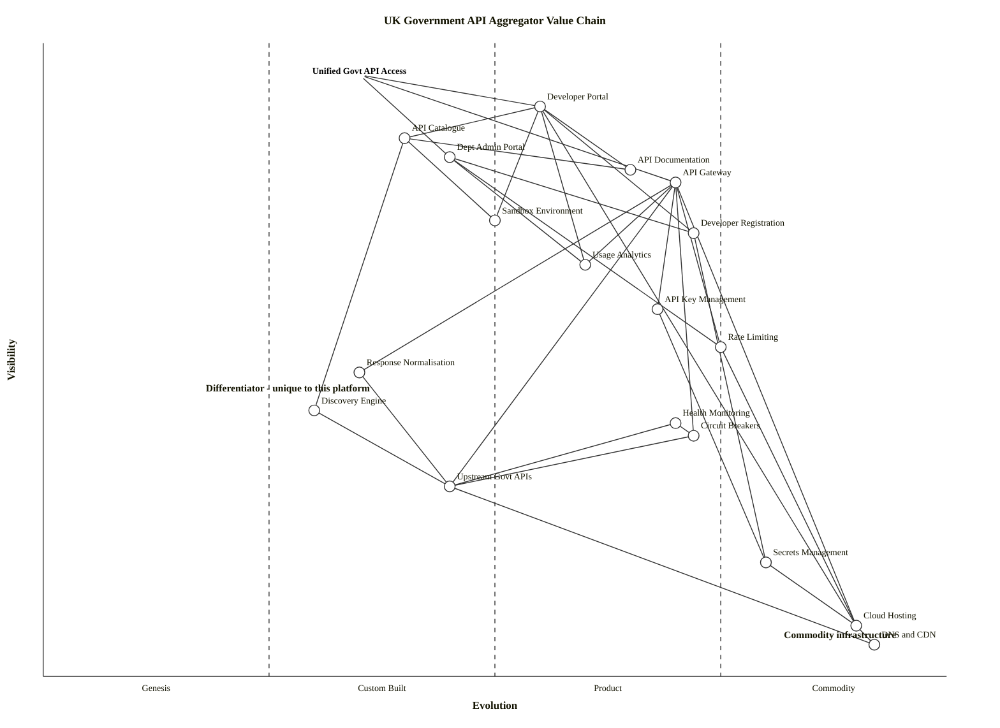

# Wardley Value Chain: UK Government API Aggregator

> **Template Origin**: Official | **ArcKit Version**: 4.3.1 | **Command**: `/arckit.wardley.value-chain`

## Document Control

| Field | Value |
|-------|-------|
| **Document ID** | ARC-001-WVCH-001-v1.0 |
| **Document Type** | Wardley Value Chain |
| **Project** | UK Government API Aggregator (Project 001) |
| **Classification** | OFFICIAL |
| **Status** | DRAFT |
| **Version** | 1.0 |
| **Created Date** | 2026-03-18 |
| **Last Modified** | 2026-03-18 |
| **Review Cycle** | Quarterly |
| **Next Review Date** | 2026-04-17 |
| **Owner** | [OWNER_NAME_AND_ROLE] |
| **Reviewed By** | [PENDING] |
| **Approved By** | [PENDING] |
| **Distribution** | Programme Board, Architecture Team, GDS Assessors |

## Revision History

| Version | Date | Author | Changes | Approved By | Approval Date |
|---------|------|--------|---------|-------------|---------------|
| 1.0 | 2026-03-18 | ArcKit AI | Initial creation from `/arckit:wardley.value-chain` command | [PENDING] | [PENDING] |

---

## Executive Summary

This value chain decomposes the primary user need of the UK Government API Aggregator platform: enabling developers to build applications using UK Government data through a single integration point. The analysis identifies 18 components across 5 dependency levels, from user-facing capabilities (Developer Portal, API Catalogue) down to commodity infrastructure (Cloud Hosting, DNS/CDN). The critical path runs through the API Gateway and its dependency on upstream Government APIs via department-specific adapters. The most strategically significant finding is that the Discovery Engine and Response Normalisation are custom-built components unique to this platform, representing the core differentiating value, while the surrounding infrastructure (gateway, identity, hosting) can leverage existing products and commodities.

---

## User Need / Anchor

**Anchor Statement**: Developer can build applications using UK Government data through a single integration point.

```text
Anchor: Developer can build applications using UK Government data through a single integration point
User: Third-party developers (private sector, GovTech startups, local authority digital teams)
Outcome: Developers integrate with multiple government department APIs through one registration, one API key, one authentication flow, and one consistent data format — reducing integration time by 60%+
```

---

## Users and Personas

| Persona | Role | Primary Need |
|---------|------|--------------|
| Alex (Private Sector Developer) | Full-stack developer at a GovTech startup | Combine data from multiple government APIs (Companies House + HMRC) with minimal integration overhead |
| Sam (Local Authority Developer) | Digital developer in small council team | Access environmental, planning, and property data APIs without per-department registration overhead |
| Jordan (Department API Owner) | Technical lead for a department's API estate | Maintain control over their APIs while increasing adoption and reducing developer support burden |
| Pat (Platform Administrator) | GDS WebOps engineer | Operate the aggregator with minimal toil, clear monitoring, and automated recovery |

---

## Value Chain Diagram

**View this map**: Paste the OWM syntax below into [https://create.wardleymaps.ai](https://create.wardleymaps.ai)

**ASCII Placeholder**:

```text
Visibility
    ^
0.95| [Unified Govt API Access]
    |       /          |           \
0.90| [Developer Portal]  |    [Dept Admin Portal]
    |     /    |    \      |          |
0.85| [API Catalogue]  |  [API Docs]    |
    |     |        |     |         |
0.78|     |    [API Gateway]       |
    |     |    /    |    \         |
0.72| [Dev Registration] [Sandbox]  |
    |              |       |       |
0.65|       [Usage Analytics]      |
    |              |               |
0.58|       [API Key Mgmt]        |
    |              |               |
0.52|       [Rate Limiting]        |
    |              |               |
0.48|    [Response Normalisation]  |
    |              |               |
0.42| [Discovery Engine] [Health Monitoring]
    |              |               |
0.38|       [Circuit Breakers]     |
    |              |               |
0.30|    [Upstream Govt APIs]      |
    |              |               |
0.18|       [Secrets Management]   |
    |              |               |
0.08|    [Cloud Hosting]  [DNS/CDN]
    |
    +--Genesis--Custom--Product--Commodity-->  Evolution
       (0.0)   (0.25)  (0.50)   (0.75)  (1.0)
```

**OWM Syntax**:

```wardley
title UK Government API Aggregator Value Chain
anchor Unified Govt API Access [0.95, 0.35]

component Developer Portal [0.90, 0.55]
component API Catalogue [0.85, 0.40]
component Dept Admin Portal [0.82, 0.45]
component API Documentation [0.80, 0.65]
component API Gateway [0.78, 0.70]
component Sandbox Environment [0.72, 0.50]
component Developer Registration [0.70, 0.72]
component Usage Analytics [0.65, 0.60]
component API Key Management [0.58, 0.68]
component Rate Limiting [0.52, 0.75]
component Response Normalisation [0.48, 0.35]
component Discovery Engine [0.42, 0.30]
component Health Monitoring [0.40, 0.70]
component Circuit Breakers [0.38, 0.72]
component Upstream Govt APIs [0.30, 0.45]
component Secrets Management [0.18, 0.80]
component Cloud Hosting [0.08, 0.90]
component DNS and CDN [0.05, 0.92]

Unified Govt API Access -> Developer Portal
Unified Govt API Access -> API Gateway
Unified Govt API Access -> Dept Admin Portal
Developer Portal -> API Catalogue
Developer Portal -> API Documentation
Developer Portal -> Developer Registration
Developer Portal -> Sandbox Environment
Developer Portal -> Usage Analytics
API Catalogue -> Discovery Engine
API Documentation -> API Catalogue
Dept Admin Portal -> Usage Analytics
Dept Admin Portal -> Rate Limiting
Dept Admin Portal -> Developer Registration
API Gateway -> Rate Limiting
API Gateway -> Response Normalisation
API Gateway -> Circuit Breakers
API Gateway -> API Key Management
API Gateway -> Upstream Govt APIs
Sandbox Environment -> API Catalogue
Developer Registration -> Secrets Management
Usage Analytics -> API Gateway
API Key Management -> Secrets Management
Rate Limiting -> Cloud Hosting
Response Normalisation -> Upstream Govt APIs
Discovery Engine -> Upstream Govt APIs
Health Monitoring -> Upstream Govt APIs
Health Monitoring -> Circuit Breakers
Circuit Breakers -> Upstream Govt APIs
Upstream Govt APIs -> DNS and CDN
Secrets Management -> Cloud Hosting
Developer Portal -> Cloud Hosting
API Gateway -> Cloud Hosting
Cloud Hosting -> DNS and CDN

note Differentiator - unique to this platform [0.45, 0.18]
note Commodity infrastructure [0.06, 0.82]

style wardley
```

<details>
<summary>Mermaid Value Chain Map (renders in GitHub, VS Code, and other Mermaid-enabled viewers)</summary>

> **Note**: Mermaid Wardley Maps use the `wardley-beta` keyword. This feature is in Mermaid's develop branch and may not render in all viewers yet. No sourcing decorators at the value chain stage -- those are added when creating the full Wardley Map.



</details>

---

## Component Inventory

| ID | Component | Description | Depends On | Visibility (0.0-1.0) |
|----|-----------|-------------|------------|----------------------|
| C-01 | Unified Govt API Access | Anchor user need: developers build apps using UK Government data through one integration point | -- | 0.95 |
| C-02 | Developer Portal | Self-service web portal for API discovery, registration, sandbox testing, key management, and documentation | C-04, C-06, C-08, C-09, C-10, C-17 | 0.90 |
| C-03 | API Catalogue | Searchable registry of all discovered UK Government APIs with metadata (department, endpoints, auth, status) | C-12 | 0.85 |
| C-04 | Dept Admin Portal | Secure administration portal for department API owners to manage APIs, configure policies, and view analytics | C-08, C-10, C-11 | 0.82 |
| C-05 | API Documentation | Interactive documentation rendered from OpenAPI specifications with try-it-out capability | C-03 | 0.80 |
| C-06 | API Gateway | Request routing engine that authenticates consumers, applies rate limits, and proxies requests to upstream APIs | C-10, C-11, C-13, C-14, C-15, C-17 | 0.78 |
| C-07 | Sandbox Environment | Mock API environment allowing developers to test without hitting production upstream APIs | C-03 | 0.72 |
| C-08 | Developer Registration | Identity management for developer accounts including registration, authentication (MFA), and profile management | C-16 | 0.70 |
| C-09 | Usage Analytics | Near-real-time analytics dashboards showing request volumes, error rates, latency, and rate limit consumption | C-06 | 0.65 |
| C-10 | API Key Management | Provisioning, rotation, and revocation of API keys for consumer authentication | C-16 | 0.58 |
| C-11 | Rate Limiting | Multi-tier rate limiting (platform, department, consumer) with configurable thresholds and 429 responses | C-17 | 0.52 |
| C-12 | Response Normalisation | Transformation layer normalising dates, errors, pagination, and envelope structures across department APIs | C-15 | 0.48 |
| C-13 | Discovery Engine | Automated crawler discovering and indexing APIs from api.gov.uk, department developer hubs, and OpenAPI specs | C-15 | 0.42 |
| C-14 | Health Monitoring | Active health checks on upstream APIs with status page, alerting, and circuit breaker integration | C-15, C-13b | 0.40 |
| C-13b | Circuit Breakers | Fault isolation preventing cascading failures when upstream APIs degrade, with automatic recovery | C-15 | 0.38 |
| C-15 | Upstream Govt APIs | External government department APIs (HMRC, Companies House, DVLA, NHS Digital, Environment Agency, OS) | C-18 | 0.30 |
| C-16 | Secrets Management | Secure vault for API keys, upstream credentials, and encryption keys | C-17 | 0.18 |
| C-17 | Cloud Hosting | Cloud compute, storage, networking, and managed services infrastructure (UK region) | C-18 | 0.08 |
| C-18 | DNS and CDN | Domain name resolution and content delivery for portal and gateway endpoints | -- | 0.05 |

---

## Dependency Matrix

The dependency matrix shows which components (rows) depend on which other components (columns). **X** = direct dependency, **I** = indirect dependency.

| | C-01 | C-02 | C-03 | C-04 | C-05 | C-06 | C-07 | C-08 | C-09 | C-10 | C-11 | C-12 | C-13 | C-14 | C-13b | C-15 | C-16 | C-17 | C-18 |
|---|---|---|---|---|---|---|---|---|---|---|---|---|---|---|---|---|---|---|---|
| **C-01** | -- | X | | X | | X | | | | | | | | | | | | | |
| **C-02** | | -- | X | | X | | X | X | X | | | | | | | | | X | |
| **C-03** | | | -- | | | | | | | | | | X | | | I | | | |
| **C-04** | | | | -- | | | | X | X | | X | | | | | | | | |
| **C-05** | | | X | | -- | | | | | | | | | | | | | | |
| **C-06** | | | | | | -- | | | | X | X | X | | | X | X | | X | |
| **C-07** | | | X | | | | -- | | | | | | | | | | | | |
| **C-08** | | | | | | | | -- | | | | | | | | | X | | |
| **C-09** | | | | | | X | | | -- | | | | | | | | | | |
| **C-10** | | | | | | | | | | -- | | | | | | | X | | |
| **C-11** | | | | | | | | | | | -- | | | | | | | X | |
| **C-12** | | | | | | | | | | | | -- | | | | X | | | |
| **C-13** | | | | | | | | | | | | | -- | | | X | | | |
| **C-14** | | | | | | | | | | | | | | -- | X | X | | | |
| **C-13b** | | | | | | | | | | | | | | | -- | X | | | |
| **C-15** | | | | | | | | | | | | | | | | -- | | | X |
| **C-16** | | | | | | | | | | | | | | | | | -- | X | |
| **C-17** | | | | | | | | | | | | | | | | | | -- | X |
| **C-18** | | | | | | | | | | | | | | | | | | | -- |

---

## Critical Path Analysis

The critical path is the longest dependency chain from anchor to deepest infrastructure, where failure at any step breaks the chain.

**Critical Path**:

```text
Unified Govt API Access (Anchor)
  |-> API Gateway  (Visibility: 0.78)
        |-> Circuit Breakers  (Visibility: 0.38)
              |-> Upstream Govt APIs  (Visibility: 0.30)
                    |-> DNS and CDN  (Visibility: 0.05)
```

**Alternative Critical Path** (Discovery):

```text
Unified Govt API Access (Anchor)
  |-> Developer Portal  (Visibility: 0.90)
        |-> API Catalogue  (Visibility: 0.85)
              |-> Discovery Engine  (Visibility: 0.42)
                    |-> Upstream Govt APIs  (Visibility: 0.30)
```

**Bottlenecks and Single Points of Failure**:

| Component | Risk Type | Impact if Failed | Mitigation |
|-----------|-----------|------------------|------------|
| API Gateway | Single routing point | All API requests fail; developers cannot access any government API | Active-active deployment across availability zones; automatic failover |
| Upstream Govt APIs | External dependency; not under platform control | Individual department APIs become inaccessible; platform cannot guarantee upstream availability | Circuit breakers, cached responses, graceful degradation, per-API isolation |
| Discovery Engine | Custom-built, low maturity | API Catalogue becomes stale; new APIs not indexed | Scheduled re-crawls, manual catalogue updates as fallback, monitoring for crawler failures |
| Secrets Management | Credential store | All upstream API connections fail; developer authentication breaks | High-availability vault deployment, credential caching with short TTL |
| API Key Management | Authentication dependency | Developers cannot authenticate; all requests rejected | Distributed key validation, local cache of valid keys with TTL |

**Resilience Gaps**:

- [x] Upstream Government APIs are external dependencies with no fallback beyond cached responses and circuit breakers
- [x] Discovery Engine is a Genesis/Custom-built component with no off-the-shelf alternative
- [x] Response Normalisation is custom-built per department and tightly coupled to upstream API schema knowledge
- [ ] No identified vendor lock-in on critical path (cloud-agnostic architecture principles apply)

---

## Validation Checklist

- [x] Chain starts with user need (anchor): "Developer can build applications using UK Government data through a single integration point"
- [x] All critical dependencies captured: 18 components with 31 dependency relationships
- [x] Chain reaches commodity level: Cloud Hosting (0.08) and DNS/CDN (0.05)
- [x] No orphan components: every component has at least one inbound or outbound dependency
- [x] Dependencies reflect reality: validated against requirements (ARC-001-REQ-v1.0) and stakeholder analysis (ARC-001-STKE-v1.0)
- [x] Visibility ordering correct: user-facing components (Portal 0.90, Catalogue 0.85) above infrastructure (Hosting 0.08, DNS 0.05)
- [x] Granularity appropriate for purpose: 18 components suitable for strategic build vs buy analysis

---

## Visibility Assessment

| Component | Visibility | Rationale |
|-----------|-----------|-----------|
| Unified Govt API Access | 0.95 | Anchor -- the user need itself, directly experienced |
| Developer Portal | 0.90 | Primary user interface; developers interact with it directly every session |
| API Catalogue | 0.85 | Developers search and browse it directly; failure immediately visible |
| Dept Admin Portal | 0.82 | Department users interact directly; failure noticed by API owners immediately |
| API Documentation | 0.80 | Developers read docs directly; poor docs = immediate user frustration |
| API Gateway | 0.78 | Developers hit it with every API call; latency/errors immediately visible |
| Sandbox Environment | 0.72 | Developers use it during onboarding; failure blocks the getting-started journey |
| Developer Registration | 0.70 | One-time interaction but critical; failure blocks all access |
| Usage Analytics | 0.65 | Viewed periodically by developers and departments; delay noticed but not critical |
| API Key Management | 0.58 | Developers interact at registration and rotation; otherwise invisible |
| Rate Limiting | 0.52 | Invisible until limits hit; then very visible via 429 responses |
| Response Normalisation | 0.48 | Invisible when working; developers see inconsistent formats if it fails |
| Discovery Engine | 0.42 | Background process; users notice only if catalogue becomes stale |
| Health Monitoring | 0.40 | Operators see it; developers see status page (derivative output) |
| Circuit Breakers | 0.38 | Invisible to users; they see error responses but not the mechanism |
| Upstream Govt APIs | 0.30 | External systems; users are unaware they exist behind the gateway |
| Secrets Management | 0.18 | Purely operational; users never interact with or see this component |
| Cloud Hosting | 0.08 | Deep infrastructure; users unaware it exists |
| DNS and CDN | 0.05 | Deepest infrastructure; completely invisible to all users |

---

## Assumptions and Open Questions

**Assumptions Made**:

| # | Assumption | Basis | Confidence |
|---|------------|-------|------------|
| A-01 | All target department APIs have or will provide machine-readable specifications (OpenAPI) | REQ FR-001 assumes crawlable specs; most major depts already publish these | Medium |
| A-02 | Upstream Government APIs are independently operated and have varying reliability characteristics | Architecture principles (ARC-000-PRIN-v1.0 Principle 2) and stakeholder analysis (SD-2) | High |
| A-03 | A single API Gateway component can handle routing to all upstream APIs without per-department gateway instances | Requirements specify a single base URL and unified authentication (BR-002) | Medium |
| A-04 | Developer Registration can leverage existing identity products (e.g., GOV.UK One Login patterns) rather than building custom | Architecture principle of reuse and TCoP alignment; One Login exists as a GDS platform | Medium |
| A-05 | Cloud hosting will be UK-region only per data sovereignty requirements | ARC-000-PRIN-v1.0 Principle 7: all data must reside within UK-approved jurisdictions | High |
| A-06 | The Discovery Engine is a novel, custom-built component with no off-the-shelf equivalent for UK Government API crawling | No known product exists that crawls api.gov.uk and department developer hubs | High |

**Open Questions**:

| # | Question | Owner | Due Date |
|---|----------|-------|----------|
| Q-01 | How many upstream Government APIs will require bespoke adapter development vs. automated adapter generation from OpenAPI specs? | Enterprise Architect | 2026-04-30 |
| Q-02 | Will GOV.UK One Login be available and suitable for developer registration, or is a custom identity solution required? | GDS Service Owner | 2026-04-15 |
| Q-03 | What caching strategy is acceptable for upstream API responses -- is department-by-department agreement required, or can a platform-wide policy apply? | Department API Owners | 2026-05-01 |
| Q-04 | Should the Discovery Engine also monitor non-API data sources (CSV datasets on data.gov.uk) or strictly APIs? | Product Owner | 2026-04-15 |

---

**Generated by**: ArcKit `/arckit:wardley.value-chain` command
**Generated on**: 2026-03-18 14:30 GMT
**ArcKit Version**: 4.3.1
**Project**: UK Government API Aggregator (Project 001)
**AI Model**: claude-opus-4-6
**Generation Context**: Decomposed from ARC-001-REQ-v1.0 (Requirements), ARC-001-STKE-v1.0 (Stakeholder Analysis), and ARC-000-PRIN-v1.0 (Architecture Principles)
